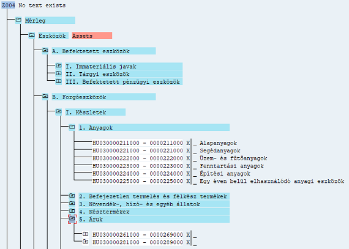
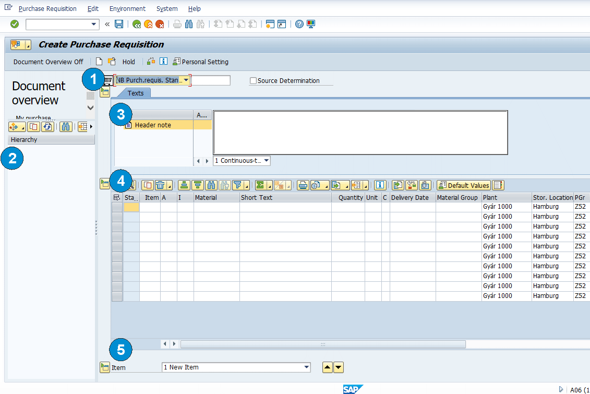

```{r setup, include=FALSE}
knitr::opts_chunk$set(echo = FALSE)
```


<link rel="stylesheet" href="toc_css/bootstrap.min.css">
<link rel="stylesheet" href="toc_css/bootstrap-toc.css">

<script src="https://code.jquery.com/jquery-2.1.4.min.js"></script>
<script src="https://maxcdn.bootstrapcdn.com/bootstrap/3.3.5/js/bootstrap.min.js" integrity="sha512-K1qjQ+NcF2TYO/eI3M6v8EiNYZfA95pQumfvcVrTHtwQVDG+aHRqLi/ETn2uB+1JqwYqVG3LIvdm9lj6imS/pQ==" crossorigin="anonymous"></script>
<script src="https://cdn.rawgit.com/afeld/bootstrap-toc/2f761d4/dist/bootstrap-toc.min.js"></script>


<body data-spy="scroll" data-target="#toc">
<nav id="toc" data-spy="affix" data-toggle="toc"></nav>

**Lendvai Tamás Purchase Requisition – Beszerzési igény**


**Általános információk:** beszerzési igények több szempontból
csoportosíthatók, az alábbiakban a tárgyuk, jellegük és előállításuk
szerint teszünk különbséget.

**Tárgyuk szerint:** beszerzési igénylések elsősorban anyag- és
árukészletekre adhatók le a gyártási, illetve a tovább értékesítendő
áruk esetében az értékesítéssel összefüggésben. Emellett természetesen
lehetőség van tárgyi eszközöket igényelni, illetve azonnali
felhasználásra (költségnem számlákra és költséghelyekre) igényelni.
Szintén lehetőség van azonnali felhasználású / továbbszámlázott
szolgáltatások igénylésére. Az igénylések egy speciális formája, amikor
pl.: munkavállalók belső katalógusból rendelnek pl.: irodai eszközöket,
és ebből rendelés készül. Az igénylés általános alapfeltétele az anyag,
áru, szolgáltatás, tárgyi eszköz törzsadata, tehát amire, vagy amivel
kapcsolatban leadjuk a rendelést.

**Előállításuk:** nagymértékben függ a tárgyuktól, illetve attól, hogy
milyen célból és mihez készítjük el. Amennyiben folyamatos, vagy
ciklikus termelésről van szó, és BOM-ok alapján rendelünk meg gyártáshoz
alapanyagokat akkor automata módon jönnek létre az igénylések (ennek
hátterében a Production Order, illetve az MRP beállításai vannak).
Szintén automatizálható, ha változatlan formában tovább értékesítendő
áruról van szó, és a vevői megrendelések generálnak beszerzési
igényléseket. Ezzel szemben ha eseti / nem rendszeres igénylésről van
szó, akkor manuálisan hozunk létre igényléseket. Ilyen eset lehet, ha a
termelésen kívül projektre / beruházásra szerzünk be anyagot, vagy ha
eseti jelleggel próbaárut, vagy azonnali felhasználású terméket
igénylünk, de ebbe a körbe tartoznak a szolgáltatások is.

**Környezetük:** az igényléseket beszerzési, felhasználási, tárolási és
számviteli környezet veszi körül.

**Forrásuk szerint:** beszerzési igénylések készülhetnek korábban
létrehozott beszerzési igénylésekből, azonban a beszerzési rendelésektől
eltérően szerződések, megállapodások, stb. nem másolható át beszerzési
igényre.

**Felhasználásuk szerint:** beszerzési igénylésekkel megalapozhatók
beszerzési rendelések, árajánlatok, keretszerződések, ütemezései
megállapodások

**Kapcsolódásuk szerint:** igénylésekhez kapcsolhatók szerződések,
megállapodások, és beszerzési infó rekordok, valamint szállítók is.

**Beszerzési igények elhelyezése a magyar standard számlatükörben és a
mérlegben:**


<div class="row">
<div class="column">

</div>
</div>


<div id="myModal" class="modal">
<span class="close cursor" onclick="closeModal()">&times;</span>
<div class="modal-content">
<div class="mySlides">
<div class="numbertext">1 / 5</div>

</div>

<div class="mySlides">
<div class="numbertext">2 / 5</div>

</div>

<div class="mySlides">
<div class="numbertext">3 / 5</div>

</div>

<div class="mySlides">
<div class="numbertext">4 / 5</div>

</div>

<div class="mySlides">
<div class="numbertext">5 / 5</div>

</div>


<a class="prev" onclick="plusSlides(-1)">&#10094;</a>
<a class="next" onclick="plusSlides(1)">&#10095;</a>
<div class="caption-container">
<p id="caption"></p>
</div>
<div class="column">

</div>

<div class="column">

</div>

<div class="column">

</div>

<div class="column">

</div>

<div class="column">

</div>


</div>
</div>


Megállapítható, hogy beszerzési igényeket elsősorban a forgóeszköz
mérlegosztály készleteibe tartozó anyagokra és árukra adunk le a
gyártási folyamat részeként. Az anyagok esetében a gyártáshoz szükséges
alapanyagok, segédanyaok, üzemanyagok és fenntartási anyagokról lehet
szó (többnyire), az áruk esetében a változatlan formában értékesíteni
kívánt kereskedelmi áruk és a tovább számlázott szolgáltatások igénylése
merülhet fel. A mérleg tekintetében, beszerzési igényléssel eszköz,
különösen anyagtartalommal rendelkező tárgyi eszköz megrendelése is
megalapozható. Befektetett pénzügyi eszközök és immateriális javak nem
képezik általában az igénylések alapját. A mérleg mellett lehetőségünk
van közvetlen költséget is elszámolni, és ezzel kapcsolatban anyagot,
vagy szolgáltatást azonnal felhasználni, tehát az 5-ös
eredményosztályra, illetve költséghelyre igényelni.

**A fentiekkel kapcsolatban alapvető kérdés**, hogy mit szeretnénk,
milyen mennyiségben, és hova igényelni (rendelni), valamint milyen
konstrukcióban, kitől (szerződések, megállapodások, megegyezések
szerint), milyen környezetben, illetve mikorra igényelni.

**Tranzakció típusa:** SAP-ban ME51 és ME51N-el lehet létrehozni
beszerzési igénylést. A különbség abban van, hogy amíg az ME51 egy több
képernyős felépítésű, úgynevezett classic tranzakció, addig az ME51N az
új típusú, egy / osztott képernyős Enjoy single screen tranzakciók
osztályába tartozik. Gyakorlatilag a táblázat és a tételrészletező egy
képernyő szerepel, amely jelentősen transzparensebbé teszi a
képernyőfelépítést.

**A beszerzési igénylés moduláris felépítése és elhelyezkedése**

<div class="row">
<div class="column">

</div>
</div>

**Beszerzési igénylés modul felépítése szerint a Logisztika \\
Anyaggazdálkodás \\ Beszerzés könyvtár** főkönyvtárban lévő
tranzakciókból és alkönyvtárakban elhelyezkedő tranzakciókból áll. A
főkönyvtárban elérhető ME51-ennel egyedileg hozhatunk létre, az
ME53N-nel egyedileg módosíthatunk, az ME53N-el egyedileg tekinthetünk
meg igényléseket. Az MEMASSRQ-val tömegesen tudunk megtekinteni és
szerkeszteni már elkészített igényléseket. A Release mappában az
elkészült igényléseket hagyhatjuk jóvá egyedileg, vagy tömegesen. A List
Displays-ban különböző lekérdezések és kimtatások érhetőek el, valamint
listák generálhatóak, ahonnan szintén elérhetőek az egyes
anyagigénylések megtekintésre és szerkesztésre. A Follow-On-Functions
keretében további műveletek érhetők el, pl.: az igénylések megfelelő
beállítás esetén megrendelésekké konvertálhatók.

# ME51N -- Create (PR)

<div class="row">
<div class="column">

</div>
</div>

## 1-es rész: Document Type (Bizonylat típusa)

<div class="row">
<div class="column">

</div>
</div>

Az anyagigénylésünket egy bizonylat fogja tárolni, amely egy
bizonylatrendszerben, bizonylatkörben helyezkedik el. Minden bizonylat
mentés után egy egyedi számot fog kapni, amelynek segítségével
transzparensen nyomonkövethetővé válnak. A bizonylat tulajdonságait
pedig az őt leíró bizonylattípus beállításai fogják meghatározni. A
legördülő menüben elérhető bizonylattípusok - kiválasztás esetén --
meghatározzák egyrészt a bizonylat űtlaptáblázatának felépítését és
szerkezetét (különösen az elérhető oszlopokat / mezőket), másrészt
determinálják, hogy a bizonylat melyik számintervallumban fog
elhelyezkedni. Ennek hátterében az áll, hogy SPRO-ban minden
bizonylathoz tartozik egy előre definiált képernyőkép (Screen Layout),
illetve egy bizonylatintervallum. A bizonylattípusok emellett
meghatározhatják, hogy milyen típusú Account Assignment és Item
Categoriek befogadására alkalmasak.

A PTE TTK-s IDES rendszerben az alapértelmezett az NB Standard PR.

## 2-es rész: Document Overview

A Document Overview ON-ra kattintva a képernyő baloldalán megjelenik egy
hasáb. A hasábon lévő műveletek segítségével korábban elkészült, az
anyagigénylés szempontjából releváns előzményeket tudunk látszólag
betölteni. Eredményeim szerint azonban reálisan kizárólag korábbi
beszerzés igénykés másolható át új anyagigénylésre. A funkció értelmét
az a koncepció adja, amely szerint új beszerzési igényléshez
felhasználhatóak korábban elkészített bizonylatokat is.

<div class="row">
<div class="column">

</div>
</div>

Purchase Order-ből, RFQ-ból, Conratcts-ból, Ütemezési megállapodásokból
nem lehet átvenni adatokat új igénylésekhez (ez csak a Purchase Order
esetében működik). Tehát csak a már korábban elkészített igénylés
választható. Amennyiben nem a saját igényléseinket (My PR) választjuk,
úgy egy összetett keresőfelület jön elő, amely érdemi segítséget jelent
az egyes bizonylatok megtalásában. (Lásd videót)

## 3. Header

{width="6.291666666666667in"
height="2.3958333333333335in"}

A Header-ben, tehát fejlécben tudunk megadni olyan információt, amely
igénylésre, illetve az igénylés valamennyi / egyes tételeire vonatkozik.
Az 1-es változatban folyamatos szöveget tudunk megadni, a 2-es
változatban pedig sorokra bontott szöveget tudunk felvinni.

## 4. Rész: Tételnyilvántartó

{width="6.291666666666667in" height="1.5in"}

**Menüsáv ikonjainak szerepe:**

{width="6.3in" height="2.423611111111111in"}

### 4.1. Alapadatok:

Material -- anyag kódja I Short Text -- anyag, rövid leírása I Quantity
-- mennyiség I Unit -- mennyiség mértékegysége I Plant -- üzem, ahová az
anyagot igényeljük I Storage Location: az üzemhez tartozó raktárhely I
Delivery date: szállítás naptári dátuma I Requested by: az igénylő neve,
vagy kódja I Tracking No.: az igénylés nyomonkövetésének száma

#### 4.1.1. Tételkategória (Item Category)

{width="2.7395833333333335in"
height="2.11288167104112in"}

**Üres - Standard:** alapanyag beszerzése a szállítótól (a szállító
késztermékét vásároljuk meg), órai kerete között ezt tanuljuk.

K -- **Consignment:** a konszignációs készletre vonatkozó igénylés az
esetben arról van szó, hogy a szállító által beszállított áru egészen
addig a szállító tulajdonában marad, amíg nem adjuk ki a termelésre.
Lényeges, hogy a szállítói számlát is elvileg ebben az időpontban kell
lekönyvelnünk, tekintettel arra, hogy egész addig a szállító
tulajdonában állt. A konszignációs készlet a „beszállítók által vezérelt
készletek (VMI Vendor Management Invantory) típusába tartozik. A
konszignációs készletek esetében a vevő, tehát ebben az esetben mi „csak
a felhasznált mennyiség után fizet. ... A konszignációs készletek olyan
készletek, melyeket a beszállító a vevői megrendelések alapján a vevő
rendelkezésére bocsát, de egy későbbi időpontban történik meg a fizetés
és a beszállított ám tulajdonjogának az átadás (Molamohamadi et al.,
2013). A vevő csak a felhasznált, a gyártásnak átadott mennyiségeket
fizeti ki a beszállító részére." Oláh J. & Vad V. A konszignációs
készletek jellemzői az ellátási láncban. Vezetéstudomány. (15)8. 67-76.
<https://core.ac.uk/download/pdf/161069385.pdf> (2021. január 20.)

**L-** **Subcontracting:** az alapanyagot, vagy félkészterméket kiadjuk
megmunkálásra egy üzleti partnernek, amely megmunkálást követően
visszaszállítja. Ilyen eset lehet a bérmunka típusú együttműködések.

**S -- Third Party**:

**U - Stock transfer:** az anyagot a szervezeten belül mozgatjuk, pl.:
üzemek között, ebben a relációban lesz jelentősége a Plant / Supply
Plant összefüggésének.

**D -- Service:** jellemzően olyan anyagtörzsben létező szolgáltatás,
amelyet 5-ös számlaosztályra és költséghelyre könyvelünk.

### 4.2. Kontírozási adatok

Az anyagigénylést a következő objektumokkal lehet összekapcsolni:
Purchase Group: Beszerzési csoport I Requested by: anyagigénylés
kérelmezője I Tracking Number: tétel követési száma I Des. Vendor:
javasolt szállító I Fixed Vendor: rögzített szállító I Purchase Org.:
beszerzési szervezet I Agreement: szerződés I Item: a szerződés
tételének sorszáma pl.: 10 I Info Record: beszerzési adatok.

Az Agreement-hez és az Info Record-hoz való hozzárendelés lényeges
lehet, tekintettel arra, hogy az azokban foglalt kondíciók
meghatározhatják az adott tétel tulajdonságait, pl.: árak és szállítási
feltételek tekintetében. Később a Purchase Order (beszerzési megrendelés
ezeket fogja átvenni).

Kitöltés sorrendje: először adjuk meg az anyag kódját, utána a Plant
(üzemet). A kettő kombinációjából a program az anyagtörzs adataiból
kitölti a többi mezők egy részét, szintén adjuk meg a Storage
Location-t, majd a többi szükséges mezőt. Az itt megadott adatokat
később átveheti többek között a Contract (szerződés nyilvántartó modul),
valamint a Purchase Order (megrendelések).

## 5. Rész: Tételrészletező

**Az 5-ös rész az egyes tételek részletezésre szolgál**

Az egyes tételek részletes adatainak megtekintéséhez az Item drop
down-ból válasszuk ki az adott tételt, majd azt követően nyissuk meg az
egyes űrlapokat. Az űrlapok részben a táblázatban szereplő oszlop
mezőket tartalmazzák csoportosítva, néhány esetben a táblázatban nem
szereplő mezők és kapcsolók is rendelkezésre állnak.

### 5.1. Material Data

{width="6.291666666666667in"
height="1.2083333333333333in"}

A Material Data űrlapon az anyag kódja, az anyag rövid neve, a sarzs
(Batch), és az anyag csoportja szerepel. Ezek az adatok az anyagtörzsből
töltödnek ki. A Vendor Material szabadszöveges mezőben a szállító
nyilvántartásában szereplő anyagnevet és / kódot lehet megadni, ennek
értelme abban az esetben van, ha a szállító adatbázisában más kóddal és
névvel fut az anyag, mint a saját SAP rendszerünkben. (In most cases,
the vendor uses a different number for the material than the one used in
this system. The vendor\'s material number can therefore also be quoted
in a [**purchase
order**](sapevent:DOCU_LINK\DS:GLOS.3526C0CEAFAB52B9E10000009B38F974)
for identification purposes. from: SAP help menü) A Batch esetében a
sarzs menedzsmentről van szó, amelynek segítségével bizonyos szempontok
szerint az egy kötegbe tartozó anyagok mozgása transzparensen nyomon
követhető. *(ehhez a részhez annyira nem értek, én az alábbi külső
hivatkozásból indultam ki)*

### 5.1. Mennyiség és dátumok (Quantity/Dates)

{width="6.291666666666667in"
height="1.3541666666666667in"}

Az űrlapon három mennyiséget találunk. Az első az igénylendő
mennyiséget, a második az ebből megrendelt mennyiséget, a harmadik a
kettő különbözetét a nyitott mennyiséget tartalmazza. A Closed-el lehet
lezárni az igénylést. A jobb oldali hasábban lehet megadni a tervezett
szállítás időpontját, és az engedélyeztetés időpontját. A kérelem
időpontja alapértelmezetten az a nap lesz, amikor az igénylést
elkészítjük. Ezek alatt megadhatjuk a tervezett szállítás időt, illetve
az áruérkeztetéshez szükséges időmennyiséget.

**5.2. Értékelés (Valuation)**

{width="6.3in"
height="1.2079341644794401in"}

A Valuation űrlapon az anyagnak a mennyiségre / darabra vetített
tervezett ára, pénzneme szerepel. Ennek értéke elsősorban az
anyagtörzsből származhat. A Promotion alatt három kapcsoló szerepel. Az
anyagérkeztetés (Good Receipt) aktiválásával azt jelezzük, hogy a tétel
értékelése összefüggésben van érkeztetéssel, a számlaérkeztetés (Invoice
Receipt) estében, ha a számlaértkeztetéssel, a GR Non-Val. esetében, ha
az olyan árut érkeztetünk, amelyet nem kell az ávételkor értékelnünk.

**5.3. Kontírozás (Account Assignment)**

{width="6.291666666666667in"
height="1.5625in"}

A kontírozás űrlap felépítését a legördülő listában elérhető kategóriák
határozzák meg. Ennek informatikai alapját az adja, hogy SPRO-ban az
egyes kategóriákhoz egyedi beállítások (űrlapfelépítések, mezőkészletek)
tartoznak. Alapesetben, ha nem választunk kontírozási kategóriát (tehát
az AccAssCat üres) akkor az igénylés a áru- és anyagkészletre fog
vonatkozni. A Fund, Functional Area, Fund Center, Grant elsősorban az
állami költségvetésből működő intézmények forrásgazdálkodásának
adminisztrációját teszik lehetővé. Segítségükkel pl.: megadható, hogy
adott igénylést milyen alapra kontírozzuk, illetve milyen támogatást
használunk fel. A Commitment Item a kötelezettségvállalási, pénzügyi
tételnek felel meg.

**5.3.1 K Cost Center (költséghely)**

{width="6.291666666666667in"
height="2.0625in"}

Költséghely kiválasztása elsősorban akkor indokolt, ha az anyagot, árut,
vagy szolgáltatást közvetlenül költségként, pontosabban költségnemenként
számoljuk el 5-ös számlaosztályban, és azonnal felhasználjuk. Az
alapadatok tekintetében költséghelyet (Cost Center), a pénzügyi
központot (Profit center), valamint az üzletágat (Business Area-t)
adhatjuk meg. Az egyes objektumok összefüggésben állhatnak egymással a
háttérbeállítástól függően, ezért pl.: a költséghely kitöltésével a
pénzügyi központ és az üzletág is kitöltődhet automatikusan. Amennyiben
költséghelyre adunk le beszerzési igényt, abban az esetben 5-ös
számlaszámra fogjuk később könyvelni a beszerzésünket, egyúttal egy 6-os
számvlteli költséghelyhez is hozzárendeljük azt. Az Unloading point
mezőjében a kirakodás, illetve a felhasználás helyét tudjuk megadni, a
mezőbe a költséghely fizikai elhelyezkedését célszerű megadni.

Amennyiben egy tételt több költséghely szerint szeretnénk felosztani,
úgy válasszuk az első kockát, a többszörös konítrozás beállítását.

{width="6.291666666666667in"
height="1.8854166666666667in"}

{width="6.291666666666667in"
height="2.3020833333333335in"}

Amennyiben több költséghelyre szeretnénk kontírozni a beszerzendő
tételt, úgy megosztás mezőben (Distribution) válasszuk ki a mennyiség,
vagy a százalékos (arányos) formában való megosztást, és töltsük ki az
alsó táblázatot.

{width="2.40625in"
height="0.8707436570428696in"}

Ha az első sort kitötöttük, utána a Reapet on (második ikonnal) tudjuk
másolni a sort.

**5.3.2. Projekt**

{width="6.291666666666667in"
height="1.9270833333333333in"}

Ha a beszerzési igénylést projekthez szeretnénk kapcsolni, úgy a P
Project-et kell kiválasztani. A legtöbb mező azonos lesz a költséghely
űrlapjával, ugyanakkor a WBS Element és a Network új elemként jelenik
meg. A két mező kitöltése lehetővé teszi, hogy beszerzési igénylésünket
a projekt megfelelő szintjével, elemével tudjuk összekapcsolni. Egy
projekt alapszintű felépítését szemlélteti az alábbi ábra.

{width="6.3in"
height="4.59375in"}

<https://help.sap.com/viewer/5ecdd9085d344e6693e65fc60c3b5b0f/6.17.19/en-US/26d4b65334e6b54ce10000000a174cb4.html>
(2021. január 20.)

Az ábrán szereplő projekt esetében az egyes szintekhez tudunk
anyagigényléseket rögzíteni.

**5.3.3 Befejetlen beruházás / Tárgyi eszköz (Asset)**

{width="6.291666666666667in"
height="1.96875in"}

Amennyiben tárgyi eszközt szeretnénk beszerezni, úgy az Asset-et
válasszuk ki. A szokásos kontírozásos mezők mellett az igénylésünket
rátudjuk vezetni egy / több befejezetlen beruházásra, vagy közvetlenül a
tárgyi eszközre.

**5.4. A beszerzési igény információ forrása (Source of Supply)**

{width="6.291666666666667in"
height="1.4270833333333333in"}

Beszerzési igényekhez rendelhetünk különböző forrásdokumentumokat
(keretszerződéseket, központi szerződéseket, vagy infó rekordokat). Ezek
kiválasztásával alapesetben megjelenik az a rögzített szállító is,
amelyet az adott dokuemtum tartalmaz. Emellett megadhatunk javasolt
szállítót is. A keretszerződés, keretmegállapodás (amely jellemzően
valamilyen Outline Agreement objektum) esetében meg kell adni, hogy az
igénylés a szerződés melyik tételére vonatkozik, ellenkező esetben nem
lesz összefüggés az igényelt tétel és a szerződés tétele között. Ez alól
az információs rekord kivétel, ugyanis az mindig egy adott anyagra
vonatkozik, szemben a szerződésekre, amelyek több tételt is
tartalmazhatnak. Lényeges, hogy ezt csak abban az esetben tudjuk
megtenni, ha azok (szerződések, infó rekordok) már elkészültek. Emellett
szintén meg lehet adni a beszerzési szervezetet. A jelentősége ennek a
Purchase Order létrehozása során lesz, a PO az igénylés adott tételéhez
kapcsolt szerződésből fogja a kondíciók egy részét, pl.: az árat, a
szállítási feltételeket kiolvasni.

**5.5. Status** (a beszerzési igénylés státusza)

{width="6.302083333333333in"
height="0.7604166666666666in"}

A Status űrlapon a Process Status (feldolgozás státusza), a Block ID (az
anyagigénylés blokkolása), és a Block text (a blokkolás szöveges
indoklása adható meg).

{width="1.9270833333333333in"
height="1.375in"}

Az aktív legördülő menüből az anyagigénylés állapota tekinthető meg. 03
= engedélyeztetés alatt, 05 = engedélyeztetés teljesítve, 08 =
engedélyeztetés visszautasítva.

**5.6. Contact Person**

{width="6.302083333333333in"
height="1.4375in"}

Created by: a felhasználó neve, aki készítette (ez a bejelentkezési
adatokból származik)

Created Indicator: a létrehozás módjára utal

{width="3.0833333333333335in"
height="1.7129625984251968in"}

Amennyiben manuálisan hozzuk létre, úgy a Realtime (valós idejű,
manuális létrehozás) lesz az alapértelmezett, B) esetben az
anyagszükségletek tervezése hozza létre automatában, az F esetében a
gyártás elrendelés hozza létre automatában.

**5.7. Enviroment**

{width="6.302083333333333in"
height="2.5416666666666665in"}

**Az Enviroment menüsorban** lehet a tételhez kapcsolt rekordokat /
objektumokat megtekinteni, illetve különböző kimutatásokat (pl.:
készletek, szállítók értékeléseit) lekérni. A menüsor előnye, hogy külső
tranzakciók nélkül is tudunk az adott tételhez tartozó objektumokat
menedzselni.

**Item Changes --** Ez a tétel egyes elemeinek módosításait mutatja
történeti megközelítésben (régi érték --\> új érték) kronológiailag.

{width="6.302083333333333in"
height="1.5208333333333333in"}

**Material -\> A tétel, illetve az adott anyag törzsadatait nyitja meg**

{width="6.291666666666667in"
height="6.4375in"}

**Material Stock -\> Az adott anyagból rendelkezésre álló mennyiséget és
elhelyezkedését mutatja meg vállalat \\ gyár \\ tárolási hely szerint:**

{width="6.291666666666667in"
height="2.5833333333333335in"}

**Vendor -\> A szállító törzsadatainak egy részét (alapadatokat,
beszerzési adatokat) mutatja**

{width="5.015733814523185in"
height="5.9375in"}

**Vendor Evaluation -\> A szállító automata értékelését nézhetjük meg:**

{width="5.75in" height="5.32160542432196in"}

**Info Record -\> A tételhez kapcsolódó Infó Rekordot nyitja meg**

{width="6.291666666666667in"
height="6.916666666666667in"}

**Contract -- a tételhez kapcsolódó szerződést lehet megnézni /
módosítani**

{width="6.302083333333333in"
height="6.21875in"}

**Quota Arrangement -\> A tételhez tartozó kvótamegállapodásokat lehet
megtekinteni / módosítani**

{width="5.395833333333333in"
height="4.041666666666667in"}

Az alábbi videó az egyedi és csoportos megjelenítés és módosítás
lehetőségeit mutatja be.

<iframe width="560" height="315" src="https://www.youtube.com/embed/PXfx7seJ1ZA" frameborder="0" allow="accelerometer; autoplay; clipboard-write; encrypted-media; gyroscope; picture-in-picture" allowfullscreen>
</iframe>

</body>


<script>
// Open the Modal
function openModal() {
  document.getElementById("myModal").style.display = "block";
}

// Close the Modal
function closeModal() {
  document.getElementById("myModal").style.display = "none";
}

var slideIndex = 1;
showSlides(slideIndex);

// Next/previous controls
function plusSlides(n) {
  showSlides(slideIndex += n);
}

// Thumbnail image controls
function currentSlide(n) {
  showSlides(slideIndex = n);
}

function showSlides(n) {
  var i;
  var slides = document.getElementsByClassName("mySlides");
  var dots = document.getElementsByClassName("demo");
  var captionText = document.getElementById("caption");
  if (n > slides.length) {slideIndex = 1}
  if (n < 1) {slideIndex = slides.length}
  for (i = 0; i < slides.length; i++) {
    slides[i].style.display = "none";
  }
  for (i = 0; i < dots.length; i++) {
    dots[i].className = dots[i].className.replace(" active", "");
  }
  slides[slideIndex-1].style.display = "block";
  dots[slideIndex-1].className += " active";
  captionText.innerHTML = dots[slideIndex-1].alt;
}
</script>


