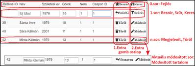
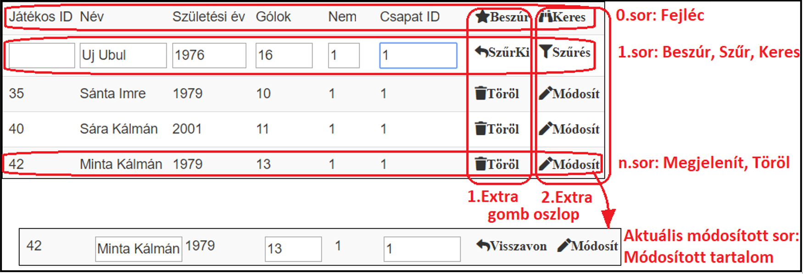

<html xmlns:ns0="urn:schemas-microsoft-com:office:smarttags">

<head>
<meta http-equiv=Content-Type content="text/html; charset=windows-1250">
<meta name=Generator content="Microsoft Word 15 (filtered)">
<title>PHP OOP</title>

</head>

<body lang=HU link=blue vlink="#954F72" style='word-wrap:break-word'>

# 10.6.Controller (Servlet) package létrehozása

-&nbsp;
NetBeans|FRM:Projects|LIN:kezilabda1|LIN:Source
packages|Jobbkatt|New…|Java package|DDN:Name=Controller, BTN:OK

## 10.6.1.Servlet osztály létrehozása

###  10.6.1.1.DEF

-&nbsp;
Egy speciális Servlet típusú osztály, ami a Glassfish szerverre
kívülről hívható Servleteket telepít adott URL-re (itt most localhost) 

-&nbsp;
Amiknek segítségével a frontend AJAX-ból meghívhatja a Service
csomag CRUD+A metódusait 

-&nbsp;
JSON-on keresztül kommunikálva (vagy pl. XML-ben):

-&nbsp;
Request: Frontend-&gt;Szerver:

-&nbsp;&nbsp;
Egyezményesen „task” kulccsal jön a service CRUD+A neve, amit meg
kell hívni

-&nbsp;&nbsp;
A bemenő paramétereik a paraméter nevével egyező kulccsal jönnek

-&nbsp;
Response: Szerver-&gt;Frontend: 

-&nbsp;&nbsp;
C, U, D egyezményesen „msg” kulccsal siker/sikertelenség jelzést
ad szöveggé konvertált JSONObject-ben

-&nbsp;&nbsp;
R és A szöveggé konvertált visszatérő JSONArray-t ad ki

-&nbsp;
Nem tárgyaljuk, hogyan lehet azon URL-eket korlátozni, honnan
érhetik el a servletet, itt most mindenhonnan elérhetik

###  10.6.1.2.Létrehozás

-&nbsp;
NetBeans|FRM:Projects|LIN:kezilabda1|LIN:Source packages|LIN:Service|Jobbkatt|New…|Servlet|

-&nbsp;
DDN:Name=JatekosServlet, BTN:Next|

-&nbsp;
CHK:Add information to deployment descriptor Web.XML=Yes,
BTN:Finish //Ne felejtsd el!

package
Controller; <b>//Controllerbe menjen!</b>

&nbsp;

import
Service.JatekosService;

import
java.io.IOException;

import
java.io.PrintWriter;

import
javax.servlet.ServletException;

import
javax.servlet.http.HttpServlet;

import
javax.servlet.http.HttpServletRequest;

import
javax.servlet.http.HttpServletResponse;

import
org.json.JSONObject;

&nbsp;

public
class JatekosServlet extends HttpServlet {

&nbsp;

   
protected void processRequest(HttpServletRequest request, HttpServletResponse
response)

           
throws ServletException, IOException {

       
response.setContentType(&quot;<b>application/json</b>&quot;);
<b>//Üzenetformátomot beállítani!</b>

       
PrintWriter out =
response.getWriter(); <b>//Szöveges output webkeresőhöz rendelése</b>

        try { <b>//Alapértelmezett try</b>

            <b>//Adott kliens sessionhoz tartalmazó
service példány deklarálása</b>

            JatekosService js = new JatekosService();

            <b>//Szerver-&gt;kliens üzeneti
alapértelmezett JSON objektum deklarálása</b>

            JSONObject obj = new JSONObject();

            if (request.getParameter(&quot;task&quot;)
!= null) { <b>//Ha bejött frontendről task...</b>

                <b>//Ide kell kézzel megírni
CRUD+A task kezelő if-eket…</b>

                <b>//………………………………………………………………………</b>

            }            

        }

        catch (Exception e) { <b>//Hiba esetén...</b>

            out.write(e.toString() + &quot;
Error:Servlet&quot;); <b>//Alapértelmezett hibaüzenet webre</b>

        }

    }

}

-&nbsp; A kijelölt részeket kézzel kell beírni, mert rosszul hozza
a minta kódban!

###  10.6.1.3.Servlet beregisztrálását szerverre ellenőrizni

-&nbsp;
NetBeans|FRM:Projects|LIN:kezilabda1 project|LIN:Configuration
files|LIN:Web.XML|Duplakatt

&lt;?xml
version=&quot;1.0&quot; encoding=&quot;UTF-8&quot;?&gt;

&lt;web-app
version=&quot;3.1&quot; xmlns=&quot;http://xmlns.jcp.org/xml/ns/javaee&quot;
xmlns:xsi=&quot;http://www.w3.org/2001/XMLSchema-instance&quot;
xsi:schemaLocation=&quot;http://xmlns.jcp.org/xml/ns/javaee
http://xmlns.jcp.org/xml/ns/javaee/web-app_3_1.xsd&quot;&gt;

   
&lt;servlet&gt;

       
&lt;servlet-name&gt;JatekosServlet&lt;/servlet-name&gt; <b>//Legyen servlet bejegyzés!</b>

       
&lt;servlet-class&gt;Controller.JatekosServlet&lt;/servlet-class&gt;

   
&lt;/servlet&gt;

   
&lt;servlet-mapping&gt;

       
&lt;servlet-name&gt;JatekosServlet&lt;/servlet-name&gt; <b>//Legyen servlet mapping bejegyzés!</b>

       
&lt;url-pattern&gt;/JatekosServlet&lt;/url-pattern&gt;

   
&lt;/servlet-mapping&gt;

   
&lt;session-config&gt;

       
&lt;session-timeout&gt;

           
30

       
&lt;/session-timeout&gt;

   
&lt;/session-config&gt;

&lt;/web-app&gt;

###  10.6.1.4.Taskok írása

<h5 style='margin-left:7.1pt'><u> 10.6.1.4.1.</u>Általános
séma</h5>

-&nbsp;
frontendről érkezik a request JSON formátumban, <b>request.getParameter(„Kulcs”)</b>-al
lehet belőle kulccsal jelölt, nem tipizált értékeket kiszedni (mindet
autokonvertálja szöveggé ha kell)

-&nbsp;
Először egy if-ben vizsgáljuk, hogy adott CRUD+A műveletre
vonatkozik a <b>task</b>, ha igen…

-&nbsp;
A már létrehozott service osztály példány CRUD+A metódusát egy
if-ben hívom meg, bemenő paramétereiket getParaméterrel, nevükkel szedem ki a
request-ből szövegként

-&nbsp;&nbsp;
Siker esetén <b>„msg”</b> kulccsal siker jelzést <b>put</b>-olok
a korábban létrehozott JSONObjekt-be

-&nbsp;&nbsp;
Hiba esetén <b>„msg”</b> kulccsal sikertelenség jelzést

-&nbsp;
<b>out.write</b>-olom a JSONObjektet stringgé konvertálva a
frontendre, kiv. Read és AllRecods, ahol a Service példány metódustól kapok
JSONArray-t, és azt <b>out.write</b>-olom stringgé konvertálva

<h5 style='margin-left:7.1pt'><u> 10.6.1.4.2.</u>Create</h5>

if
(request.getParameter(&quot;task&quot;).equals(&quot;<b>addNewJatekos</b>&quot;)) { <b>//Ha task addNewJatekos…</b>

   
if(js.addNewJatekos(

       
request.getParameter(&quot;nev&quot;), <b>//Paraméterek
a requestből a nevük alapján szövegként</b>

       
request.getParameter(&quot;szulEv&quot;), 

       
request.getParameter(&quot;golok&quot;), 

       
request.getParameter(&quot;nem&quot;), 

     
  request.getParameter(&quot;csapatID&quot;)

   
)) {

       
obj.put(&quot;msg&quot;, &quot;Sikeres játékos létrehozás: &quot; +
request.getParameter(&quot;nev&quot;)); <b>//Siker
jelzés</b>

    }

   
else {

       
obj.put(&quot;msg&quot;, &quot;Sikertelen játékos létrehozás: &quot; +
request.getParameter(&quot;nev&quot;)); <b>//Hiba
jelzés</b>                      

    }

   
out.write(obj.toString()); <b>//Siker jelzés küldése
frontendnek szöveggé konvertált JSONban</b>

}

<h5 style='margin-left:7.1pt'><u> 10.6.1.4.3.</u>Read     
</h5>

if
(request.getParameter(&quot;task&quot;).equals(&quot;getJatekos&quot;)) { //Ha
task getJatekos...

   
out.write(js.getJatekos(

       
request.getParameter(&quot;jatekosID&quot;) 

   
).toString());                    

}

<h5 style='margin-left:7.1pt'><u> 10.6.1.4.4.</u>Update        
</h5>

if
(request.getParameter(&quot;task&quot;).equals(&quot;updateJatekos&quot;)) {
//Ha task updateJatekos...

   
if(js.updateJatekos(

       
request.getParameter(&quot;jatekosID&quot;), 

       
request.getParameter(&quot;nev&quot;), 

       
request.getParameter(&quot;golok&quot;), 

       
request.getParameter(&quot;csapatID&quot;)

   
)) {

       
obj.put(&quot;msg&quot;, &quot;Sikeres játékos módosítás: &quot; +
request.getParameter(&quot;jatekosID&quot;));                        

    }

   
else {

       
obj.put(&quot;msg&quot;, &quot;Sikertelen játékos módosítás: &quot;  +
request.getParameter(&quot;jatekosID&quot;));                        

    }

   
out.write(obj.toString());

}

<h5 style='margin-left:7.1pt'><u> 10.6.1.4.5.</u>Delete      
</h5>

if
(request.getParameter(&quot;task&quot;).equals(&quot;deleteJatekos&quot;)) {
//Ha task deleteJatekos...

   
if(js.deleteJatekos(request.getParameter(&quot;jatekosID&quot;))) {

       
obj.put(&quot;msg&quot;, &quot;Sikeres játékos törlés: &quot; + request.getParameter(&quot;jatekosID&quot;));

    }

   
else {

       
obj.put(&quot;msg&quot;, &quot;Sikertelen játékos törlés: &quot;  +
request.getParameter(&quot;jatekosID&quot;));

    }

   
out.write(obj.toString());

}

<h5 style='margin-left:7.1pt'><u> 10.6.1.4.6.</u>AllRecords</h5>

if
(request.getParameter(&quot;task&quot;).equals(&quot;getAllJatekos&quot;)) {
//Ha task getAllJatekos...

   
out.write(js.getAlljatekos().toString());

}

<b><u> 
</u></b>

# 10.7.Frontend HTML oldal létrehozása

## 10.7.1.Kezelők meghívása az index.html kezdőoldalon

-&nbsp;
NetBeans|FRM:Projects|LIN:Kezilabda1 project|LIN:Web
pages|LIN:Index.html|Duplakatt:

&lt;!DOCTYPE
html&gt;

&lt;html&gt;

   
&lt;head&gt;

       
&lt;title&gt;<b>Kézilabda Oldal</b>&lt;/title&gt;

       
&lt;meta charset=&quot;UTF-8&quot;&gt;

       
&lt;meta name=&quot;viewport&quot; content=&quot;width=device-width,
initial-scale=1.0&quot;&gt;

       
<b>&lt;!-- Stíluslap kezelő megadása
--&gt;</b>

        &lt;link rel=&quot;stylesheet&quot;
href=&quot;https://use.fontawesome.com/releases/v5.8.2/css/all.css&quot;
crossorigin=&quot;anonymous&quot;&gt;

        <b>&lt;!-- CSS kezelő
megadása --&gt;</b>

        &lt;link rel=&quot;stylesheet&quot;
href=&quot;https://maxcdn.bootstrapcdn.com/bootstrap/3.4.0/css/bootstrap.min.css&quot;&gt;

        <b>&lt;!-- Ajax kezelő
megadása --&gt;</b>

        &lt;script
src=&quot;https://ajax.googleapis.com/ajax/libs/jquery/3.3.1/jquery.min.js&quot;&gt;&lt;/script&gt;

        <b>&lt;!-- jQuery kezelő
megadása --&gt;</b>

        &lt;script
src=&quot;https://ajax.googleapis.com/ajax/libs/jquery/3.4.0/jquery.min.js&quot;&gt;&lt;/script&gt;

        <b>&lt;!-- JavaScript kezelő
megadása --&gt;</b>

        &lt;script
src=&quot;https://maxcdn.bootstrapcdn.com/bootstrap/3.4.0/js/bootstrap.min.js&quot;&gt;&lt;/script&gt;

        <b>&lt;!-- Saját
JavaScriptek --&gt;</b>

        &lt;script&gt;

        <b>//CRUD+A kezelő
függvények</b>

            

        <b>//Oldalbetöltés (onload)
előtt induló főprogram</b>

            

        &lt;/script&gt;

   
&lt;/head&gt;

   
&lt;body&gt;

       

   
&lt;/body&gt;

&lt;/html&gt;

-&nbsp; A sárgával jelölt részeket kézzel kell hozzáadni!

-&nbsp;
A kezelők az első futtatáskor letöltik a script könyvtáraikat a NetBeans|FRM:Projects|LIN:Kezilabda1
project|LIN:Remote files könyvtárba a legfrisebb aktuális verzióban (ezért az 1. futtatás jóval lassabban fog indulni, mint
normálisan).

##  10.7.2.Egy adatbázis táblához/Entity Class-hoz tartozó JavaScript CRUD+AF függvények írása

###  10.7.2.1.Cél

-&nbsp;
A modern frontend programozás célja, hogy minimalizálja az
oldalra rakandó statikus elemeket, és szinte mindent dinamikusan hozzon létre,
ezáltal biztosítva a kód újrafelhasználhatóságot különböző oldalak közt

-&nbsp;
Ezért a CRUD+A függvények írásánál az a cél, hogy az oldalon
statikusan egyetlen kopasz, üres <b>&lt;Table &gt;&lt;/Table&gt;</b> elemre
legyen hozzájuk szükség, ráadásul azt is paraméterezzük, milyen nevű <b>Table</b>-be
dolgozzanak

-&nbsp;
A tábla elrendezésével biztosítjuk, hogy minden CRUD+A kezelő
elem elférjen benne:

&times;

1 / 4

<a class="prev" onclick="plusSlides(-1)">&#10094;</a>
<a class="next" onclick="plusSlides(1)">&#10095;</a>

###  10.7.2.2.Általános függvényszerkezeti séma

-&nbsp;
JavaScript nem szigorúan típusos: változókat <b>var</b>-al kell
deklarálni, de nem muszáj a típusukat megadni, bármely típust bármely típusba
autokonvertál, ha tud 

-&nbsp;
JavaScript nem objektum orientált (majd későbbi verziója a
TypeScript lesz az), csak struktúrált, így csak oldal betöltődés előtt lefutó
főprogram meg függvények vannak benne:

-&nbsp;
<b>function</b> kulcszóval kezdődik, majd a CRUD+AF neve jön

-&nbsp;
Bemenő paraméterlistája nem tipizált, és akkor üres, ha fel tudja
adatokat felszedni valamilyen HTML-elemből

-&nbsp;
Visszatérő értéke nem tipizált, és nem kötelező, hogy legyen

-&nbsp;&nbsp;
Ha HTML elemekből szed fel bemenő adatot, akkor az legyen egy <b>id=osztalynevMezonev</b>
-vel hivatkozott <b>form</b>, és abban legyen egy azonos nevű <b>input</b> elem
(mert az <b>input id</b>-vel hivatkozása problémás). <b>var</b>-al változót
deklarálunk a <b>form</b>-ra és <b>.elements[0].value</b>-vel szedhetjük ki
belőle az értéket

-&nbsp;&nbsp;
Ezt használjuk egy szervernek küldendő, <b>kuldendo</b> nevű JSON
összeállítása során a <b>„mezonev”:</b> kulcsokkal jelőlt paraméterek
értékadására. A JSON-ból nem felejtjük ki <b>„task”</b>:
kulccsal beadni a Servleten megírt task nevét.

-&nbsp;
Ezután <b>$.ajax({</b> fejléccel összeállítjuk az AJAX-hívást:

-&nbsp;&nbsp;
url: „osztalynevServlet”, //servlet meghívása

-&nbsp;&nbsp;
<b>type</b>: „post”, //Post típusú üzenet legyen, vagyis a
webkereső címsorában ne látsszon a JSON tartalma

-&nbsp;&nbsp;
<b>data</b>: <b>kuldendo</b> //Összeállított JSON szerverre
küldése

-&nbsp;&nbsp;
<b>success</b>: <b>function(vissza) { … }</b> //Mit kell tenni
sikeres szerver válasz esetén, ahol a <b>vissza</b> nevű JSON-ban jönnek az
adatok szerverről:

-&nbsp;&nbsp;
<b>alert(vissza.msg); </b>//Fejlesztési időszakban mindig adjak
webkereső alert-be siker esetén is jelzést, hogy tudjam, mi történt meg

-&nbsp;&nbsp;
<b>vissza[index].mezonev </b>//szerverről jövő rekordok
mezőértékeit megadhatom HTML elemek .innerHTML vagy .value tulajdonságának,
megjelenítve őket

-&nbsp;&nbsp;
<b>error</b>: <b>function(vissza) { … }</b> //Mit kell tenni
sikertelen szerver válasz esetén, ahol a <b>vissza</b> nevű JSON-ban jönnek az
adatok szerverről.

###  10.7.2.3.Create

function
addNewJatekos(targetTable) {

   
var jatekosNev = document.getElementById(&quot;jatekosNev&quot;); <b>&lt;!-- Bemenő adatokat tartalmazó form HTML elemek
deklarálása --&gt;</b>

   
var jatekosSzulEv = document.getElementById(&quot;jatekosSzulEv&quot;);

   
var jatekosGolok = document.getElementById(&quot;jatekosGolok&quot;);

   
var jatekosNem = document.getElementById(&quot;jatekosNem&quot;);

   
var jatekosCsapatID = document.getElementById(&quot;jatekosCsapatID&quot;);

   
var kuldendo = { <b>&lt;!-- Egy kuldendo nevű JSON-ba
töltöm a bemenőket --&gt;</b>

       
&quot;task&quot;: &quot;addNewJatekos&quot;, <b>&lt;!--
Mindig a task megadással kezdődik, nem felejtjük el! --&gt;</b>

       
&quot;nev&quot;: jatekosNev.elements[0].value, &lt;!—Paraméter
felszedése form elem-ben lévő input értékéből--&gt;

       
&quot;szulEv&quot;: jatekosSzulEv.elements[0].value, 

       
&quot;golok&quot;: jatekosGolok.elements[0].value,

       
&quot;nem&quot;: jatekosNem.elements[0].value, 

        &quot;csapatID&quot;:
jatekosCsapatID.elements[0].value

   
};

   
$.ajax({ <b>&lt;!—AJAX hívás kezdete --&gt;</b>

       
url: &quot;JatekosServlet&quot;, <b>&lt;!-- Servlet
címe --&gt;</b>

       
type: &quot;post&quot;,     <b>&lt;!-- Küldött adat ne
legyen látható webkereső címsorban --&gt;</b>

       
data: kuldendo, <b>&lt;!—Küldés a szervernek --&gt;</b>

       
success: function(vissza) { <b>&lt;!-- Szerver válasza
vissza-ba kerül --&gt;</b>

           
alert(&quot;Szerver válasza: &quot; + vissza.msg); &lt;!--Debug
időszakban siker esetén is alertel,majd kiveszi--&gt;

           
getAllJatekos(targetTable,-1,&quot;&quot;,&quot;&quot;,&quot;&quot;,&quot;&quot;,&quot;&quot;,&quot;&quot;);
<b>&lt;!—Tábla újrarajzolása szűrés nélkül --&gt;</b>

       
},

       
error: function(vissza) {

           
alert(&quot;Kapcsolati hiba! &quot; + vissza.msg);

           
getAllJatekos(targetTable,-1,&quot;&quot;,&quot;&quot;,&quot;&quot;,&quot;&quot;,&quot;&quot;,&quot;&quot;);

       
}

   
});

}

###  10.7.2.4.Read

function
getJatekos() {

   
var jatekosID = document.getElementById(&quot;jatekosID&quot;);

   
var jatekosNev = document.getElementById(&quot;jatekosNev&quot;);

   
var jatekosSzulEv = document.getElementById(&quot;jatekosSzulEv&quot;);

   
var jatekosGolok = document.getElementById(&quot;jatekosGolok&quot;);

   
var jatekosNem = document.getElementById(&quot;jatekosNem&quot;);

   
var jatekosCsapatID = document.getElementById(&quot;jatekosCsapatID&quot;);

   
var kuldendo = {&quot;task&quot;: &quot;getJatekos&quot;,
&quot;jatekosID&quot;: jatekosID.elements[0].value};

   
$.ajax({

       
url: &quot;JatekosServlet&quot;,

       
type: &quot;post&quot;,

       
data: kuldendo,

       
success: function(vissza) { &lt;!—Szerver vissza
válaszból felnyomja formok inputjaiba az adatokat --&gt;

           
alert(&quot;Játékos keresése: &quot; + jatekosID.elements[0].value);

           
jatekosID.elements[0].value = vissza[0].jatekosID;

           
jatekosNev.elements[0].value = vissza[0].nev;

           
jatekosSzulEv.elements[0].value = vissza[0].szulEv;

           
jatekosGolok.elements[0].value = vissza[0].golok;

           
jatekosNem.elements[0].value = vissza[0].nem;

           
jatekosCsapatID.elements[0].value = vissza[0].csapatID;

       
},

       
error: function(vissza) {

           
alert(&quot;Kapcsolati hiba játékos keresésénél: &quot; +
jatekosID.elements[0].value);

       
}

   
});

}

###  10.7.2.5.Update

function
updateJatekos(targetTable, jatekosID) {

   
var jatekosNev = document.getElementById(&quot;jatekosNevUpd&quot;);

   
var jatekosGolok = document.getElementById(&quot;jatekosGolokUpd&quot;);

   
var jatekosCsapatID = 

</body>

</html>

