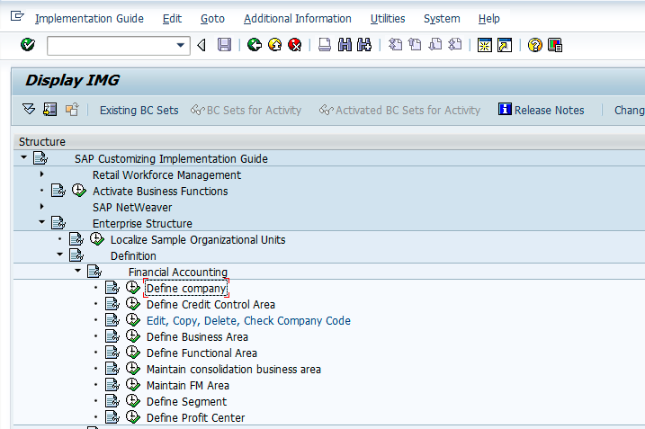
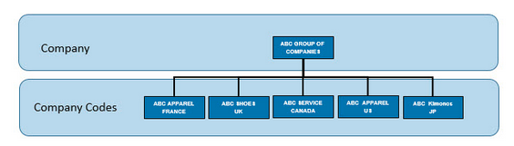
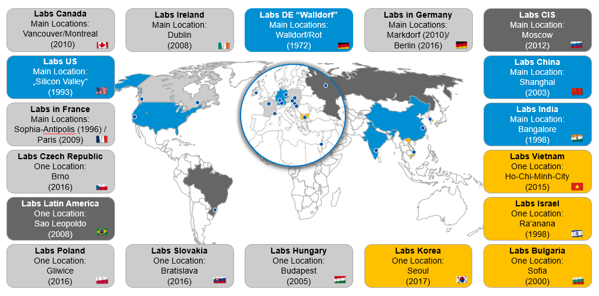
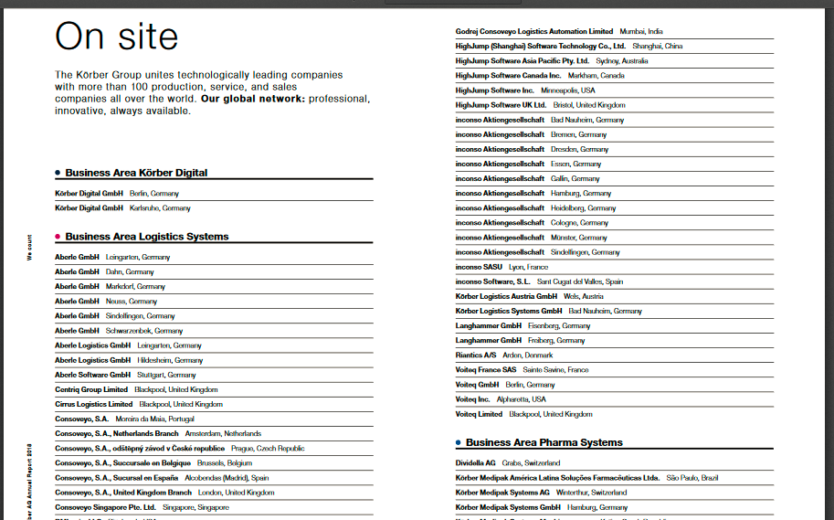
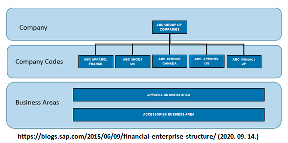

```{r setup, include=FALSE}
knitr::opts_chunk$set(echo = FALSE)
```


<link href="styles/bootstrap.css" rel="stylesheet">
<link href="http://ajax.googleapis.com/ajax/libs/jqueryui/1.8.21/themes/black-tie/jquery-ui.css" rel="stylesheet">
<link href="styles/jquery.tocify.css" rel="stylesheet">


<link rel="stylesheet" href="https://cdnjs.cloudflare.com/ajax/libs/font-awesome/4.7.0/css/font-awesome.min.css">

<script src="https://unpkg.com/darken"></script>


<style>
a:nth-child(3) {
	color: white;
	background-image: linear-gradient(0deg, transparent 91%, rgb(32, 152, 209) 9%);
}
</style>


<body>

<div id="toc">
</div>


<div class="row">
<div class="column">

<button data-hypothesis-trigger style="font-size:24px; border-radius: 20px;width: 100%;">
<i class="far fa-sticky-note"></i>
</button>


</div>
<div class="column">

<button id="dm-toggle" style="font-size:24px; border-radius: 20px;width: 100%;"> <i class="far fa-moon"></i></button>

</div>
</div>


<h2>[**Pénzügyi és vezetői számviteli környezet felépítése SAP-ban**]{.ul}</h2>


```{r,dpi=60,fig.align='center'}

```


A szeminárium során elsősorban felhasználói tranzakciókat használunk,
azonban lényegesnek tartjuk megemlíteni és igény esetén szemléltetni a
pénzügyi és a vezetői számvitel környezetének objektumait, illetve
lehetőséget adni azok létrehozására. Az alábbi ismeretek azoknak igazán
hasznos, akik szeretnék érteni, hogy milyen szervezeti tényezők,
szervezeti egységek szerepelnek a könyvelési folyamatok hátterében,
azokat hogyan lehet beállítani, illetve milyen környezetet lehet
kialakítani. Más tekintetben a felhasználói szint szempontjából a
kontírozási, hozzárendelések miatt lényegesek.

Elöljáróban megállapítható, hogy az SAP rendszerekben (ERP R/3, S/4
HANA) két eltérő funkciójú, mégis több szálon kapcsolódó szervezeti
környezet működhet részben egymással kapcsolatban, részben párhuzamosan.
Az egyik a Financial Accounting, tehát a Pénzügyi Számvitel, amelynek
alapvető feladata a külső környezet szereplőinek, pl: adóhatóságok, pl.:
NAV tájékoztatása a vállalat, vagy annak egységeinek vagyoni helyzetéről
mérleg-, eredmény és pénzügyi beszámolók formájában. Ennek a
környezetnek a klasszikus részét a Business Area, Consolidated Business
Area és részben a Segement adja. Ezzel szemben a Controlling modul a
belső tájékoztatást látja el, a vállalat valós teljesítményéről ad
számot a menedzsmentnek. Ebben az esetben Controlling Area-ban
elhelyezkedő, eredmények kimutatását lehetővé tevő Profit Center,
valamint az ez alatt lévő, költségeket gyűjtő Cost Center-ek
szerepelnek. A helyzetet az bonyolítja, hogy a Business Area (FI) alá
tartozhat Cost Cenrer, a Segment alá pedig Profit Center és Cost Center.
Tehát a két eltérő funkciójú szervezeti objektumok összekapcsolhatók.

[**Vállalatcsoport** **(Company) / Kliens (Client)**]{.ul}

Az SAP rendszerben két, egymással vertikális kapcsolatban álló vállalati
szint különíthető el. A felső szintet a vállalatcsoport (Company), az
alsó szintet a vállalat (Comapny Code) jelenti. Egy vállalatcsoportban
több egymással azonos, mellérendelt, horizontális szinten lévő vállalat
helyezkedik el. A magasabb szint a vállalatcsoport), az alacsonyabb
szint a vállalat. A vállalatcsoportba, amely több országban, esetleg
kontinensen is tevékenykedik - pl. ThyssenKr\*pp - tartoznak a
vállalatok. Company szinten lehet benyújtani pl.: konszolidált pénzügyi
beszámolót. Ezzel szemben a vállalatok Company Codes) azok a jogi
entitások, amelyekre az adott ország jogszabályai vonatkoznak, illetve
amelyeknek pl.: az adóhatóságoknak kell adatszolgáltatás végezniük. SAP
rendszerben elsőként a vállalatcsoportot célszerű beállítani, ha ez
indokolt (pl.: azokban az esetekben, ha csak Magyarországon működik a
vállalat (szervezet), pl.: PTE, illetve más felsőoktatási intézmények,
nem kell megadni vállalatcsoportot, mivel ez nem releváns).


```{r,dpi=60,fig.align='center'}

```


Tehát megállapítható, hogy a szervezeti hierarchia legmagasabb pontján a
vállalatcsoport áll. A különböző formában, pl.: konszernként,
holdingként, konglomerátumkén megjelenő vállalatcsoportok elsősorban a
transznacionális és multinacionális szervezetekre jellemzők. Az ügyfél /
kliens / vállalatcsoport az SAP rendszer legmagasabb hierarchikus
szintjén helyezkedik. A rendszeren belül, saját adataival,
törzsrekordjaival és független táblákkal rendelkezik. Üzleti szempontból
az ügyfél vállalati csoportot alkot, ügyfél jogi és szervezeti
szempontból is önálló. A gyökér (root) a vállalati csoport szintjét
képviseli. A hierarchia összes többi csomópontjának nem kell fix
szemantikával rendelkeznie. Ez azt jelenti, hogy hierarchiáját jogi
személyek (például leányvállalatok) és üzleti egységek (például
értékesítés) keverékével állíthatja össze.


Az alábbiakban nézzünk meg két standard, szabványos SAP szervezeti
ábrát:

```{r,dpi=50,fig.align='center',fig.cap='http://sapmoduletutor.blogspot.com/2015/11/sap-mm-organizational-structure-in-sap.html (2021. 02. 10.)'}

```


```{r,dpi=50,fig.align='center',fig.cap='https://help.sap.com/doc/e2b9d153e8b34208e10000000a174cb4/1503%20SP%206/en-US/a8ffcc537cbf224be10000000a174cb4.html (2021. 02. 10.)'}

```


Példák a vállalatcsoportokra:


```{r,dpi=60,fig.align='center'}
knitr::include_graphics("images/fin/media/image5.png")
```


```{r,dpi=50,fig.align='center',fig.cap='https://www.slideshare.net/VishalHarichund/20150129tkiscompanypresentationtranen (2021. 02. 10.)'}

```


```{r,dpi=50,fig.align='center',fig.cap='https://blogs.sap.com/2018/03/26/sap-labs-network-the-art-of-being-connected/ (2021. 02. 10.)'}

```


Az alábbi lista a világviszonylatban is meghatározó transznacionális
vállalatok egy részét tartalmazza.


```{r,dpi=60,fig.align='center'}

```


**[Vállalat (Company Code)]{.ul}**

A vállalatcsoport alatt helyezkedik a vállalat. A vállalat, többnyire a
cégcsoport leányvállalata jogilag bejegyzett, Magyarország esetében a
cégjegyzékben szereplő entitás. Ezen a szinten készülnek el az
országspecifikus, az adott ország adóhatósága számára készülő,
jogszabályokban rögzített jelentések.


```{r,dpi=60,fig.align='center'}

```


Vállalatot (2. szint) létrehozhatunk teljesen üres állapotból, illetve
átmásolhatjuk más vállalat adatait az új vállalatunkba. A második
lehetőség azért előnyösebb (esetünkben), mivel a másolással minden
korábbi függőségeket is átmásolhatunk, nem kell előröl minden
kapcsolatot kiépíteni, tehát ez jelentős időmegtakarítás, maximum
módosítani kell a függőségeket az igények szerint. Ezzel szemben az új
létrehozásával valamennyi függőviszonyt (100-as nagyságrend) ki kell
építeni. A függőviszony pontos megnevezése: \"company code-specific
parameters\". SAP bevezetés esetében lehet teljesen üres állapotról
kezdeni, de ha egy vállalatcsoportba több vállalat tartozik, akkor
lehet, hogy célszerűbb a függőviszonyok egy részének - átgondolt -
átvétele.

**[Üzletág a vállalatcsoport alatt (Business Area under Company)]{.ul}**


```{r,dpi=60,fig.align='center'}

```


```{r,dpi=60,fig.align='center'}

```


```{r,dpi=60,fig.align='center'}

```


Mint a Körber Solution példája is mutatja, megállapítható, hogy
transznacionális vállalatcsoportok tevékenységüket egymástól jól
elkülönült üzletágakban végzik. Lényeges, hogy egy üzletágba több
leányvállalat is tartozhat, illetve egy-egy leányvállalat több
üzletágban is érdekelt lehet. Ennek az összetett lehetőségnek a
gazdasági események kontírozásának tekintetében lesz súlya.

**[Üzletág (Business Area)]{.ul}**


```{r,dpi=60,fig.align='center'}

```


Az üzletágak kialakítására az SAP standard megoldásaiban két lehetőséget
ad. Az egyik lehetőség a (Segment -) Pénzügyi központ (csoport) --
költséghely kombináció, a másik pedig a klasszikus Üzletág --
költséghely (Business Area -- Cost Center) megoldás.


Az üzletág egy adott üzleti szegmensnek vagy felelősségi körnek felel
meg. A pénzügyi könyvelésbe bevitt értékmozgások üzleti területekhez
vannak rendelve. Pénzügyi kimutatások (mérleg- és eredménykimutatások
készíthetők üzleti területekre belső célokra. Az üzleti terület egy
külön szervezeti egységet képvisel a pénzügyi könyvelésben, amely az
üzleti tevékenység külön területét képviseli. Könyvelési sorokhoz
rendelhető és ennek előnye, hogy ezen üzleti területek alapján belső
pénzügyi kimutatást készíthetünk. Mondhatjuk, hogy belső jelentési
célokra használható. Az üzleti területeket a külső szegmensjelentésekben
(a vállalati kódokon felül) használják, a vállalat jelentős működési
területei alapján (például termékvonalak, fióktelepek).

Az üzletágak meghatározását követően, a gazdasági események rögzítésével
a főkönyvi számlák tranzakciós adatait külön lehet értékelni belső
kimutatási célokból. Ezért létrehozhatunk belső pénzügyi kimutatásokat
az üzleti területekre vonatkozóan. Üzleti területre való könyveléshez
minden esetben meg kell adni vagy az üzletág alá tartozó költséghelyet,
vagy közvetlenül magát az adott üzletágat. A Business Area előnye, hogy
vállalatcsoporton belüli vállalatok között Cross-Company könyvelés
esetén egy bizonylaton gyakorlatilag az összes vállalati kód különböző
üzleti területeire könyvelhetünk el egy dokumentumban. Ennek
eredményeként a vállalati kód és az üzleti terület tetszőleges számú
kombinációja lehetséges.

Az üzletág és a pénzügyi központ közötti egyik meghatározó eltérés, hogy
az üzletág célja szerint inkább beszámolási célokra szolgál, míg a
profit központ lehetővé teszi a felelősségterületek elemzését és a
felelősség decentralizált egységekre (pl. a vállalaton belüli különféle
divíziókra) való átruházását. Így a profit központot alapvetően \"egy
vállalaton belüli társaságként\" kezelik, és biztosítja a hatékony
irányítást. Lásd.:
<https://answers.sap.com/questions/6828792/business-area-vs-segment.html>
(2021. 02. 10.)


```{r,dpi=60,fig.align='center'}

```


**[Üzleti szegmens (Segment) / Szegmens riport (Segment report)]{.ul}**


```{r,dpi=60,fig.align='center'}

```


A szegmens a vállalkozás olyan alkotóeleme, amely saját bevételeket
generál, és saját termékeket, termékvonalakat vagy szolgáltatásokat
kínál. A szegmenseknek jellemzően kapcsolódó költségeik és műveleteik
vannak. A szegmenseket \"üzleti szegmenseknek\" is nevezik. Általában,
ha egy üzleti egység elkülöníthető vagy kiemelhető a vállalat egészéből,
és továbbra is önellátó marad, akkor az megfelel az üzleti szegmensbe
sorolás kritériumainak. Az egyes szegmensek tevékenységeire és
teljesítményére vonatkozóan pénzügyi információknak kell rendelkezésre
állniuk.

(Forrás: <https://www.investopedia.com/terms/s/segment.asp> (2021. 02.
04.)

Az üzleti szegmensek szerinti jelentések a vállalat pénzügyi adatait a
részlegek, földrajzi elhelyezkedés, vagy más szegmensek szerint bontják
meg. Éves beszámolóban az üzleti szegmensre vonatkozó jelentés pontos
képet nyújt a vállalatcsoport részvényeseinek a teljesítményéről. A
menedzsment az üzleti szegmens jelentését használja az egyes üzletágak
bevételeinek, kiadásainak, eszközeinek és kötelezettségeinek
értékelésére, annak érdekében, hogy kimutassa általános állapotát -
ideértve a jövedelmezőséget és a lehetséges veszélyeket is. Korábban
erre a célra az SAP a Business Area-t, 2010-től a Szegmenst és a Profit
Center-t használja.

A szegmens bevezetésének egyik meghatározó célja az IAS 14 és az IFRS 8
szabványok szegmensjelentésre vonatkozó követelményeknek való
megfelelés. Tekintettel arra, hogy ezek standardok, illetve szabványok
elsősorban bevételalapúak, ezért a Pénzügyi Központok, másnéven Nyerség
Központok (Profit Center) kapcsolódnak a szegmensekhez.

A szegmensjelentés tehát a Nemzetközi Pénzügyi Beszámolási Standard
(IFRS) egyik követelménye, amelynek értelémében a pénzügyi információkat
üzleti és földrajzi területek szerint kell nyújtani, annak érdekében,
hogy egyértelműen meghatározható legyenek az ezeken a területeken rejlő
lehetőségek és kockázatok. Ez a megfelelés azokra a vállalatokra
vonatkozik, amelyek részvény- és hitelviszonyt megtestesítő
értékpapírjaival nyilvános kereskedést folytatnak, és értékpapírokat is
kibocsátanak a nyilvánosság számára. Forrás:
<https://answers.sap.com/questions/6828792/business-area-vs-segment.html>
(2021. 02. 10.)

A Pénzügyi Számviteli Standard Testület (FASB) meghatározza az üzleti
szegmens jelentésének számviteli standardjait. A FASB számviteli
standardok kodifikációja (ASC) 280-10-10-1 előírja, hogy a vállalat
üzleti tevékenységének minden szegmense összhangban álljon a vállalat
beszámolási struktúrájával. A vállalatnak azonban nem kell beszámolnia
az összes üzleti szegmensről. Az Egyesült Államokban általánosan
elfogadott számviteli elvek (GAAP) szerint az állami vállalatoknak
jelenteniük kell egy szegmenst, ha az az összes bevétel 10% -át, az
összes nyereség 10% -át vagy az összes eszköz 10% -át teszi ki. A
nemzetközi szabványok némileg eltérnek. Az üzleti szegmensre vonatkozó
jelentés teljes képet nyújt a társaság működéséről a részvényesek, a
felső vezetés és a befektetők számára - ami fontos lehet
döntéshozatalukhoz.

A szegmensjelentések segítségével a társaság részvényesei teljes képet
kaphatnak a cég működéséről. A szegmensjelentés részletes perspektívát
ad hozzá, amely kritikus fontosságú a felső vezetés döntéshozatala
szempontjából. Az összevont mérleg- és eredménykimutatás mellett
felmerülhet igény arra, hogy egy adott befektető, vagy befektetői
csoport mélyebben szeretne beleolvasni a vállalat gazdasági adataiba,
pl.: üzleti szegmensenként (földrajzi régiónként vagy üzletáganként)
elemezni a vállalat teljesítményét.

**[Példa az üzleti szegmensek felépítésére]{.ul}**


```{r,dpi=60,fig.align='center'}

```


A legtöbb nagybank különféle üzleti funkcióik alapján több részlegből
áll (fogyasztói hitelezés, kereskedelmi hitelezés és hitelkártya). A
bank pénzügyi kimutatásainak összeállításakor a pénzügyi tisztviselőnek
el kell különítenie mindhárom ilyen divíziót jövedelemtételeik, valamint
a mérlegben felsorolt ​​eszközök tekintetében.

**[Kapcsolódás SAP-ban:]{.ul}**

SAP rendszerben a szegmenshez közvetlenül a pénzügyi központ
kapcsolódhat, amelyhez pedig közvetlenül kapcsolódhat a költséghely.

**[Pénzügyi központ, vagy más néven nyerségközpont (Profit
center).]{.ul}**


```{r,dpi=60,fig.align='center'}

```


A pénzügyi központ csoportok és pénzügyi központok egy adott üzletág,
üzleti terület alatt helyezkednek el. A vezetői számvitel részének
tekinthető pénzügyi központok lényeges tulajdonsága, hogy a vállalat
belső területeiként felelősek a megcélzott nyereség és / vagy a
termelékenységi célok eléréséért. A pénzügyi központba a
költséghelyekről érkező költségek és a pénzügyi központba közvetlenül
érkező bevételek tartoznak. A pénzügyi központok vállalaton belül
vállalatként is lehet értékelni.

A **pénzügyi központ hierarchia** a vezetői számvitel szervezeti
egysége, amely tükrözi a szervezet vezetésorientált struktúráját a belső
ellenőrzés céljából. A pénzügyi központ célja egy adott termékcsalád,
üzem vagy üzleti egység bevételeinek és költségeinek elemzése. Pénzügyi
központok szerint lehet készíteni mérleg- és eredménykimutatásokat,
azonban ezeket a kimutatásokat alapvetően belső célokra lehet
felhasználni. A Profit Center könyvelése a belső felelősségi körök
nyereségének meghatározására szolgál. Ez lehetővé teszi, hogy
meghatározza a nyereséget és a veszteséget akár az időszaki elszámolás,
akár az értékesítési költség megközelítés segítségével.

Egy **másik megközelítés** szerint **pénzügyi központok /
nyereségközpontok** hozhatók létre a termékvonalak, részlegek, földrajzi
régiók, irodák, gyártási helyek vagy funkciók azonosítására. A
nyereségközpontokat belső ellenőrzési célokra használják, amelyek
lehetővé teszik a menedzsment számára a szervezetükön belüli felelősségi
területek felülvizsgálatát. A **költséghely** és a nyereségközpont
közötti különbség az, hogy a költségközpont az adott időszakban
felmerült egyedi költségeket jelenti. A pénzügyi központ biztosítja
azoknak a jövedelmezőség jelentési követelményeit, amelyek nem
illeszkednek a vállalati kód szerkezetéhez. (Forrás:
<https://www.apprisia.com/blog/sap-ecc/sap-profit-center-accounting/> )

**[Investopedia meghatározása szerint:]{.ul}**

Egy **másfajta megközelítés** szerint a pénzügyi központ egy olyan
egység, amely felelős a bevételeinek előteremtéséért. Nyereségét és
veszteségét a vállalkozás egyéb területeitől elkülönítve számolják. A
profitközpont egy olyan fióktelep vagy részleg, amely közvetlenül növeli
a vállalat nyereségességét. A profitközpontot olyan egységként kezelik,
amely a bevételeket önállóan számolják el. A profitközpontokért felelős
vezetők vagy vezetők döntési jogkörrel rendelkeznek a termékek
árképzésével és a működési költségekkel kapcsolatban. Más tekintetben
jelentős nyomásnak vannak kitéve, mivel biztosítaniuk kell, hogy
részlegük termékekkel vagy szolgáltatásokkal történő értékesítése
meghaladja a költségeket. A profit termelés történhet a bevételek
növelésével és / vagy a költségek csökkentésével.

**[Investopedia példái:]{.ul}**

A **Walmart** kiskereskedőnél a különböző termékeket értékesítő
különböző részlegeket elemezni lehet profitközpontokra. Például a
ruházat egy nyereségközpontnak tekinthető, míg a háztartási cikk második
nyereségközpontnak. Ezenkívül a szezonálisan váltakozó részlegeket,
például a kertközpontot vagy az ünnepi dekorációval foglalkozó
részlegeket profit-központként lehet vizsgálni, hogy elkülönítsék e
részlegek szezonális járulékát az egész éves hozzájárulással
rendelkezőktől.

A **Microsoft** informatikai óriás a profitközpontokkal sokféle
területen rendelkezik, a hardvertől a szoftveren át a digitális
szolgáltatásokig. Ezen nagy bevételi források elemzése során a vállalat
dönthet úgy, hogy elkülöníti a Windows operációs rendszerének
értékesítéséből származó pénzeszközöket más szoftvercsomagoktól, például
a Microsoft Office-tól vagy más hardverszektoroktól, például az Xbox
játékkonzoltól. Ez lehetővé teszi a különböző termékek
jövedelmezőségének vizsgálatát és összefüggését a kapcsolódó költség- és
bevétel-összehasonlítások alapján.

A profitközpont koncepciója az optimális erőforrás-allokáció és
jövedelmezőség megkönnyítésére szolgál. A profit optimalizálása
érdekében a menedzsment dönthet úgy, hogy több erőforrást allokál a
nagyon jövedelmező területekre, miközben csökkenti az allokációkat
kevésbé jövedelmező vagy veszteséget okozó egységekre.

(Forrás: <https://www.investopedia.com/terms/p/profitcentre.asp> )

**Kapcsolódások:** a pénzügyi központok pénzügyi központ csoportba
sorolhatók, valamint besorolhatók szegmensekbe is.

**[Szervezeti felépítés:]{.ul}**


```{r,dpi=50,fig.align='center',fig.cap='https://www.slideshare.net/bnanduri/profit-centeraccounting-50622317 (2021. 02. 06.)'}

```


**[SAP pénzügyi központ felépítése:]{.ul}**

SAP rendszerben a pénzügyi központok pénzügyi központ csoportba
sorolhatók. Az alábbi ábra szerint a járművek pénzügyi központ csoportba
tartozik a motorkerékpár és a személyautó. Ezeket tovább lehetne
bontani: robbanómotoros személyautó, elektromos személyautó, robbanó
motoros kerékpár, elektromos motorkerékpár. Az egyik kérdés az, hogy
milyen szinten szeretnénk mérni a nyereséget.


```{r,dpi=60,fig.align='center'}

```


**Lényeges,** hogy egy adott pénzügyi központhoz több vállalati kód is
kapcsolódhat. Tehát például a motorkerékpár gyártásban több vállalat is
részt vehet. A beszerzés szempontjábók az alábbi egyszerű példát nézzük
át.


```{r,dpi=60,fig.align='center'}

```


**Költséghely, költségközpont (Cost Center).** A költséghely egy
szervezeten belüli részleg vagy funkció, amely közvetlenül nem növeli a
nyereséget, de működtetése mégis pénzbe kerül a szervezetnek.


```{r,dpi=60,fig.align='center'}

```


A költségközpontok csak közvetett módon járulnak hozzá a társaság
nyereségességéhez, ellentétben a profitközponttal, amely
tevékenységeivel közvetlenül járul hozzá a nyereségességhez. A
költségközpontok vezetői, például az emberi erőforrások és a könyvelési
osztályok felelősek azért, hogy költségeik a költségvetésben
megfeleljenek vagy alacsonyabbak legyenek. A magyar standard főkönyv
esetében a 6-os számlaosztályok tekinthetők költséghelyeknek.

-   A költségközpont egy olyan szervezeten belüli funkció, amely
    közvetlenül nem növeli a nyereséget, de működése még mindig pénzbe
    kerül, például a számviteli, HR vagy IT részlegek.

-   A költségközpont fő célja a tényleges kiadások nyomon követése a
    költségvetéssel összehasonlítva.

-   A költséghely közvetett módon hozzájárul a vállalat nyereségéhez a
    működési kiválóság, az ügyfélszolgálat és a megnövekedett
    termékérték révén.

-   A költségközpont vezetője csak azért felel, hogy a költségeket a
    költségvetéssel összhangban tartsa, és semmilyen felelősséget nem
    vállal a bevételi vagy befektetési döntésekkel kapcsolatban.

A költségközpontok a belső jelentések szempontjából relevánsabb
mutatókat nyújtanak. A belső vezetés a költségközpont adatait használja
fel a működési hatékonyság javítása és a profit maximalizálása
érdekében. A pénzügyi kimutatások külső felhasználói, köztük a
szabályozók, az adóhatóságok, a befektetők és a hitelezők, alig
használják a költségközpont adatait. Ezért a külső pénzügyi
kimutatásokat általában úgy készítik el, hogy a tételek az összes
költségközpont összesített számaként kerülnek bemutatásra. Emiatt a
költséghelyi könyvelés a vezetői számvitel alá tartozik, szemben a
pénzügyi vagy az adóelszámolással.

**[Investopedia példája szerint:]{.ul}**

A költségközpontok közé tartozik a vállalat könyvelési osztálya, az
informatikai (IT) részleg és a karbantartó személyzet. A gyártó egységek
jellemzően költségminőséggel rendelkeznek a minőség-ellenőrzés
érdekében. A gazdálkodó egység ügyfélszolgálati központja csak olyan
költségeket generál, mint bérek és telefonköltségek, ezért
költségközpont.

A költséghelyeknek nem kell olyan nagynak lenniük, mint az osztályok.
Valójában egy osztálynak több költséghelye lehet. Költséghely lehet
bármely meghatározott csoport, amelyben a menedzsment előnyökkel jár a
csoport költségeinek elkülönítésében. Például egy költségközpont magában
foglalhat egy adott minőségfejlesztési projekttel, pályázati díjjal vagy
munkakörrel kapcsolatos összes költséget. Ennek a finom részletességnek
a hátránya az információkövetés nehéz követelményei, amelyek
potenciálisan felülmúlják a megszerzett ismeretek előnyeit.

(Forrás: <https://www.investopedia.com/terms/c/cost-center.asp> (2021.
02. 04.)

**[SAP költséghely felépítése:]{.ul}**


```{r,dpi=50,fig.align='center',fig.cap='http://saphelp.ucc.ovgu.de/NW750/EN/70/acd65378024308e10000000a174cb4/ppt_img.gif (2021. 02.04.)'}

```


<iframe src="https://docs.google.com/spreadsheets/d/e/2PACX-1vQur75852cbezwweM1n64uUe4CQMPNr6umhUCoJ1yfuP8jrjIzF505pIoqTXPiBbnOk6CEI-_K2mriu/pubhtml?gid=0&amp;single=true&amp;widget=true&amp;headers=false" style="height: 600px;"></iframe>

<figcaption>https://docs.google.com/spreadsheets/d/1ka_UpCylIc1JJzWflMofiyK8SDgXsCCznGPBd6biJJQ/edit?fbclid=IwAR1OoMnsMeVmoHpTTXH8Qs-TarcPM6-BrBNivQp2I48JtnRqTFoUX10V3Ic#gid=0</figcaption>


<script src="js/jquery-1.8.3.min.js"></script>
<script src="js/jquery-ui-1.9.1.custom.min.js"></script>
<script src="js/bootstrap.js"></script>
<script src="js/jquery.tocify.js"></script>
<script>
$(function() {

var toc = $("#toc").tocify({
selectors: "h2,h3,h4,h5"
}).data("toc-tocify");


});
</script>


<script>
		const darkmode = new darken({
			toggle: "#dm-toggle",
			variables: {
				"--primary-color": ["#ffffff", "#191919"],
				"--secondary-color": ["#000000", "#ffffff"],
			}
		});
</script>


</body>

