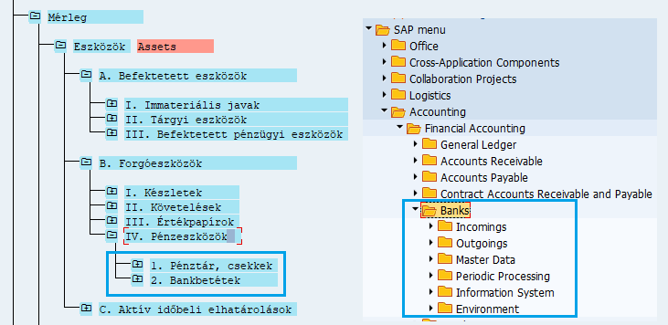
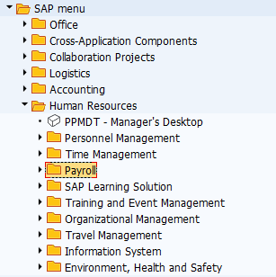
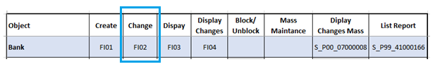

```{r setup, include=FALSE}
knitr::opts_chunk$set(echo = FALSE)
```


```{scss}
.underline {
    --line: blue;
    --color: blue;
    text-decoration: none;
    color: var(--color);
    position: relative;
    span {
        background-image: linear-gradient(0deg, var(--line) 0%, var(--line) 100%);
        background-position: 100% 100%;
        background-repeat: no-repeat;
        background-size: var(--background-size, 100%) 1px;
        transition: background-size .2s linear var(--background-delay, .15s);
        font-size: 16px;
        line-height: 20px;
        transform: translateZ(0);
    }
    svg {
        vertical-align: top;
        display: inline;
        line-height: 1;
        width: 13px;
        height: 20px;
        position: relative;
        left: -2px;
        fill: none;
        stroke-linecap: round;
        stroke-linejoin: round;
        stroke-width: 1px;
        stroke: var(--line);
        stroke-dasharray: 7.95 30;
        stroke-dashoffset: var(--stroke-dashoffset, 46);
        transition: stroke-dashoffset var(--stroke-duration, .15s) var(--stroke-easing, linear) var(--stroke-delay, 0s);
    }
    &:hover {
        --background-size: 0%;
        --background-delay: 0s;
        --stroke-dashoffset: 26;
        --stroke-duration: .3s;
        --stroke-easing: cubic-bezier(.3, 1.5, .5, 1);
        --stroke-delay: .195s;
    }
}

```


<link href="site_libs_toc/bootstrap-3.3.5/css/bootstrap.css" rel="stylesheet" />

<script src="site_libs_toc/jqueryui-1.11.4/jquery-ui.min.js"></script>
<link href="site_libs_toc/tocify-1.9.1/jquery.tocify.css" rel="stylesheet" />
<script src="site_libs_toc/tocify-1.9.1/jquery.tocify.js"></script>


<style>
@media (max-width: 768px) {
  .title~ a {
    display: none;
  }
}

.title+ a {
	color: white;
	background-image: linear-gradient(0deg, transparent 91%, rgb(32, 152, 209) 9%);
}

#algolia-autocomplete-listbox-0 h3 {
  color: black;
  text-decoration: unset;
}

.algolia-autocomplete {
  width: inherit;
  text-align: center;
  border: none;
}

.algolia-autocomplete .aa-input, .algolia-autocomplete .aa-hint {
	outline: none;
	border: none;
	height: 2em;
	top: -7px;
	width: 4em;
}

#distill-search::placeholder{
  color:transparent;
}

input[type="text"] {
	box-sizing: border-box;
	border: 2px solid #ccc;
	border-radius: 4px;
	font-size: 16px;
	background-color: white;
	background-image: url('https://upload.wikimedia.org/wikipedia/commons/thumb/7/7e/Vector_search_icon.svg/1200px-Vector_search_icon.svg.png');
	background-position: 3px 5px;
	background-repeat: no-repeat;
	padding: 14px 24px 14px 30px;
	-webkit-transition: width 0.4s ease-in-out;
	transition: width 0.4s ease-in-out;
	background-size: 25px;
}

.aa-suggestion {
  -webkit-transform: perspective(1px) translateZ(0);
  transform: perspective(1px) translateZ(0);
  box-shadow: 0 0 1px rgba(0, 0, 0, 0);
  text-align: justify;
}
.aa-suggestion:before {
  pointer-events: none;
  position: absolute;
  content: '';
  height: 0;
  width: 0;
  top: 0;
  left: 0;
  background: white;
  /* IE9 */
  background: linear-gradient(135deg, white 45%, #aaa 50%, #ccc 56%, white 80%);
  filter: progid:DXImageTransform.Microsoft.gradient(GradientType=0,startColorstr='#ffffff', endColorstr='#000000');
  /*For IE7-8-9*/
  z-index: 1000;
  box-shadow: 1px 1px 1px rgba(0, 0, 0, 0.4);
  -webkit-transition-duration: 0.3s;
  transition-duration: 0.3s;
  -webkit-transition-property: width, height;
  transition-property: width, height;
}
.aa-suggestion:hover:before, .aa-suggestion:focus:before, .aa-suggestion:active:before {
  width: 25px;
  height: 25px;
}


h3
	{margin-top:0cm;
	margin-right:0cm;
	margin-bottom:0cm;
	margin-left:0cm;
	text-indent:19pt;
	page-break-after:avoid;
	punctuation-wrap:simple;
	text-autospace:none;
	border:none;
	padding:0cm;
	font-size:9.0pt;
	font-family:"Arial Narrow",sans-serif;
	color:#00B050;
	text-decoration:underline;}

</style>


<body>

<div class="row">

<div class="column">
<button data-hypothesis-trigger style="font-size:17px;width: 100%;color: white;border-radius: 10px;">
<i class="far fa-sticky-note" style="font-size:20px"></i>
</button>

</div>

<div class="column">
<div class="custom-control custom-switch">
<button class="toggle_switch" style="font-size:24px; width: 100%;border-radius: 10px;">
<input type="checkbox" class="custom-control-input" id="darkSwitch">
<svg class="checkbox" xmlns="http://www.w3.org/2000/svg" style="isolation:isolate" viewBox="0 0 168 80">
<path class="outer-ring" d="M41.534 9h88.932c17.51 0 31.724 13.658 31.724 30.482 0 16.823-14.215 30.48-31.724 30.48H41.534c-17.51 0-31.724-13.657-31.724-30.48C9.81 22.658 24.025 9 41.534 9z" fill="none" stroke="#233043" stroke-width="3" stroke-linecap="square" stroke-miterlimit="3"/>
<path class="is_checked" d="M17 39.482c0-12.694 10.306-23 23-23s23 10.306 23 23-10.306 23-23 23-23-10.306-23-23z"/>
<path class="is_unchecked" d="M132.77 22.348c7.705 10.695 5.286 25.617-5.417 33.327-2.567 1.85-5.38 3.116-8.288 3.812 7.977 5.03 18.54 5.024 26.668-.83 10.695-7.706 13.122-22.634 5.418-33.33-5.855-8.127-15.88-11.474-25.04-9.23 2.538 1.582 4.806 3.676 6.66 6.25z"/>
</svg>
</button>
</div>
</div>

</div>


<h1>**Bevezetés**</h1>

**Köszönetnyilvánítás.** A tantárgy a Pécsi Tudományegyetem
Természettudományi Kar, a PTE TTK Szentágothai Szakkollégium és a
Közgazdaságtudományi Kar Pénzügy és Számviteli Intézet támogatásával
jött létre. A tantárgy indításában köszönet illeti meg a
Természettudományi Kar oktatási dékánhelyettesét, dr. habil. Trócsányi
András egyetemi docenst, dr. Hatvani Zsolt szakkollégium igazgatót, és
dr. habil. Pauler Gábor egyetemi docenst, SAP tantárgyfelelőst,
valamint Meisl Gábor tanár urat. Szintén köszönet illeti a
Közgazdaságtudományi Kar Pénzügy és Számviteli Intézet oktatóit a
tantárgy befogadásáért, különösen Balogh Virgínia tanárnőt a szeminárium
menedzselésében.


**A tantárgy teljesítése.** A tantárgy rendszeres, aktív órai
részvétellel, órai munkával és a házi feladatok megoldásával, illetve az
ezekből származó pontok szerzésével teljesíthető.

**Határidők.** 2021. február 13-ig mindenkinek csapatot kell
választania, és be kell jelentkeznie az SAP rendszerbe.

**A tantárgy célja.** A szeminárium elsődleges célja az SAP-s
felhasználói szintű, gazdasági munkakörök betöltésének megalapozása.
Álláspontom szerint a PTE Közgazdaságtudományi Kar képzésein szerezhető
magas színvonalú, versenyképes tudásra épített SAP vállalatirányítási
rendszer ismerete lehetővé teszi a szakmai gyakorlatok, gyakornoki
programok, valamint belépő szintű pozíciók sikeres megpályázását. A
minőségi pozíciókra kiírt álláshirdetések gyakran fogalmazzák meg
elvárásként az SAP ismereteket. Tekintettel arra, hogy a felsőoktatási
versenyben más intézmények ezt felismerték az álláspályázatok során jó
eséllyel olyan pályázókkal kell versenyezni, akik ilyen tudással
rendelkezhetnek. Annak érdekében, hogy más egyetemeken végzett
hallgatókkal szemben eredményesen lehessen fellépni egy-egy pozíció
elnyeréséért, kulcsfontosságúnak tartom az elméleti alapozottságú,
gyakorlati megközelítésű SAP ismereteket.

**Tantárgy szakirodalma.** A tantárgyhoz egy elektronikus tananyag
fejlesztése zajlik a PTE TTK keretében, dr. Pauler Gábor szakmai
felügyeletével. A tananyag jellegzetessége, hogy tartalmát tekintve nem
zárt és statikus jellegű, hanem dinamikus ezért az újabb tudáselemek
megjelenésével folyamatosan bővül és módosul. Az elektronikus tananyag
nem vállalkozik azonban a részletes monográfiák idézésére. Ezért a
vállalatirányítási rendszerek, a beszerzési folyamatok és a számviteli
ismeretek tekintetében az alábbi könyvek elolvasása javasolt
(erőteljesen). Az elektronikus tananyagban elhelyezem, hogy az adott
részhez melyik fejezetet szükséges elolvasni. Ezek elolvasása szükséges
az órai programhasználat szakmai / tartalmi dimenziójának megértéséhez.

**Tarcsi Ádám, Molnár Bálint: Vállalatirányítási rendszerek gazdaságinformatikai megközelítésben (SAP).** 
ELTE Társadalomtudományi Kar, 2011. Elérhető:
<a href="https://regi.tankonyvtar.hu/hu/tartalom/tamop412A/2011-0052_40_vallalatiranyitasi_rendszerek_gazdasaginformatikai_megkozelitesben/index.scorml" class="underline">
<span>VÁLLALATIRÁNYÍTÁSI RENDSZEREK GAZDASÁGINFORMATIKAI MEGKÖZELÍTÉSBEN</span>
<svg viewBox="0 0 13 20"><polyline points="0.5 19.5 3 19.5 12.5 10 3 0.5" /></svg>
</a>
(2021. 02. 04.)

**Takács András, Márkus Gábor: Számviteli alapismeretek.** 
PTE Közgazdaságtudományi Kar. Pécs, 2019. Elérhető:
<a href="https://digitalia.lib.pte.hu/hu/pub/takacs-a-markus-g-szamviteli-alapismeretek-pte-ktk-pecs-2019-4393" class="underline">
<span>SZÁMVITELI ALAPISMERETEK</span>
<svg viewBox="0 0 13 20"><polyline points="0.5 19.5 3 19.5 12.5 10 3 0.5" /></svg>
</a>
(2021. 02. 04.)

**[Beszerzési részhez (ajánlott):]{.ul}**

-   **P. K. Agrawal:** **SAP MM Purchasing: Technical Reference and
    Learning Guide.** PHI Learning Private Limited. Delhi, 2014. 912. p.
    13 Euróért elérhető E-bookként. (Ebben a könyvben minden benne van,
    ami felhasználói és rendszerbeállítás szintjén előfordul a
    beszerzési modulban, (személyes véleményem szerint ennyi pénzért
    kiemelt mértékben megéri.) Megvásárolható:
<a href="https://www.amazon.com/SAP-MM-PURCHASING-TECHNICAL-REFERENCE-ebook/dp/B00LPGBWX2/ref=sr_1_4?crid=2ZAJO773J9HX9&dchild=1&keywords=sap+purchasing&qid=1610966550&sprefix=sap+purchase%2Caps%2C483&sr=8-4" class="underline">
<span>SAP MM PURCHASING TECHNICAL REFERENCE</span>
<svg viewBox="0 0 13 20"><polyline points="0.5 19.5 3 19.5 12.5 10 3 0.5" /></svg>
</a>
 (2021. 02. 04.)

**[Financial Accounting modulhoz (ingyenesen elérhető szakkönyvek):]{.ul}**

-   **FICO Team GCL & PETL: SAP-FI-CO User Manual.** Greaves Cotton
     Limited & Premium Energy & Transmissions Limited. Mumbai, 2009.Elérhető:
<a href="https://sapfidocz.files.wordpress.com/2013/01/sap-fico-complete-end-user-manual-realtime-project.pdf" class="underline">
<span>SAP-FI-CO MANUAL</span>
<svg viewBox="0 0 13 20"><polyline points="0.5 19.5 3 19.5 12.5 10 3 0.5" /></svg>
</a>
(2021. 02. 04.)

-   **Jayachandran KS MBA (Fin), SAP FI: SAP FICO User Guide.** Flemingo
     International Limited. 2010. Elérhető: 
<a href="https://www.academia.edu/8036298/SAP_FICO_USER_GUIDE" class="underline">
<span>SAP FICO USER GUIDE</span>
<svg viewBox="0 0 13 20"><polyline points="0.5 19.5 3 19.5 12.5 10 3 0.5" /></svg>
</a>
 (2021. 02. 04.)
 

- 
<a href="https://erproof.com/fi/free-training/" class="underline">
<span>ERPROOF FREE TRAINIG</span>
<svg viewBox="0 0 13 20"><polyline points="0.5 19.5 3 19.5 12.5 10 3 0.5" /></svg>
</a>
 (2021. 02. 04.)

-   **Saját tananyag:**
<a href="https://github.com/cssz98/sap_rdistill" class="underline">
<span>GitHub</span>
<svg viewBox="0 0 13 20"><polyline points="0.5 19.5 3 19.5 12.5 10 3 0.5" /></svg>
</a>

**A tantárgy tartalma, kiegészítések.** A szeminárium a beszerzési
folyamatokra, a szállítói modulra, valamint a főkönyvi lekérdezések
alapszintű bemutatására vállalkozik. Emellett érdeklődés esetén
közreadhatok bankra, házi pénztárra és tárgyi eszközre vonatkozó magyar
nyelvű, SAP tanácsadó irodák által készített anyagokat.

**Tantárgy eddigi eredményei.** A 2020/21-es tanév őszi szemeszterében
megvalósult SAP Financial Accounting képzés segítségével egy hallgató
helyezkedett el egy német vállalatcsoport magyarországi vállalatában SAP
könyvelő gyakornoki pozícióban.

**Miért SAP?** Hazánkban az SAP az 1990-es évektől, a német működő tőke
beérkezésével jelent meg. Elsőként a nagy autóipari összeszerelők és
gyártók, majd azok beszállítóinak megérkezése révén terjedt. A működő
tőke közvetett tudástranszfere hatására a hazai, illetve a magyar
tulajdonú beszállítók is ezt a rendszert kezdték használni annak
érdekében, hogy versenyképességüket emeljék. Az SAP a szolgáltatási
szférába és a közszférába is átlépett, tehát gyakorlatilag minden
szektort lefedett. Más tekintetben az SAP nem egy dobozos szoftver,
hanem olyan platform, amelynek alapfolyamataira vállalatspecifikus
megoldások fejleszthetők, és a fejlesztésekben, illetve a folyamatos
optimalizálásban, jogszabályi harmonizációban jelentős pénzügyi
lehetőségek vannak. A fejlesztéseket közel 20 SAP tanácsadó cég végzi,
ezek a cégek gyakran hirdetnek gyakornoki programot, amelyhez alaptudás
birtokában érdemes csatlakozni (SAP Hungary Kft.; ERP Consulting Zrt.;
itelligence Hungary Kft.; BSIS9 Kft.; Onespire Zrt.; BCS Business
Consulting Services Kft.

**SAP, vagy ERP tudás.** A szeminárium során SAP vállalatirányitási
rendszer egyes területeinek használatát lehet alapszinten elsajátítani.
A programhasználati ismeretek azonban viszonylag könnyen konvertálhatók
más fejlett vállalatirányítási ERP rendszerbe, különösen MS Dynamics
Axapta 2012 és Oracle rendszerekbe. Ennek alapja az, hogy az órán
tanulandó felhasználói ismeretek standard és szabvány üzleti megoldások,
illetve standard üzleti megoldásokon alapulnak. A tranzakciók alapjai
70%-ban azonosak a három rendszerben.

**SAP rendszereket használnak az alábbi vállalatok a teljesség igénye
nélkül:**

ALTEO Nyrt., AUDI HUNGARIA Zrt., AVL Hungary Kft., BAT,
\'\'BALLUFF-ELEKTRONIKA\'\' Kft. BESSER HUNGARIA Kft., BioCo
Magyarország Kft., Bonafarm, BOS Magyarország Bt., Bosch Csoport,
Budapest Consultans Kft., Chinoin Zrt. / SANOFI AVENTIS, Continental
Automotive Hungary Kft., Dana Hungary Gyártó Kft., DMRV Zrt., ELTER
Világítás Kft., Experis, FCA Central and Eastern Europe Kft., FEJÉRVÍZ
ZRt., \'FHL BJÖRN HUNGARY\'\' Kft., FŐTÁV ZRt., Gentherm Hungary Kft.,
Givaudan Hungary Kft., Grafton Recruitment, Harman Becker Kft., Hauni,
Hydro Extrusion Hungary Kft., IMPC Personnel Hungária Kft., ISD DUNAFERR
Zrt., Jabil Circuit Magyarország Kft., Jacobs Douwe Egberts HU Zrt.,
Karrier Hungária Kft., Kayser Automotive Hungária Kft., KNORR-BREMSE
Hungária Kft., KPMG Global Services Hungary Kft., KUKA Robotics Hungária
Kft., Media Markt Saturn Hold.Magyo.Kft., Mercedes-Benz Manufacturing
Hungary Kft., MP Solutions Kft., MTB Magyar Takarékszövetkezeti Bank
Zrt., Nitrogénművek Zrt. , Óbudai Egyetem, OTP Bank Nyrt., PAYER
INDUSTRIES HUNGARY Kft., Profession Services, Raiffeisen Bank Zrt.,
Reményi Csomagolástechnika Kft., Richter Gedeon Nyrt., SAMSUNG SDI
Magyarország Zrt., Schindler Hungária Kft., SCHMITZ CARGOBULL
MAGYARORSZÁG Kft. , Siemens Healthcare Kft., Sofidel Hungary Kft.,
Tech-Con Hungária Kft., Testo kft., Thermo Fisher , thyssenkrupp
Components Technology Hungary Kft., Tiszamenti Regionális Vízművek Zrt.,
TS Hungaria Kft., UPS Healthcare Hungary Zrt., Villeroy & Boch
Magyarország Kft., Vitesco Technologies Hungary Kft., Waberer\'s
International Nyrt., WALLACE & WEBB Kft., Wienerberger Zrt., WIZZ Air
Hungary Zrt., ZOLLNER Kft, Zöld-Ker Kft.

**SAP rendszert nagy valószínűséggel használó, 500 fő feletti
feldolgozóipari nagyvállalatok területi elhelyezkedése és adatbázisa.**


```{r}
knitr::include_url("https://drlendvaitamas2.maps.arcgis.com/apps/webappviewer/index.html?id=4003254591f94cc4bd3b919c1d3c131b")
```

<figcaption>
<a href="https://drlendvaitamas2.maps.arcgis.com/apps/webappviewer/index.html?id=4003254591f94cc4bd3b919c1d3c131b" class="underline">
<span>
500 fő feletti, feldolgozóiparban, külföldi tőkével működő nagyvállalatok területi elhelyezkedése (2020. 07. állapotok szerint)
</span>
<svg viewBox="0 0 13 20"><polyline points="0.5 19.5 3 19.5 12.5 10 3 0.5" /></svg>
</a>
</figcaption>


**A tantárgy megközelítése és feldolgozása.** A szeminárium felhasználói
megközelítésben dolgozza fel a beszerzési folyamatok és a szállítói
modul használatát. Az álláshirdetések és a gyakornoki programok ismerete
alapján a beszállítói folyamatok és a szállítói modul jelenti a belépési
pontot, tehát feldolgozására került a hangsúly.

**SAP verzió és jogosultság.** A szeminárium során a Természettudományi
Kar fenntartásában és előfizetésében lévő SAP ERP R/3-as IDES (demó)
rendszer használatára van lehetőség SAP Super User jogosultság mellett
(tehát minden standard felhasználói és rendszerbeállítási művelet
elérhető).

**SAP oktatás rövid története a PTE TTK-n.**

-   Dr. Pauler Gábor habil. egyetemi docensnek köszönhetően 2009-ben
    indult a Pollack Mihály Műszaki Főiskolán hallgatói kezdeményezésre,
    az ELTE SAP Excellence center szakmai segítségével

-   2011-ben átkerült a TTK-ra, elsőként a Szentágothai Szakkollégium
    kurzusaként indult

-   2014 tavaszán indult az ITSH finanszírozásában (4.5MFt) az első SAP
    szuperkurzus a TTK-n

-   Az ITSH támogatása megerősítette az SAP oktatás kari pozícióját

-   2015-ben indult az ITSH finanszírozásában a második SAP szuperkurzus
    a TTK-n.

-   2014-től szerepel az SAP a kötelező tantárgyak között
    (gazdaságinformatikus, programtervező)

-   2011-2020 között 60 hallgató tudott SAP karrierben elhelyezkedni

-   2011-2020 között számos SAP rész került szakkollégiumi tantárgyként
    oktatásra

**A PTE TTK SAP oktatói.** Az SAP tantárgyfelelőse dr. Pauler Gábor
habil. egyetemi docens, aki a logisztikai, beszerzési, gyártási, és
raktármenedzsment részt oktatja. Meisl Gábor az SAP programnyelvét az
ABAP-ot oktatja, illetve a SECATT folyamat optimalizálást.

**A tantárgy keretében szerezhető tudással megpályázható szintek.**
Tekintettel arra, hogy a tantárgy a beszerzési és szállítói modulok
alapszintű használatát mutatja be, egyes esetekben részletesen,
elsősorban a belépő szintű felhasználói munkakörökre készít fel.
Elhelyezkedés tekintve elsősorban Magyarországon működő feldolgozóipari
tőkeerős közép- és nagyvállalatok, valamint a világ más részén működő
feldolgozóipari vállalatainak kiszolgálására létrehozott (Shared Service
Center) központokban. Valószínűsíthetően a pozíciókban néhány tranzakció
napi szintű ellátása lesz a feladat. Az álláshirdetések meghatározó
részét ismerve elmondható, hogy a könyvelőirodás munkaköröktől eltérően
az all-in-one mindenre kiterjedő tudás helyett, egy-egy feladatcsoportra
történő specializálódás figyelhető meg a kezdő pozíciók esetében.
Emellett természetesen jelen vannak a komplex munkakörök (szállító,
bank, vevő), de ezek inkább a tapasztalattal már rendelkező
munkavállalóknak reálisak. A munka mennyisége alapján azonban 1-1
(rész)modul ellátása is elegendő feladatot tartalmaz. Az alábbiakban
olvasható néhány felhasználói szintű, specializált SAP-s munkakör. A
feldolgozóipari vállalatok esetében lehet tisztán adminisztrációs
munkakör és lehet olyan munkakör, amelynek az adminisztráció csak egy
részét képezi. A Shared Service Center előnye, hogy viszonylag könnyen
be lehet kerülni, és egy multis karriert lehet megalapozni vele.

**Néhány feldolgozóipari beszerzési munkakör:**


```{r,dpi=60,fig.align='center'}
knitr::include_graphics("images/intro/image2.png")
```

```{r,dpi=60,fig.align='center'}
knitr::include_graphics("images/intro/image3.png")
```


```{r,dpi=60,fig.align='center'}
knitr::include_graphics("images/intro/image4.png")
```

**Néhány kiszervezett (Shared Service) munkakörre vonatkozó olyan
álláshirdetés, amely a beszerzés és a szállítói modul tartalmát fedi
le. **

```{r,dpi=60,fig.align='center'}
knitr::include_graphics("images/intro/image5.png")
```

```{r,dpi=60,fig.align='center'}
knitr::include_graphics("images/intro/image6.png")
```


<h1>**SAP számviteli felépítésének alapjai I.**</h1>


Az SAP és szinte bármely kettős könyvvitelre alkalmas közép- és
nagyvállalati rendszer párhuzamosan használja a szintetikát és az
analitikát. Ezen a helyen nem célunk ezek tartalmát részletezni (lásd
ezzel kapcsolatban: Takács & Márkus, 2019), kizárólag alapszinten
vázoljuk fel a leginkább fontosnak tartott szempontokat.

**Az analitika általános ismérvei.** A vagyonrészek részletes
nyilvántartását részmodulok és segédkönyvek végzik, amelyek kapcsolatban
állnak a szintetikus könyvelést végző főkönyvvel. A segédkönyvek a
főkönyvbe, illetve a főkönyvi számlákra adnak fel rendszeresen
értékeket. Az analitika feladata az egyes vagyonrészek részletes
nyilvántartása, segédkönyvek / segédnaplók és segédszámlák
használatával. Az analitikus elszámolás mennyiségben, értékben, illetve
mennyiségben és értékben történhet. Alapszabály, „hogy az analitikus
nyilvántartásnak mindig meg kell egyeznie a szintetikával, tekintettel
arra, hogy a könyvelési adatok a szintetikába az analitikából kerülnek
be feladások segítésével, kivéve azokat a gazdasági eseményeket, ahol
nincsen szükség analitikus nyilvántartásra." (Lukács, 2016, 22. o.) Az
analitikus nyilvántartás egyik segédeszköze a leltározás.

**Az analitika feladata.** Megállapítható, hogy „a számviteli
információrendszer legfontosabb inputjai az elsődleges bizonylatok,
melyek feldolgozását elsőként az analitikus nyilvántartás végzi el."
(Takács & Márkus, 2019, 92. o.) Az analitikához kapcsolódó segédkönyv
feladata a bizonylatok érkeztetése, rögzítése és feldolgozása mellett a
különböző szempontok szerint összeállított kimutatások előállítása.
Lényeges, hogy az analitikát „nem egyetlen homogén rendszerként kell
értelmezni, hanem különböző területeket átölelő alrendszerek
halmazaként. Az analitika konkrét formájának és szerkezetének
kialakítása a gazdálkodó egység hatásköre. A gyakorlati tapasztalatok
alapján az analitika legalább a következő alrendszereket foglalja
magában." (Takács & Márkus, 2019, 92. o.)

Takács András és Márkus Gábor munkája alapján megállapíthatjuk, hogy az
elsődleges bizonylatok, illetve azok feldolgozása alapján az analitikus,
részletező nyilvántartás a feladások alapján juttatja az érték szerinti
adatokat a főkönyvnek. (Takács & Márkus, 2019, 92. o.)


```{r,dpi=60,fig.align='center'}
knitr::include_graphics("images/intro/2/image1.png")
```


**Az alábbiakban a mérlegcsoportok („A" típusú mérlegösszeállítás)
szerint haladunk.** A bal oldali képernyőfelvétel a vagyonrész
mérlegbesorolását, a jobb oldali a vagyonrészhez kapcsolódó analitikus
nyilvántartást és segédkönyveket tartalmazó felhasználói modult
tartalmazza.

**A/I. és A/II.** **A befektetett eszközök közül az immateriális javak
és a tárgyi eszköz**ök könyvelését, adminisztrációját,
értékcsökkenésének számítását, stb. a pénzügyi számvitel (Financial
Accounting) modul tárgyi eszközök (Fixed Asset) részmodulban tudjuk
elvégezni. Az SAP rendszer külön tartja nyilván a befejezetlen beruházás
és a befektetett eszközök csoportjait. A befektetett eszközök
tekintetében kiemelten lényeges az eszközök azonosító adatainak,
bekerülési értékének (a költségek szétosztásának), az aktiválás
időpontjának tárolása. Emellett meghatározó jelentőségű az
értékcsökkenés számításának és az állományváltozásból adódó értékeknek a
felvezetése a főkönyvi számlákra.

```{r,dpi=60,fig.align='center'}

```


A szeminárium során nem vesszük a tárgyi eszközök modult, azonban két,
SAP tanácsadó irodától származó magyar nyelvű leírásom, és egy angol
nyelvű rendszerbeállítási monográfiával rendelkezem. A tárgyi eszköz
könyvelésével összefüggésben van a beruházás menedzsment modul.

```{r,dpi=60,fig.align='center'}

```


**A/II/1.** **A tárgyi eszköz közül az ingatlanok** részletes
könyvelését az ingatlankezelő modulok segítik (Real Estate Mgmt.;
Flexible Real Estate Mgmt.).

```{r,dpi=60,fig.align='center'}
knitr::include_graphics("images/intro/2/image4.png")
```


**A/III. Befektetett pénzügy eszközöket (és a vállalat teljes pénzügyi
rendszerét)** a pénzügyi ellátás lánc modul (Financial Supply Chain
Management), és annak részmoduljai, köztük a pénzügyi és kockázatkezelő
modul (Treasury and Risk Management) támogatja. A modul kiemelten
összetett, gyakorlatilag SAP az SAP-ban jellegű. Alapvető feladata a
gazdasági szervezet hosszú- és rövid lejáratú követeléseinek és
kötelezettségeinek, illetve az e mögött álló üzleti kapcsolatoknak a
részletes nyilvántartása, menedzselése.

```{r,dpi=60,fig.align='center'}
knitr::include_graphics("images/intro/2/image5.png")
```


A befektetett pénzügyi eszközökben és a hosszú lejáratú kötelezettségben
szereplő lízing nyilvántartását a lízing könyvelési (Lease Accounting)
modul végzi.

```{r,dpi=60,fig.align='center'}
knitr::include_graphics("images/intro/2/image6.png")
```


**B/2. Forgóeszközökön belüli készleteket**, a tárgyi eszközökre, és az
5-ös számlaosztályra is vonatkozó beszerzési folyamatokat az
anyaggazdálkodás modul (Materials Management) kezeli. A modulban
található Service Master viszont az 5-ös számlaosztály költségnemeire
beszerezhető szolgáltatásokat tartalmazza.

```{r,dpi=60,fig.align='center'}
knitr::include_graphics("images/intro/2/image7.png")
```

Az analitikus feladatok elvégző modul legfontosabb feladata a vásárolt
anyag- és árukészletekről részletező nyilvántartást vezetni. Erről a
későbbiekben részletesen írunk.

**B/IV. Pénzeszközök mindennapi** könyvelési műveleteit a bank modul
(Banks) tartalmazza. A modul a pénztár készpénzállományának, valamint a
pénzintézeti bankszámlákat kezeli. Különösen lényeges a kimenő és bejövő
utalások nyilvántartása, könyvelése, és a bankszámlakivonatok
feldolgozása.

```{r,dpi=60,fig.align='center'}

```


**B/II/1. Áruszállításból és szolgáltatásokból** származó követelések
analitikus nyilvántartását a vevői modulban (Account Receivable)
vezetjük.

```{r,dpi=60,fig.align='center'}

```


**F/III/4. Kötelezettségek \\ Rövid lejáratú kötelezettségek \\
Kötelezettségek áruszállításból és szolgáltatásból.**

```{r,dpi=60,fig.align='center'}
knitr::include_graphics("images/intro/2/image10.png")
```


**5-ös számlaosztályra** a dolgozók bérét a bérszámfejtési modullal
(Payroll) tudjuk előállítani.


```{r,dpi=60, fig.align='center'}

```


**Az analitikus könyvelés** fenti alrendszerei a számviteli törvényben
rögzített egyedi értékelés elve szerint „minden egyes vagyonelemről
egyedi, külön nyilvántartást vezet." Az SAP minden egyes vagyonelemről
létrehoz egy nyilvántartólapot, amelyen a jogszabályokban meghatározott
adatkörök szerepelnek, „az egyedi értékelés elve bizonyos esetekben
sajtosan érvényesül, hiszen néhány speciális esetben (például
készleteknél, tárgyi eszközöknél, vagy értékpapíroknál, ahol nagy
mennyiségű, de teljesen azonos paraméterekkel rendelkező eszközről van
szó) a csoportos nyilvántartás is megfelel az egyedi értékelés elvének."
(Takács & Márkus, 2019, 94. o.)

**Szintetikus könyvelés.** A segédkönyvekből és modulokból történő
feladások alapján „a gazdasági események hatásai a szintetikus
nyilvántartásban (szintetikában) is rögzítésre kerülnek. A szintetikus
nyilvántartás gyakorlatilag a kettős könyvvitel szabályai szerinti
könyvelést jelenti ... A beszámoló összeállításának elsődleges
információforrását a szintetika képezi, hiszen a legfontosabb
kimutatások (a mérleg és az eredménykimutatás) a naprakész kettős
könyvvitel információiból állíthatók össze. Ugyanakkor a beszámoló
bizonyos részeinek (különösen a szöveges, tájékoztató jellegű részek)
összeállításához nélkülözhetetlenek az analitikából származó eredeti
adatok." (Takács & Márkus, 2019, 91-92. o.) Fogalmi meghatározás
szintjén megállapítható, hogy a **„**szintetika, azaz a főkönyvi
nyilvántartás a kettős könyvviteli szabályok szerinti könyvelést,
valamint az ehhez kapcsolódó összesítő-ellenőrző feladatokat foglalja
magában. A szintetika szintjén minden növekedés és csökkenés pénzértéken
kerül kimutatásra. Legfőbb feladata, hogy beszámolóban szereplő
kimutatások összeállításához közvetlenül felhasználható információkat
állítson elő. A szintetikus nyilvántartás csak akkor lehet korrekt, ha a
háttérben pontos és naprakész analitikus adatok állnak rendelkezésre."
(Takács & Márkus, 2019, 96. o.) Forrását tekintve megállapítható, hogy A
zárlati teendők után a szintetika és az analitika együttesen már képes a
beszámoló elkészítéséhez igényelt valamennyi információt szolgáltatni.
Adatforrását tekintve megállapítható, hogy a „szintetika
információbázisát ... az analitikából érkező feladások képezik. A
feladások alapján a gazdasági események folyamatosan rögzítésre
kerülnek, számlasoros és idősoros könyvelés formájában is. Az évközi
könyvelést az üzleti év végén a könyvviteli zárlat teszi teljessé. A
könyvviteli zárlat magában foglalja különböző év végi rendező/pontosító
tételek elszámolását, összesítő kimutatások elkészítését, valamint a
technikai zárást. A zárlati teendők után a szintetika és az analitika
együttesen már képes a beszámoló elkészítéséhez igényelt valamennyi
információt szolgáltatni.

**SAP rendszerben a szintetikus könyvelés** részeként főkönyvi számlák
között értékeket a főkönyvi modulban tudunk mozgatni, illetve szintén a
főkönyvi modulban tudunk kimutatásokat készíteni.

{width="4.458333333333333in"
height="2.4791666666666665in"}


<h1>**[SAP használat alapjai]{.ul}**</h1>

A PTE Természettudományi Kar, illetve a szeminárium keretében elérhető
SAP ERP R/3-as rendszerben az alábbi modulok, illetve az azokhoz
kapcsolódó tranzakciók érhetők el Super User megközelítésben, tehát
teljes funkcionalitásukban (felhasználói és rendszerbeállítási szinten).


```{r,dpi=50,fig.align='center',fig.cap='https://www.hipfunggroup.com/sap-erp-system/ (2021. 02.10.)'}
knitr::include_graphics("images/intro/intro_sapbasics/media/image1.jpeg")
```


Ezekből a modulokból a Materials Management, a Financial Accounting és a
Controlling modulok részmoduljaiba tartozó tranzakciókat fogjuk
használni.

Az egyes modulokba tartozó tranzakciók, intéző nézetben elérhető
mappákban (Folder) vannak tárolva.


```{r,dpi=60,fig.align='center'}
knitr::include_graphics("images/intro/intro_sapbasics/media/image2.png")
```


Felmerülhet a kérdés, hogy az adott specializált SAP-s munkakörök milyen
összefüggésben vannak az elérhető mappákkal és tranzakciókkal. A
kérdéssel kapcsolatban megállapítható, hogy a munkakörök és az azokban
lévő feladatok nagy mértékben meghatározzák az intéző menüpont tartalmi
felépítését. Ezt az Other menu kapcsolóval, illetve szerepek megadásával
lehet szemléltetni.

{width="6.302083333333333in"
height="0.78125in"}

**[AIS_APAY_CLERK_US00 Szállítói számla könyvelő]{.ul}**

{width="6.291666666666667in"
height="2.6770833333333335in"}

**[Role VS:: AIS_AR_CLERK_US00 Vevői számla könyvelő]{.ul}**

{width="6.302083333333333in"
height="2.6770833333333335in"}

**[Role VS::FI_AA_ASSET_TRANSACTIONS Tárgyi eszköz könyvelő]{.ul}**

{width="6.291666666666667in"
height="4.4375in"}

Ezek és az ezekhez hasonló szerepek jogosultságokban tárgyiasulnak.
Adott felhasználók jogosultságcsoporthoz tartoznak, és kizárólag a
munkakörök szempontjából releváns mappákat láthatják, illetve a
feladataikhoz szükséges tranzakciókat használhatják.

**[Intézőnézet felépítése:]{.ul}**

{width="6.3in"
height="5.954861111111111in"}

Az intézőből tranzakciók érhetőek el. A tranzakciók mezőkből felépített
űrlapokat tartalmaznak. Az egyes mezők és azok értékei pedig
adattáblákban helyezkednek el. A tranzakciók jellegük és tartalmuk
alapján különböző típusba sorolhatók. Az alábbiakban a törzsadatokra és
a folyamatokra vonatkozó tranzakciók között teszünk különbséget.

**Törzsadatok (Master Data):** SAP rendszerben (és más
vállalatirányítási rendszerekben) a törzsadatok jellemzően az üzleti
folyamatok konstans, nagyrészt állandó jellegű objektumaihoz
kapcsolódnak. A törzsadatok értékei általában hosszú időtávra
vonatkoznak, és összességükben ritkán változnak. Informatikai értelemben
egy-egy objektumosztályba sorolható objektum tulajdonságait írják le.
Jellemző törzsek lehetnek a szállítók, vevők, üzleti partnerek,
bankfiókok, készletbe tartozó anyagok, áruk, a befektetett eszközök közé
sorolható immateriális javak, tárgyi eszközök, befektetett pénzügyi
eszközök. A törzsadatokkal az alábbi műveletekre van lehetőség: egyedi
felvitel, egyedi megtekintés, egyedi módosítás, módosítások egyedi és
tömeges megtekintése, táblázatszerű tömeges megtekintés és módosítás,
listaszerű riportok. Ezeket a funkciókat az alábbi táblázat tartalmazza
rendszerezetten:


```{r,dpi=50,fig.align='center',fig.cap='Saját szerkesztés (Lendvai Tamás)'}
knitr::include_graphics("images/intro/intro_sapbasics/media/image8.png")
```


Amint a szöveges részben is írtuk, illetve a 2-es számú táblázatból is
látható, az egyes törzsadatokra vonatkozó tranzakciók sematikusak,
sablonosak abban a tekintetben, hogy a létrehozás (Create), a módosítás
(Change), a megtekintés (Display), a változások egyedi megtekintése
(Display Changes), tömeges megtekintés és karbantartás (Mass Maintance)
és a listariportok (List Ereport) valamennyiükre vonatkoznak.

**Folyamatadatok (Process Transaction):**

Kidolgozás alatt

A **félvés első részében** a fenti táblázatban szereplő törzsadatokra
vonatkozó alapműveletek alapszintű használatát fogjuk elsajátítani.

**[Kezdő feladat:]{.ul}**


```{r,dpi=60,fig.align='center'}

```


Az első feladatunkban fel kell vinni (FI02), meg kell tekinteni (FI03,
S_P00_07000008), és riportálni kell bankfiókadatokat. Bankfiókadatokra a
szállítók, vevők, és az üzleti partnerek törzsadataiban lesz szükség.
Bankfiókadatok nélkül nem tudunk rögzíteni bankszámlaszámot.

**1. Lépés:** Other menu \\ SAP_FI_BL_BANK_MASTER_DATA (másoljuk ki)
Maintaining Bank Master Data

Az 1. lépés megtétele opcionális, és ki lehet keresni a tranzakciókat a
szokásos elérés alapján is. A role kiválasztását azért tartjuk
lényegesnek, mert így látni lehet, hogy adott SAP-s munkakörök milyen
jellemző feladatokat tartalmaznak, illetve világossá válik a szerepek és
az intéző nézet közötti összefüggés.

{width="6.302083333333333in"
height="2.5625in"}

{width="3.441626202974628in"
height="1.7291666666666667in"}

{width="4.083333333333333in"
height="3.709909230096238in"}

A szerep kiválasztásának hatására az intézőben kizárólag a bankfiók
törzsadataival összefüggésben lévő műveletek találjuk meg.

**[2. Lépés: Hozzunk létre egy új bankfiók törzsadatot (FI01)]{.ul}**

Amennyiben nem a szerepek kiválasztásával kívánjuk limitálni a listát,
úgy a banki törzsekre vonatkozó tranzakciók elérhetők az alábbi úton is.

<div class="zoom">

```{r,dpi=50,fig.align='center'}
knitr::include_graphics("images/intro/intro_gif/Bank_route.gif")
```

</div>

**Az elérhető tranzakciók közül az alábbiak használatát tekintjük át.**


```{r,dpi=60,fig.align='center'}
knitr::include_graphics("images/intro/intro_sapbasics/media/image13.png")
```


A törzsadatok feltöltéséhez nyissuk meg az alábbi táblázatot:

A feladat a következő. Mindenki talál a neve mellett olyan banki
adatokat, amelyek nem szerepelnek még az SAP adatbázisban. Nyissuk meg
az FI01-es tranzakciót, és elsőként adjuk meg az országot HU, majd az A
oszlopban található 8 számból álló bankfiók kódot (Branch office code)
Bank Key-ként, majd enter.

{width="2.409448818897638in"
height="1.125in"}

Ezt követően értelemszerűen töltsük ki az űrlapot.

{width="6.3in"
height="5.144132764654418in"}

Ezt követően kattintsunk a lemez ikonra és mentsük el. Fogunk kapni egy
értesítés a bal alsó sarokban, hogy sikerült a mentés.

{width="2.2916666666666665in"
height="0.4583333333333333in"}

**FI02 - Módosítás**


```{r,dpi=60,fig.align='center'}

```


<div class="zoom">
```{r,dpi=50,fig.align='center'}

```


</div>

**FI03 -- Megtekintés (Display)**


```{r,dpi=60,fig.align='center'}
knitr::include_graphics("images/intro/intro_sapbasics/media/image18.png")
```


<div class="zoom">

```{r,dpi=50,fig.align='center'}

```
</div>

**FI04 Változások egyedi megtekintése (Display Changes)**


```{r,dpi=60,fig.align='center'}
knitr::include_graphics("images/intro/intro_sapbasics/media/image19.png")
```


<div class="zoom">

```{r,dpi=50,fig.align='center'}

```

</div>

**S_P00_07000008 -- Változások tömeges megtekintése (Display of Bank
Changes)**


```{r,dpi=60,fig.align='center'}
knitr::include_graphics("images/intro/intro_sapbasics/media/image20.png")
```


<div class="zoom">


```{r,dpi=50,fig.align='center'}
knitr::include_graphics("images/intro/intro_gif/S_P00_07000008_Display_of_Bank_Changes.gif")
```

</div>


**S_P99_41000166 -- Bankok listaszerű lekérdezése (Display Bank
Directory)**


```{r,dpi=60,fig.align='center'}
knitr::include_graphics("images/intro/intro_sapbasics/media/image21.png")
```


<div class="zoom">

```{r,dpi=50,fig.align='center'}

```

</div>


<script src="js/dark-mode-switch.min.js"></script>

<script>
$(function() {
    $("#TOC").tocify();
});
              
</script>

</body>
