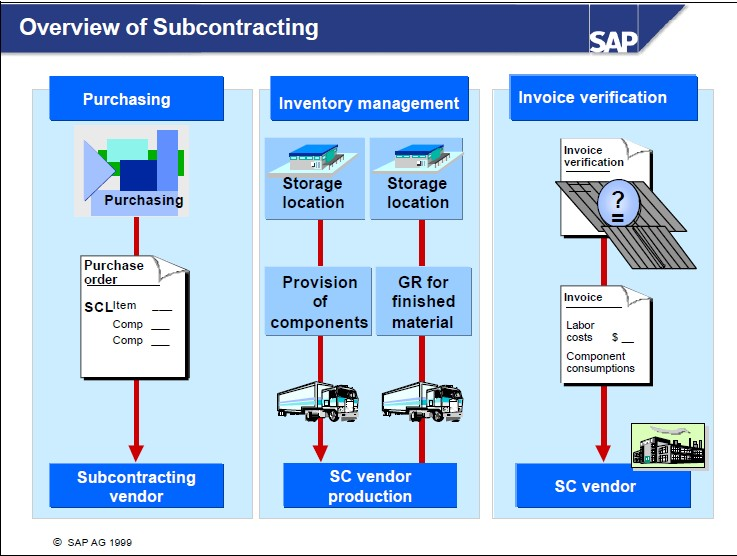
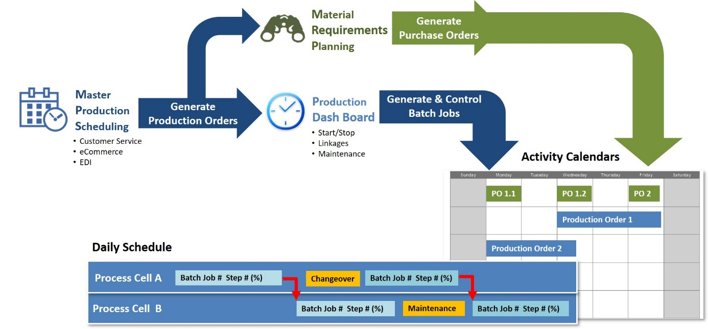
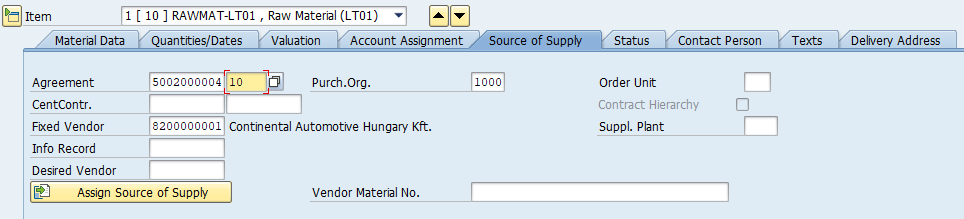
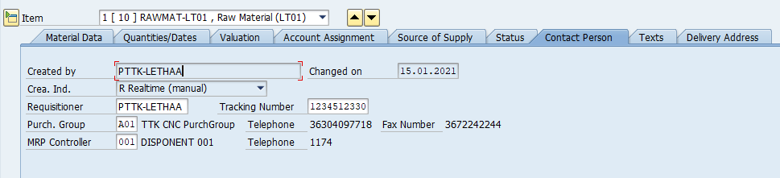
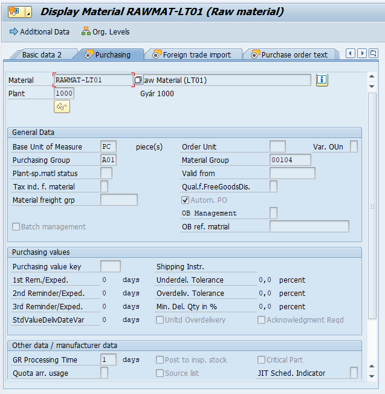
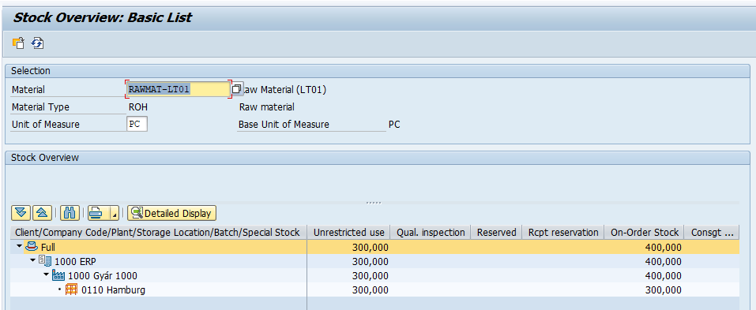
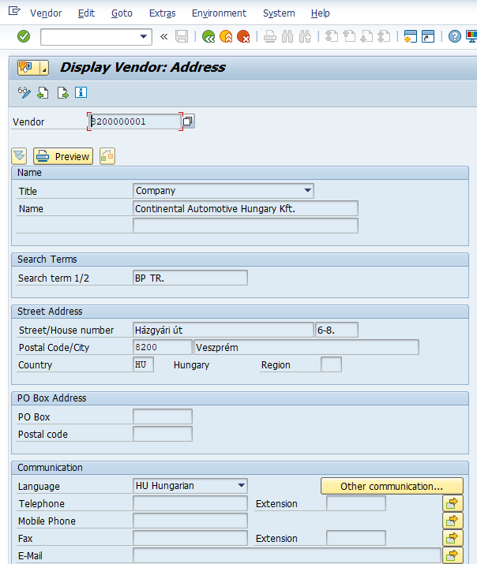
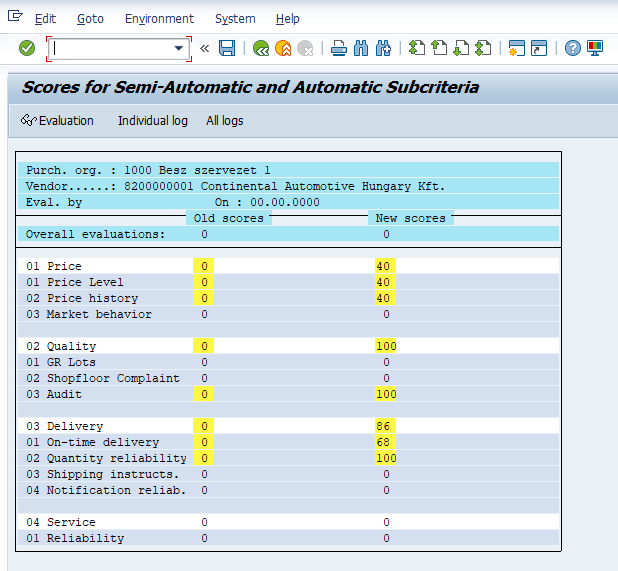
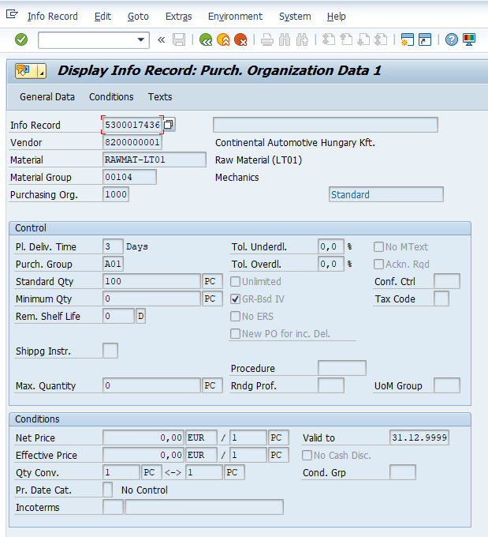
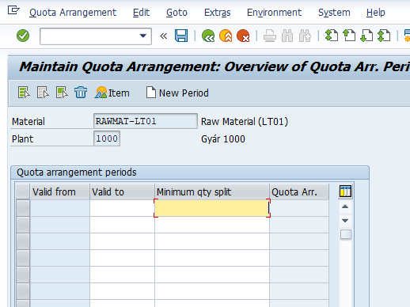

```{r setup, include=FALSE}
knitr::opts_chunk$set(echo = FALSE)
```


<link href="styles/bootstrap.css" rel="stylesheet">
<link href="http://ajax.googleapis.com/ajax/libs/jqueryui/1.8.21/themes/black-tie/jquery-ui.css" rel="stylesheet">
<link href="styles/jquery.tocify.css" rel="stylesheet">


<body>


<div id="toc">
</div>

<h2>1. General Overview: Materials Management (Készletmenedzsment)</h2>
**Materials Management.** Az anyaggazdálkodás közvetlenül az SAP menüben
lévő a Logisztika (Logistics) mappában található.

{width="3.5520833333333335in"
height="3.40625in"}

Az anyaggazdálkodás (Materials Management) legfontosabb feladata 2-es
számlaosztályba tartozó anyag- és árukészlet részletes nyilvántartása. A
modul elsősorban az alábbi mérlegelemeket és számlaosztályokat fedi le.

{width="6.291666666666667in"
height="4.71875in"}

Másodsorban azonban lehetőség van 5-ös számlaosztályba tartozó, azonnali
felhasználású, tehát nem továbbszámlázott szolgáltatások
nyilvántartására.

**Purchasing.** A készlet beszerzését, a készletek beáramlását segíti a
beszerzési modul (Purchasing), amely a beszerzési igénylés (Purchase
Requisition), a beszerzési rendelés (Purchase Order), a szerződés
(Outline Agreement), az árajánlat (RFQ/Quotation), valamint a törzsadat
(Master Data) részmodult tartalmazza. A beszerzési modul üzemeltetése
elsősorban a beszerzési osztályok és csoportok feladatkörébe tartozik. A
készletek, illetve a tovább számlázott szolgáltatások mellett lehetőség
van 5-ös számlaosztályra beszerezni azonnali felhasználású
szolgáltatásokat, illetve 1-es számlaosztályra beszerezni tárgyi
eszközöket.

{width="2.5625in"
height="1.6770833333333333in"}

**Inventory Management.** A készlet mozgatását, az anyagáramlás
alapszintű szabályozását a készletmenedzsment modul látja el.
Legfontosabb területei az anyagmozgatás (Goods Movement), az
anyagbizonylatok (Material Document) és az anyagfoglalások
(Reservation). A modul üzemeltetéséhez elsősorban a készletkezelési
feladatok ellátó csoportoknak van jogosultsága.

{width="2.8541666666666665in"
height="1.71875in"}

**Logistics Invoice Verification.** A beszerzési folyamatok, különösen a
készletrendelések könyvelését a LIV modul látja el. Az elnevezése arra
utal, hogy a modulban lehet könyvelni a logisztikai előzményekkel
rendelkező szállítói számlákat. A modulban a Document Entry mappában van
lehetőség a számlák iktatására és könyvelésére, az Automatic Settlement
mappa a költségek (pl.: szállítási, rakodási, stb.) szétosztást
támogatja, a GR/IR Account Maintance mappában az áru/számla
beérkeztetést időben elhatároló főkönyvi számla menedzselését segíti.

{width="2.8333333333333335in"
height="2.0833333333333335in"}

**Physical Inventory modul** az anyag- és árukészlet leltározását
segíti. Ebben a modulban hozhatók létre leltárbizonylatok (Physical
Inventory Document), végezhetők el készletszámítások (Inventory Count)
és az eltérések kezelése (Difference).

{width="3.6145833333333335in"
height="2.4479166666666665in"}

**Valuation modul** a készlet értékelésére vonatkozik, és segédkönyveket
használ. A Change in Material Price követi az anyagok értékben
bekövetkezett változásokat. A Balance Sheet Valuation a mérleg /
vagyonelemek szerinti értékelést számítja ki. Az ezen belül lévő mappák
különböző számítási lehetőségeket tartalmaznak: legalacsonyabb költség
meghatározása (Determination of Lowest Value), LIFO szerinti és FIFO
szerinti értékelés, valamint ezek eredményei (Results). További
értékelési lehetőséget tartalmaz a Balance Sheet Valuation with Material
Ledger, és a Actual Costing/Material Ledger.

{width="3.8645833333333335in"
height="3.1979166666666665in"}

**Service Master modullban** a jellemzően 5-ös számlaosztályra,
költségnemre és költséghelyre könyvelendő szolgáltatásokat lehet
nyilvántartani.

{width="3.40625in"
height="3.15625in"}

A szolgáltatás (Service) mappában lehet felvinni, megtekinteni és
módosítani a szolgáltatások törzsadatait. A Standard Service Catalog-ban
a szolgáltatásokból lehet katalógusokat, nyilvántartásokat létrehozni.

**Material Master modulban** lehet létrehozni olyan anyagokat, árukat és
közvetített szolgáltatásokat, amelyek II/1 mérleg osztályba, illetve a
21-28-as számlacsoportba tartoznak.

{width="3.5104166666666665in"
height="6.1875in"}

Material Master mappában lehet felvinni, módosítani, megtekinteni
anyagokat, árukat, továbbszámlázott szolgáltatásokat. A Profile mappában
lehet létrehozn az automata beszerzési igények összeállítása miatt is
lényeges MRP és Forecast Profile-okat (ezeket később az anyagokhoz lehet
rendelni. A Batch mappában a sarsz számok beállítására van lehetőség. A
Special Stock mappában konszignációs szállítói készletekkel kapcsolatos
tranzakciók érhetők el.


<h2>**[Material Master]{.ul}**</h2>

**1. General Overview**

Mint korábban írtuk a Forgóeszköz \\ Készletek mérlegosztályba, illetve
a 2-es számlaosztályba tartozó anyag- és árukészletek analitikus
nyilvántartására az Anyaggazdálkodási modulban (Materials Management)
van lehetőség. A törzsadatokat a Material-ban tudjuk felvinni,
megtekinteni és módosítani.

{width="4.749743000874891in"
height="6.520833333333333in"}

**A modul felépítése:**

Az SAP ERP rendszerben előre megadott típusú anyagok értékeit tudjuk a
Create (Special) és a Create (Genral) mappában felvinni. Az egyes
anyagtípusok közvetve összevannak kötve a főkönyvi számlákkal. Ezek az
anyagtípusok igazodnak a nemzetközi számviteli szabványok (IAS) alapján
készült standard számlatükrökhöz (IFRS, US GAAP), valamint a standard
magyar számlatükörhöz is. Az egyes típusok lefordításától eltekintünk,
ugyanakkor az említett számlatükröket bemutatjuk.

**[IFRS]{.ul}**

{width="5.510416666666667in"
height="3.75in"}

**[US GAAP]{.ul}**

{width="5.666666666666667in"
height="2.1979166666666665in"}

**[Magyar standard számlatükör]{.ul}**

{width="6.291666666666667in"
height="2.7916666666666665in"}

**A korábban felvitt készletbe tartozó anyagokat egyenként módosítani**
MM02-vel, egyedileg megtekinteni MM03-al, csoportosan módosítani és
megtekinteni MM17-el tudunk. A már rögzített anyagok típusát MMAM-el
tudjuk megváltoztatni. Minden változást a Display Changes mappában
tudjuk figyelemmel kísérni. Ezek részletes használatáról később lesz
szó.

{width="2.7083333333333335in"
height="3.2395833333333335in"}

**A Profil (Profile) mappában** adhatunk meg különböző
anyagigény-tervezési (MRP) és anyagigény-előrejelzési profilt.
Mindkettőre az anyagbeszerzés automatizálásáért van szükség. Mindkettő
esetében arról van szó, hogy előre meghatározunk szabályrendszereket,
amelyeket később, az anyag törzsadatainak űrlapjain betudunk tölteni.
Ennek lényege az, hogy már elkészült sablon jellegű standard szabályokat
vegyünk át, és ne a törzsadatok létrehozása során tervezzük meg. Ezzel
jelentősen csökkenthető a hiba lehetőségét.

{width="3.2083333333333335in"
height="3.9375in"}

**Sarzs számozást a Batch mappában tudunk létrehozni.**

{width="2.2395833333333335in"
height="2.0416666666666665in"}

Részletesebben a Batch-ről:

<https://www.symbolenterprise.hu/modul/beszerzesi-azonosito-sarzs/>
(2021. 02. 04)

<https://sioexcise.hu/aas_szoveg/file/452_lot_kod.pdf> (2021. 02. 04)

A **szállító konszignációs készlete** a különleges készletállomány
(Special Stock) mappában érhető el.

{width="2.65625in"
height="2.0729166666666665in"}

A konszignációs készletekkel kapcsolatban lásd:

Oláh J. & Vad V. A konszignációs készletek jellemzői az ellátási
láncban. Vezetéstudomány. (15)8. 67-76. pp.
[**https://core.ac.uk/download/pdf/161069385.pdf**](https://core.ac.uk/download/pdf/161069385.pdf)
(2021. január 20.)

**[2. Alapanyag (Raw Materials)]{.ul}**

Az alapanyag felvitelével létrehozunk egy logikai objektumot, amelyhez
majd kapcsolódni fognak a szállítóktól beszerzett konkrét, fizikai
termékek mennyiségben és értékben is. Ahhoz azonban, hogy a készletünk
adatbázisában tárolni tudjuk a fizikai készletek valós adatait, elsőként
a rekordokat kell felvinnünk. Másképpen megfogalmazza, ahhoz, hogy pl.:
egy alapanyagra (pl.: almát, lisztet, cukrot, krumplit, tejet, dohányt,
papírt) tudjunk kötni szerződést, megállapodást, megtudjuk rendelni,
nyilván tudjuk tartani, áttudjuk adni a termelésnek (átalakításra), el
tudjuk helyezni raktárházakban, üzemekben stb. elsőként az őt leíró
logikai rekordot kell létrehoznunk. Ennek érdekében készítsük el egy
tetszőleges alapanyag logikai rekordját.

**Alapanyagok felvitele (központilag):**

{width="2.5208333333333335in"
height="1.1458333333333333in"}

{width="3.2177220034995626in"
height="2.9375in"}

-   **Anyag (Material) cikkszáma, rövid megnevezése.** Két lehetőségünk
    van. Vagy megadunk egy maximum 18 karakterből álló alfanumerikus
    kódot (megnevezést), vagy üresen hagyjuk és a rendszer az
    anyagtípushoz kapcsolódó alapértelmezett számintervallum alapján
    automatában legenerálja.

-   **Iparág (Industry sector).** Az alapanyaghoz tartozó releváns
    iparág. Lényege abban áll, hogy a rendszerbeállítástól függően
    meghatározhatja, a későbbi űrlapok felépítését, az elérhető mezők
    körét.

-   **Material Type.** Az anyag típusa megegyezik szinte minden esetben
    a főkönyvben szereplő megnevezésekkel (alapanyag, segédanyag,
    csomagolóanyag, stb.). Jelentősége számos más tényező mellett abban
    van, hogy a rendszerbeállítás hatására az anyagtípusokhoz
    kapcsolódnak a kiválasztható űrlapok köre, valamint a megadható
    főkönyvi számlák is.

-   **Amennyiben anyagot egy már elkészült anyagról hozunk létre újat,
    akkor válasszuk a Copy from-ot,** és adjuk meg a cikkszámot.

Ezt követően kattintsunk a **Select Views-ra**, amely listaként sorolja
fel az anyagtípushoz tartozó lehetséges űrlapokat. Azt, hogy melyik
űrlapok tartozhatnak egy adott anyagtípushoz a rendszermenedzserek
határozzák meg a háttérbeállításokban. Általánosságban elmondható, hogy
az elérhető űrlapok köre anyagtípusonként eltér (pl.: az alapanyag
esetében nem lesz elérhető az eladási űrlap, mivel az alapanyagokat nem
értékesítési céllal vesszük meg, hasonlóan a késztermék esetében nem
lesz beszerzési űrlap, mivel a késztermékeket magunk állítjuk el). Az
alapanyag (ROH RAW Material) esetében a gyári beállításokkal az alábbi
űrlapok érhetők el.

{width="3.289080271216098in"
height="4.041666666666667in"}

Az űrlapok kiválasztása, majd mezőkészleteinek kitöltése szükséges lesz
később az egyes részmodulok üzemeltetéséhez. Pl.: beszerzési
folyamatokat nem tudunk végezni, ha az anyagnak nincsen Purchasing
űrlapja, érkeztetést nem tudunk végezni, ha nincsen megadva Plant /
Storage Location / Warehouse Mgmt űrlap, könyvelést nem tudunk végezni,
ha nincsen megadva az Accounting 1 & 2 űrlap, értékesítést, ha nincsen
Sales űrlap. Az alábbi ábrán próbáljuk szemléltetni a szerepüket:

{width="6.246006124234471in"
height="4.25in"}

<https://tekslate.com/sap-mm-material-master-data> (2021. 02. 04.)

{width="6.3in"
height="4.111094706911636in"}

<https://ganeshsapscm.files.wordpress.com/2015/07/mm-views.png?w=685>
(2021. 02. 04.)

Az **alapadatok 1, alapadatok 2 (Basic Data 1 & Basic Data 2)** az
alapértékek (anyagcsoport, mértékegység, súly, kiterjedés,
alapértelmezett felhasználási hely, stb.) megadását teszi lehetővé. A
**csoportosítás (Classification)** ezzel szemben az adott anyag
különböző variánsait tárolja el csoportonként. Ennek előnye, hogy ebben
az esetben nem kell variánsok szerint újra és újra külön anyagokat
felvinni, hanem elegendő egyet (vagy néhányat) és annak a variánsait
megadni. A fenti példánál maradva felviszünk alapanyagként a tejsavó
fehérjét, és megadunk különböző variánsait csoportosítva (izolátum,
koncentrátum, laktózmentes izolátum, natív előállítású izolátum, stb.),
ezzel mentesülhetünk az önálló anyagokként történő felvitelüktől.
**Beszerzés (Purchasing)** űrlap esetében a beszerzéssel kapcsolatos
alapértelmezett (később módosítható) értékeket tudjuk megadni. Ezeket
gyakorlatilag valamennyi beszerzési részmodul felhasználja
kiindulásképpen. A **megrendelési szöveg (Purchase Order Text)** a
szállítónak eljuttatandó alapértelmezett beszerzési szöveget tárolja. A
**külkereskedelemhez szükséges alapértékeket a** **Foreign Trade**
űrlapon tartjuk nyilván. Ez az űrlap az SAP külkereskedelmi (FT)
alkalmazás-összetevőjének szállítói, beszerzési információk, anyagok és
vevői törzsrekordok használatához releváns adatok részletes tárolását
teszi lehetővé. A rendszer automatizált külkereskedelmi feldolgozása a
teljes törzsadatoktól függ. Forrás:
<https://sapbrainsonline.com/mm-tutorial/foreign-trade-data-in-master-records-sap-mm.html>
(2021. 02. 04.) A **számviteli** alapértelmezett értékeket (értékelési
osztály, főkönyvi számla, árak) a könyvelési **Accounting 1 & Accounting
2** űrlap tartalmazza. Az **MRP: Material Requirement Planning** űrlapon
az anyagigénytervezés beállításaihoz szükséges értékeket tudjuk vezetni.
Az anyag alapértelmezett üzemi adatait a **General Plant Data 1 /
Storage Location & General Plant Data 2 / Storage Location** űrlapon
lehet megadni.

Miután kiválasztottuk a szükséges űrlapokat, az adott alapanyagot el
kell helyezni a szervezeti környezetben.

**Szervezeti környezet (Organizational Levels)**

A kiválasztott űrlapok alapján és függvényében meg kell adni, hogy az
alapanyagot melyik szervezeti egységben, az alapanyag esetében üzemben
(Plant), melyik tárolóhelységben (Storage Location) és melyik
raktárházban (Warehouse No.) szeretnénk logikailag, illetve fizikailag
elhelyezni. Megadhatunk standard, előre definiált MRP profilokat is. A
szervezeti környezet objektumai alapértékekként töltődnek be az egyes
űrlapokhoz. Órai keretek között használjuk az alábbi értékeket.

{width="4.71875in"
height="2.8792377515310585in"}

**[Alapadatok 1. (Basic Data 1.)]{.ul}**

**Általános adatok (General data)**

{width="6.291666666666667in"
height="2.90625in"}

-   **Anyag nyilvántartási mértékegysége (Base Unit of Measure).** A
    készletbe tartozó alapanyag alapértelmezett nyilvántartási
    mértékegysége (lehet pl.: darab, kg, köbméter). A mértékegység
    szerepe az, hogy minden attól eltérő mértékegységben megadott
    értéket erre az alapértelmezett mértékegységre fog konvertálni a
    rendszer (pl.: ha a szállító más mértékegységben szállítja az
    anyagot).

-   **Divízió (Division).** A divízió megadása az anyagok, termékek,
    szolgáltatások csoportosítására alkalmasak az eladás és értékesítés
    tekintetében, ez elsősorban nem az alapanyag, hanem az értékesítendő
    termékek esetén releváns. A rendszer divíziókat használ az
    értékesítési területek és üzletágak meghatározásához az egyes
    anyagok esetében.

-   **X Plant matl status (Cross-**plant material status, valid from):
    az adott anyaghoz lehet megadni különböző blokkolási státuszokat
    (anyagmozgatáshoz), illetve ennek a kezdő dátumát.

-   **Anyagcsoport (Material Group).** az anyagokat anyagcsoportba
    érdemes sorolni. Anyagcsoport segítségével a későbbiekben könnyen
    lehet keresni, kimutatni, riportálni és összegezni a csoportban
    szereplő anyagokat. Az anyagcsoport és az anyagtípus között nincsen
    kapcsolat. az órai munka során jelentősége lesz az anyagcsoportnak a
    lekérdezéske összeállításának szempontjából.

-   **Laboratórium / Iroda.** Az anyagot felhasználó szervezeti egységet
    lehet megadni.

{width="6.239583333333333in"
height="1.625in"}

-   **A bruottó és nettó súly (Gross Weight, Net Weight)** értékének
    megadása a raktárházakmenedzselés (Warehouse Mgmt) modulban megadott
    tárolókapacitás miatt lényeges.

-   **A térfogat (Volume, Volume unit)** az üzemi tárolás és szállítás
    tekintetében releváns

-   **Méret / dimenziók (Size / dimensions)** ennek csak tájékoztató
    szerepe van.

{width="6.291666666666667in"
height="1.6354166666666667in"}

Amennyiben nem alapanyagot, hanem értékesítendő terméket viszünk fel,
akkor célszerű megadni a csomagolóanyag referenciaszámát is.

**[Osztályozási űrlap]{.ul}**

{width="6.302083333333333in"
height="3.5729166666666665in"}

Az űrlap lehetővé teszi, hogy egy adott alapanyagot további osztályokra
és variánsokra lehessen bontani. Az eljárás előnye, hogy a Tej példánál
maradva létre tudunk hozni csoportokat aszerint, hogy a tej, mint
alapanyag ökológiai, biológiai, nagyüzemi, vagy szabadtartású
tehenektől, illetve tejgazdaságokból származik. Ennek lényege abban van,
hogy egy-egy késztermékhez különböző típusú tejre van szükség. Azonban
nem kell négy féle alapanyagot felvinni, ehelyett elegendő egy
általánosat létrehozni, és azt megbontani variánsok / típusok szerint.

**[Beszerzési űrlap (Purchase)]{.ul}**

A beszerzési űrlapon szereplő értékek olyan alapértelmezett (default)
információk, amelyeket a beszerzési folyamatok tranzakciói (más űrlapok)
átfognak venni (azokban természetesen lehet módosítani).

{width="6.3in"
height="3.196527777777778in"}

-   Az **alapvető mértékegység** (Base Unit of Measure) és a **rendelés
    mértékegysége** (Order Unit) mellett megadhatunk olyan **beszerzési
    csoportot** (Purchasing Group), amely az alapanyag operatív
    beszerzéséért felelős. Amennyiben az alapmértékegységet módosítjuk,
    úgy a Basic Data 1 űrlapon is módosulni fog. Az anyagcsoport értékét
    a Basic Data 1 űrlapról másolja át a rendszer, ha itt módosítjuk,
    ott is módosulni fog.

-   Az űrlapon lévő egyik igen lényeges kapcsoló **az automatikus
    beszerzési rendelés** (Automate Purchase Order), ha ezt aktiváljuk,
    akkor a beszerzési igényekből automatizáltan tudunk megrendeléseket
    generálni.

-   Az anyagfuvarozási **csoport** (Material freight group) az anyagok
    csoportosítására használják, annak érdekében, hogy azokat
    árufuvarozási kód és osztály szerint sorolhassák be. A fuvarozási
    kódokat és az árufuvarozási kódkészlet osztályait az anyagfuvarozási
    csoport határozza meg. Az árufuvarozási kódkészlet a fuvardíjak
    meghatározására és a szervizügynökökkel való kommunikációra szolgál.

-   Szintén lényeges mező **a sarzsszám (Batch management)** aktiválása.
    Lásd ennek részletes leírását:
    <https://erpcsere.hu/munka_adagszamokkal/> (2021. 02. 04.)

{width="6.25in" height="1.625in"}

A beszerzési értékkulcs meghatározza:

-   **Szállítókkal szemben megfogalmazott emlékeztetők, felszólítások
    (1st Rem./Exped. -- 3rd Rem./Exped.)** napokban kifejezve, arra az
    esetre, ha az üzleti partner nem szállítja le a a szerződés alapján
    összeállított és elküldött megrendelés szerinti árut.

-   **Alulszállítási határérték (Underdelivery Tolerance Limit)** az
    százalékos érték (a rendelési mennyiség alapján), ameddig a
    leszállított mennyiséget elfogadják. Pl.: a rendelési mennyiség
    70%-a alatt nem veszem át a szállított mennyiséget, rész szállítást
    nem vételezek be.

-   **Túlszállítási határérték (Overdelivery Tolerance Limit)** az
    százalékos érték (a rendelési mennyiség alapján), ameddig a
    leszállított mennyiséget elfogadják. Pl.: a rendelési mennyiség
    120%-a feletti árut mennyiséget nem veszem át.

-   **Korlátlan (Indicator: Unlimited Overdelivery Allowed)** eben az
    esetben bármilyen arányú túlszállítás elfogadható.

{width="6.25in"
height="1.5520833333333333in"}

-   **GR Processing Time (Good Receipt Processing Time):** az
    anyagérkeztetés alapértelmezett ideje napban kifejezve. Az
    ellenőrzéshez szükséges anyag beérkezése és a raktárba helyezés után
    szükséges munkanapok száma.

-   **Quota arrangement usage:** Az itt megadott bejegyzés szabályozza,
    hogy a teljes rendelési mennyiség hogyan kerül kiszámításra a
    kvótarendszerben, és ezáltal az anyag melyik ellátási forrása kerül
    meghatározásra egy adott időpontban. Kvótaelrendezést adható meg a
    következő mezőkombinációkhoz:

    -   megrendelések: a már megrendelt anyag mennyiségét a
        kvótarendszer tartalmazza.

    -   beszerzési igények: az anyag beszerzési igénylésében kért teljes
        mennyiséget a kvótarendszer tartalmazza.

    -   ütemezési megállapodás: az anyag szállítási ütemtervében
        szereplő teljes mennyiséget a kvótarendszer tartalmazza.

    -   tervezett megrendelések: az anyag tervezett mennyiségben
        tervezett teljes mennyiségét a kvótarendszer tartalmazza.

    -   anyagtervezés (MRP): a kvótaelrendezési mechanizmust az
        anyagtervezésben is használják; vagyis az anyagtervezéssel
        létrehozott tervezett megrendeléseket és beszerzési igényeket a
        kvótarendszer tartalmazza.

    -   gyártási megrendelések Ennek az anyagnak az összes gyártási
        megrendelésének teljes mennyiségét a kvótarendszer tartalmazza.

-   **Source list requirement:** meghatározza, hogy a forráslistát fenn
    kell tartani egy bizonyos üzem külső beszerzése esetén. Aktiválás
    esetén az ellátási forrást meg kell adni a forráslistában, mielőtt
    vételi megbízást lehet létrehozni.

{width="6.291666666666667in"
height="5.041666666666667in"}

Az **üzemi / tárolási adatok 1-ben** lehet megadni a tárolás pontos
helyét (Storage Bin és Picking Area), a tárolási hőmérsékletet (Temp.
conditions), a konténer tulajdonságát (Container reqmts), a feliratozás
típusát (Label type), az anyag kiadásának mértékegységét (ha ez eltérne
az alapmértékegységtől), a tárolási feltételeket (Storage conditions), a
veszélyességi besorolást (Haz. material number), valamint a tárolási
időt (Shelf life data).

A Storage Bin-t az alábbi kép szemlélteti:

{width="4.510416666666667in"
height="3.5208333333333335in"}

<https://www.wisdomjobs.com/e-university/sap-wm-tutorial-244/storage-section-7706.html>
(2021. 02. 04.)

A Picking Area-t pedig az alábbi:

{width="6.3in" height="3.54375in"}

<https://boxes.curtec.com/en/customer-stories/internal-logistics/katoen-natie>
(2021. 02. 04.)

{width="6.270833333333333in"
height="1.4791666666666667in"}

A Shelf Life data a tárolási időt értékeit tartalmazza. Max. storage
period = a maximális tárolási idő.

{width="6.3in"
height="3.7591732283464565in"}

A méret és súly adatokat a Basic Data 1 űrlapról veszi át a program. A
számunka léyeges mezőt az alapértelmezet Pénzügyi Központ megadása
(Profit Center) jelenti. A beszerzési folyamatokban erre a pénzügyi
központra fogja a program kontírozni az alapanyagot.


**Beszerzési modul (Purchase)**


A modulban található szerződések (Outline Agreement), árajánlatok (RFQ),
beszerzési igények (Purchase Requisition) és rendelések (Purchase Order)
elsősorban a 2-es számlaosztályba tartozó anyag- és árukészletbe
sorolható vagyonelemekre vonatkoznak. Emellett lehetőség van 5-ös
számlaosztályra is beszerezni, illetve költségként elszámolni
szolgáltatásokat és anyagokat, valamint az 1-es számlaosztállyal
kapcsolatban tárgyi eszközöket rendelni.


```{r,dpi=60,fig.align='center'}
knitr::include_graphics("mm/image1.png")
```


```{r,dpi=75,fig.align='center'}
knitr::include_graphics("mm/image2.png")
```


A tranzakciók használatának bemutatását megelőzően az alábbiakban a
közös jellemzőket tekintjük át.

 **[Beszerzési környezet]{.ul}**

**A beszerzési szervezet (Purchase Organization)** szervezeti egységként
felelős az anyagok- és szolgáltatások biztosításáért az egyes üzemek
(Plant) részére. Tevékenysége során elsősorban stratégiai szempontokat,
és hosszú időtávot vesz alapul.

Működése során kiválasztja és értékeli a szállítókat, megállapodásokban
és szerződésekben rögzíti az árképzés konstrukcióját és a szállítási
feltételeket. A beszerzési szervezet tevékenysége mindenekelőtt a
gyártási folyamatok input oldalának, különösen az anyag- és árukészletek
biztosítására terjed ki, de emellett a tárgyi eszközök és a
szolgáltatások beszerzésében is meghatározó szerepe van. A szervezeti
elhelyezkedés és hatáskör tekintetében meghatározó kérdés, hogy a
beszerzési szervezet centralizált, és alatta helyezkedik el egy, vagy
több vállalat (Company Code), vagy decentralizált és a vállalat alatt
van(nak) a beszerzési szervezet(ek). Lehetőség van megadni üzemek
szintjén definiált beszerzési szervezeteket is. Ebben az esetben adott
beszerzési szervezethez adott üzem fog alapértelmezettként kapcsolódni.


```{r,dpi=50,fig.align='center',fig.cap='https://i0.wp.com/www.erpdb.info/wp-content/uploads/2014/04/041814_2150_ManagingPur1.jpg?resize=576%2C233 (2021. 02. 04.)'}
knitr::include_graphics("mm/image3.jpeg")
```


**Beszerési szervezet (Purchase Organization) és az üzem (Plant)
viszonya.** A beszerzési szervezet **[az adott üzemekben jelentkező
igénylések alapján]{.ul}** az adott üzem részére végez beszerzési
tevékenységet. SAP-ban egy beszerzési szervezethez több üzem is
tartozhat, ugyanakkor egy-egy üzem esetében megadhatunk alapértelmezett
beszerzési szervezetet. Ebben az esetben a kijelölt beszerzési szervezet
felelősség- és jogkörébe fog tartozni az üzem ellátása. Az alábbi ábra a
beszerzési szervezet és az üzem kapcsolatát szemlélteti.


```{r,dpi=50,fig.align='center',fig.cap='https://slideplayer.com/slide/12701168/76/images/5/Organizational+Entities+in+Purchasing.jpg (2021. 02. 04.)'}
knitr::include_graphics("mm/image4.png")
```


**Beszerzési csoport (Purchase Group)** nem része a szervezeti
hierarchiának, nem tartozik egyetlen szervezeti egységhez sem
közvetlenül. A beszerzési szervezettől eltérően operatív feladatokat
lát, az anyagok, vagy anyagcsoportok mindennapi beszerzésében vesz
részt, és ennek részeként kapcsolatot tart a szállítókkal. A beszerzési
csoportot a mindennapi beszerzési tevékenységért felelős alkalmazottak
alkotják.

```{r,dpi=50,fig.align='center',fig.cap='https://image.slidesharecdn.com/introductiontosapr3mm-140118122254-phpapp01/95/introduction-to-sap-r3-mm-13-638.jpg?cb=1390047886 (2021. 02. 04.)'}
knitr::include_graphics("mm/image5.png")
```


**Üzem (Plant).** A vállalat tevékenységeit konkrét telephelyen működő
üzemek látják el, a legfontosabb jellemzője a fizikai, geográfiai
elhelyezkedés. Az üzemek végezhetnek gyártást, szolgáltatást, vagy egyéb
tevékenységet. Lehetnek pl.: egyetemi karok, vagy tanszékek is, tehát
nem a funkciójuk a meghatározó. Minden esetben székhelyként, vagy
telephelyként vannak bejegyezve, és minden esetben a vállalat fizikai
működési szintjének tekinthetők. Az üzemekben mennek végbe a konkrét
vállalati tevékenységek (termelés, raktározás, megrendelés, anyag- és
eszközgazdálkodás, értékesítés). A készletmenedzsment tekintetében az
üzem a legmagasabb olyan független fizikai egység, amely áru- és
anyagkészleteket tárol.

**A raktárhelyek (Storage Locations)** az üzemek alatt helyezkednek a
szervezeti hierarchiában.

Lényeges, hogy **az üzem és a raktárhely a készlet-, illetve
leltárgazdálkodás (Inventory Managment)** szintje, az alatt helyezkedik
el a fizikai raktárgazdálkodás. A beszerzendő készletek, illetve
eszközök mindkettőben megjelennek, azonban a készletgazdálkodás
elsősorban a pénzügyi számvitel modul tekintetében meghatározó.


```{r,dpi=50,fig.align='center',fig.cap='Képtalálatok a következőre: sap plant storage location hierarchy'}
knitr::include_graphics("mm/image6.jpeg")
```


A beszerzési folyamatok célja az üzemekben található gyártási /
szolgáltatási egységek kiszolgálása.


```{r,dpi=50,fig.align='center',fig.cap='Képtalálatok a következőre: sap plant storage location hierarchy'}
knitr::include_graphics("mm/image7.png")
```


**Beszerezhető tételek csoportja**


<div class="row">
<div class="column">

```{r,dpi=30}
knitr::include_graphics("mm/image8.png")
```

</div>
<div class="column">


**A beszerzési környezet** alapszintű bemutatását követően tekintsük át,
hogy a beszerzési szervezet, illetve beszerzési csoportok **milyen
jellegű tételeket (anyagokat, árukat, szolgáltatásokat) tudnak
beszerezni** egy standard, nem fejlesztett SAP rendszerben.
Megállapítható, hogy szinte valamennyi beszerzési bizonylat (szerződés,
megállapodás, igénylés, rendelés) képes tárolni és menedzselni standard,
konszignációs, alvállalkozói (bérmunka) és szolgáltatás típusú
tételeket.

</div>
</div>


**Standard:** alapanyag beszerzése a szállítótól (a szállító
késztermékét, vagy a tovább számlázandó szolgáltatását vásároljuk meg).

**Consignment:** a konszignációs készletre vonatkozó igénylés során a
szállító által leszállított áru egészen addig a szállító tulajdonában
marad, amíg nem adjuk ki a termelésre. Gazdasági esemény az anyag
termelésbe történő kiadásával történik, ebben az időpontban kell a
szállítói számlát is lekönyvelni. A konszignációs készlet a „beszállítók
által vezérelt készletek (VMI Vendor Management Invantory) típusába
tartozik." A konszignációs készletek esetében a vevő, tehát ebben az
esetben mi „csak a felhasznált mennyiség után fizet. ... A konszignációs
készletek olyan készletek, melyeket a beszállító a vevői megrendelések
alapján a vevő rendelkezésére bocsát, de egy későbbi időpontban történik
meg a fizetés és a beszállított ám tulajdonjogának az átadás. A vevő
csak a felhasznált, a gyártásnak átadott mennyiségeket fizeti ki a
beszállító részére." Oláh J. & Vad V. A konszignációs készletek
jellemzői az ellátási láncban. Vezetéstudomány. (15)8. 67-76. pp.
<https://core.ac.uk/download/pdf/161069385.pdf> (2021. január 20.)

**Alvállalkozói szerződés, bérmunka (Subcontracting)** esetében a
vállalat a gyártási folyamatának egy részét alvállalkozónak szervezi ki.
Pl.: dobozokat adunk át egy vállalatnak, amelyre matricákat / feliaratok
nyomtatni, majd a matricával ellátott dobozokat visszajuttatják a
vállalatunknak. Az alvállalkozó díjat számol fel a cégnél dobozonként
nyújtott szolgáltatásokért.


```{r,dpi=50,fig.align='center',fig.cap='https://4.bp.blogspot.com/-Y5jV2qi2piw/WT-5iUmWfiI/AAAAAAAAFEY/_SgHDJ7kmXgvxRZpBUGJ4_Yuv98j2ohOACLcB/s1600/Sub%2BCon%2BPic.jpg (2021. 02. 04.)'}

```


```{r,dpi=50,fig.align='center',fig.cap='https://erproof.com/wp-content/uploads/2017/01/word-image-244.png (2021. 02. 04.)'}
knitr::include_graphics("mm/image10.png")
```


**Harmadik fél** (**Third Party)** esetén a vevői rendelések alapján
készülnek a beszerzési igények. A rendelési igény alapján készült
beszerzési igények, illetve megrendelések egy harmadik a szállítónak
kerülnek átadásra, azzal a feltétellel, hogy a szállító nem nekünk
szállítja le az árut, hanem vevőnek és ezt követően számlázik a
vállalatunknak. Tehát arról van szó, hogy a harmadik fél rendelése
alapján megrendelést adunk le egy szállítónak áru szállítására vagy
szolgáltatás nyújtására, a harmadik fél (vevőnk) részére. Tehát nem a
saját vállalatunk szállítja le a szállítótól átvett anyagot, hanem a
megrendelést továbbítjuk a szállítónak, aki ezt követően közvetlenül
elküldi az anyagot az ügyfélnek, és számlázik Önnek.


```{r,dpi=50,fig.align='center',fig.cap='https://3.bp.blogspot.com/-NFAuVrPsFFk/VveLGuHpglI/AAAAAAAAACU/mq5qr88T0Nc-nee9kJvErJrCHdoHhBbDg/s1600/TPT%2B3.png (2021. 02. 04.)'}
knitr::include_graphics("mm/image11.png")
```


```{r,dpi=50,fig.align='center',fig.cap='https://help.sap.com/doc/PRODUCTION/78e0627c34ef43879d72718e21ea517b/6.18.13/en-US/loio4696b953495bb44ce10000000a174cb4_LowRes.png (2021. 02. 04.)'}
knitr::include_graphics("mm/image12.png")
```


A folyamatot az alábbi oktatóvideó mutatja be korrekten:

```{r}
knitr::include_url("https://www.youtube.com/embed/n1W__-G4POw")
```


**Készletátadás (Stock transfer)** vállalaton / vállalatcsoporton belül
történhet, pl.: két üzem között, illetve két vállalat között. Ebben az
esetben az üzem (Plant) és az ellátó üzemet (Supply Plant) kell megadni.
Lényeges, hogy kizárólag szabad felhasználású készletállományt
(Unrestricted Use) mozgathatunk meg.


```{r,dpi=75,fig.align='center'}
knitr::include_graphics("mm/image13.png")
```


**Service:** jellemzően olyan törzsadatokkal rendelkező szolgáltatás,
amelyet 5-ös számlaosztályra és költséghelyre könyvelünk.
Szolgáltatás-vételi megrendeléseket belsőleg vagy külsőleg beszerzett
szolgáltatásokhoz adunk meg. Ezek a vásárlási megrendelések eltérnek a
szokásosaktól, mivel nincs szükség árubevételre és nincs készletük.


<div class="row">
<div class="column">

```{r,dpi=30}
knitr::include_graphics("mm/image14.png")
```

</div>
<div class="column">


[**Kontírozási kategória. (Account Assignment).**]{.ul} A tranzakcióknak
alkalmasak többek-között (A) tárgyi eszközzel, (C) értékesítéssel (vevői
megrendeléssel), (F) gyártási rendeléssel, (K) költséghellyel, (P)
projekttel kapcsolatban létrehozni rendelési bizonylatokat és ennek
megfelelően kontírozni a rendelést.

</div>
</div>

**1 -- Harmadik fél (Third-party)** kódot használunk, amennyiben a vevői
rendelést a szállítónak továbbítjuk és az szállítja le a rendelést a
vevőnek.

**C -- Vevői megrendelés (Sales order)** utáni gyártás, vagy a
megrendelés utáni beszerzés esetén merül fel. A gyártás tekintetében az
MRP folyamatok futtatását a vevői megrendeléssel szembeni veszik fel. A
másik esetben a vevői megrendelés specifikus tételére adunk le
megrendelést. Ebben az esetben szerepet játszhatnak a harmadik fél
ügyletek.

**K -- Költséghelyet (Cost Center)** adunk meg abban az esetben, ha az
adott anyagot, vagy szolgáltatást azonnal felhasználjuk, ezért azonnali
költségként jelentkezik. Ebben az esetben az 5-ös számlaosztály valamely
releváns költségszámlájára kontírozunk, illetve kiválasztjuk az ehhez
tartozó költséghelyet a 6-os számlaosztályból.

**O -- Gyártási rendelés (Order)** a gyártás / értékesítés ütemezéssel,
és az ehhez kapcsolódó anyagigény-tervező modullal (MRP) van
kapcsolatban. Az anyagigény-tervezés fő funkciója az anyag rendelkezésre
állásának garantálása, vagyis a szükséges mennyiségek időben, időre
történő beszerzése. Ez a folyamat magában foglalja a készletek nyomon
követését, és különösen a beszerzési és termelési beszerzési javaslatok
automatikus elkészítését. Az anyagigény tervező modul kiszámítja, hogy
mikor és milyen mennyiségre kell megrendelési javaslatot létrehozni. Az
MRP-vezérlőnek a mennyiségek kiszámításához szüksége van minden
információra a készletekről, valamint a dátumok kiszámításához az
átfutási időkre és a beszerzési időkre is szüksége van. Az MRP vezérlő
minden anyaghoz meghatároz egy megfelelő MRP-t és tételméret-eljárást a
beszerzési javaslatok meghatározásához.


```{r,dpi=50,fig.align='center',fig.cap='https://www.batchmaster.com/wp-content/uploads/MRP-MPS-process-diagram.jpg (2021. 02. 04.)'}

```


**P -- Projekt (Project)** esetében készülhetnek rendelések
projektelemekre is. Ez projektszervezet esetében, illetve projekt és
pályázati elszámolás esetén lehet kiemelten hasznos.


```{r,dpi=50,fig.align='center'}
knitr::include_graphics("mm/image16.png")
```


**Q -- Megrendelésre gyártás (Project make-to order)** esetén a
beszerzés is ennek függvényében módosul. Példa: az ipari gépek
csúcstechnológiájú gyártói általában „megrendelésre gyártanak", a
gépeket vagy megbízás alapján gyártják, vagy összeszerelik, és a
megrendelést leadó ügyfél hajlandó megvárni a szállítását. Az MTO
többnyire egyedi, projekt jellegű gyártás esetén figyelhető meg.

Részletesen lásd.:
<https://www.investopedia.com/terms/m/make-to-order.asp> (2021. 02. 04.)


```{r,dpi=50,fig.align='center',fig.cap='https://www.allaboutlean.com/push-pull/make-to-oder-stock/ (2021. 02. 04.)'}
knitr::include_graphics("mm/image17.png")
```


A beszerzés tekintetében arról van szó, hogy a rendelések olyan termék
gyártásához készülnek, amelyek nem tömeggyártásban, hanem egy-egy vevő
igénye alapján készülnek el, egyedi specifikációkkal. Pécsen erre példa
lehet a Körber Hungária Gépgyártó Kft. (Hauni) egyedi „vevői igényekre
szabott" gépek és berendezések).


```{r,dpi=50,fig.align='center',fig.cap='http://www.hauni.hu/hu/technologiak/szerelouezem/ (2021. 02. 04.)'}

```


<h2>**1. Beszerzési igény (Purchase Requisition)**</h2>

<h3>**1.1. General Overview**</h3>

**A beszerzési igénylés moduláris felépítése és elhelyezkedése az SAP
navigációs menüjében**


```{r,dpi=50,fig.align='center'}
knitr::include_graphics("mm/image19.png")
```


**Beszerzési igénylés modul felépítése szerint a Logisztika \\
Anyaggazdálkodás \\ Beszerzés könyvtár** főkönyvtárban lévő
tranzakciókból és alkönyvtárakban elhelyezkedő tranzakciókból áll. A
főkönyvtárban elérhető ME51-ennel egyedileg hozhatunk létre, az
ME53N-nel egyedileg módosíthatunk, az ME53N-el egyedileg tekinthetünk
meg igényléseket. Az MEMASSRQ-val tömegesen tudunk megtekinteni és
szerkeszteni már elkészített igényléseket. A Release mappában az
elkészült igényléseket hagyhatjuk jóvá egyedileg, vagy tömegesen. A List
Displays-ban különböző lekérdezések és kimtatások érhetőek el, valamint
listák generálhatóak, ahonnan szintén elérhetőek az egyes
anyagigénylések megtekintésre és szerkesztésre. A Follow-On-Functions
keretében további műveletek érhetők el, pl.: az igénylések megfelelő
beállítás esetén megrendelésekké konvertálhatók.


**[A beszerzési igények fontosabb jelllemzőjük]{.ul}**

**Tárgyuk szerint** a beszerzési igények elsősorban az anyag- és
árukészletbe tartozó javakra, tovább számlázott szolgáltatásokra, tárgyi
eszközökre, valamint azonnal felhasználású anyagokra és szolgáltatásokra
adhatók le.

**Létrehozásukat** meghatározza, hogy a gyártási folyamatok részeként
jönnek létre, vagy attól függetlenül. Amennyiben tervezett gyártási
folyamatról van szó, úgy a gyártásvezérlés (Production Order), valamint
az MRP folyamatok hozzák létre automatikusan. Ezzel szemben a gyártási
folyamatokon kívüli, eseti eljárások keretében manuálisan létrehozhatunk
beszerzési igényeket. Hasonló eset, amikor egyedi tárgyi eszközre adunk
le igénylést. Egy másik lehetőség, ha a munkavállalók a napi
munkavégzésükhöz szükséges eszközökre, anyagokra adnak le belső
rendelési igényeket, pl.: katalógusok használatával.

**Környezetük** az igényléseket beszerzési, felhasználási, tárolási és
számviteli környezetbe sorolható objektumok veszik körül.

**Forrásuk szerint** a beszerzési igénylések készülhetnek korábban
létrehozott beszerzési igénylésekből, azonban a beszerzési rendelésektől
eltérően szerződések, megállapodások, stb. nem alapozhatnak meg
beszerzési igényeket.

**Felhasználásuk szerint a** beszerzési igénylésekkel megalapozhatók,
alapadataival létrehozhatók beszerzési rendelések, árajánlatok,
keretszerződések, ütemezései megállapodások.

**Kapcsolódásuk szerint** igénylésekhez kapcsolhatók szerződések,
megállapodások, és beszerzési infó rekordok, valamint szállítók is.

**Beszerzési igények elhelyezése a magyar standard számlatükörben és a
mérlegben:**

Megállapítható, hogy beszerzési igényeket elsősorban a forgóeszköz
mérlegosztály készleteibe tartozó anyagokra és árukra adunk le a
gyártási folyamat részeként. Az anyagok esetében a gyártáshoz szükséges
alapanyagok, segédanyagok, üzemanyagok és fenntartási anyagokról lehet
szó (többnyire), az áruk esetében a változatlan formában értékesíteni
kívánt kereskedelmi áruk és a tovább számlázott szolgáltatások igénylése
merülhet fel. A mérleg tekintetében, beszerzési igényléssel eszköz,
különösen anyagtartalommal rendelkező tárgyi eszköz megrendelése is
megalapozható. Befektetett pénzügyi eszközök és immateriális javak nem
képezhetik az igénylések alapját. A mérleg mellett lehetőségünk van
közvetlen költséget is elszámolni, és ezzel kapcsolatban anyagot, vagy
szolgáltatást azonnal felhasználni, tehát az 5-ös eredményosztályra,
illetve költséghelyre igényelni.

**A fentiekkel kapcsolatban alapvető kérdés**, hogy mit szeretnénk,
milyen mennyiségben, és hova igényelni (rendelni), valamint milyen
konstrukcióban, kitől (szerződések, megállapodások, megegyezések
szerint), milyen környezetben, illetve mikorra igényelni.

**Tranzakció típusa:** SAP-ban ME51 és ME51N-el lehet létrehozni
beszerzési igénylést. A különbség abban van, hogy amíg az ME51 egy több
képernyős felépítésű, úgynevezett classic tranzakció, addig az ME51N az
új típusú, egy / osztott képernyős Enjoy single screen tranzakciók
osztályába tartozik. Gyakorlatilag a táblázat és a tételrészletező egy
képernyő szerepel, amely jelentősen transzparensebbé teszi a
képernyőfelépítést.

<h3>**[1.2. ME51N -- Create (PR)]{.ul}**</h3>

<h4>**1.2.1. Áttekintés**</h4>

{width="6.291666666666667in"
height="4.197916666666667in"}

<h5>**1.2.1.1 Document Type (Bizonylat típusa)**</h5>


```{r,dpi=50,fig.align='center'}
knitr::include_graphics("mm/image21.png")
```


Az anyagigénylésünket egy bizonylat fogja tárolni, amely egy
bizonylatrendszerben, bizonylatkörben helyezkedik el. Minden bizonylat
mentés után egy egyedi számot fog kapni, amelynek segítségével
transzparensen nyomonkövethetővé válnak. A bizonylat tulajdonságait
pedig az őt leíró bizonylattípus beállításai fogják meghatározni. A
legördülő menüben elérhető bizonylattípusok - kiválasztás esetén --
meghatározzák egyrészt a bizonylat űtlaptáblázatának felépítését és
szerkezetét (különösen az elérhető oszlopokat / mezőket), másrészt
determinálják, hogy a bizonylat melyik számintervallumban fog
elhelyezkedni. Ennek hátterében az áll, hogy SPRO-ban minden
bizonylathoz tartozik egy előre definiált képernyőkép (Screen Layout),
illetve egy bizonylatintervallum. A bizonylattípusok emellett
meghatározhatják, hogy milyen típusú Account Assignment és Item
Categoriek befogadására alkalmasak.

A PTE TTK-s IDES rendszerben az alapértelmezett az NB Standard PR.


<h5>**1.2.1.2: Document Overview**</h5>


```{r,dpi=50,fig.align='center'}
knitr::include_graphics("mm/image22.png")
```


A Document Overview ON-ra kattintva a képernyő baloldalán megjelenik egy
hasáb. A hasábon lévő műveletek segítségével korábban elkészült, az
anyagigénylés szempontjából releváns előzményeket tudunk látszólag
betölteni. Eredményeim szerint azonban reálisan kizárólag korábbi
beszerzés igénykés másolható át új anyagigénylésre. A funkció értelmét
az a koncepció adja, amely szerint új beszerzési igényléshez
felhasználhatóak korábban elkészített bizonylatokat is.


Purchase Order-ből, RFQ-ból, Conratcts-ból, Ütemezési megállapodásokból
nem lehet átvenni adatokat új igénylésekhez (ez csak a Purchase Order
esetében működik). Tehát csak a már korábban elkészített igénylés
választható. Amennyiben nem a saját igényléseinket (My PR) választjuk,
úgy egy összetett keresőfelület jön elő, amely érdemi segítséget jelent
az egyes bizonylatok megtalásában. (Lásd videót)


**1.2.1.3 Header**


```{r,dpi=50,fig.align='center'}
knitr::include_graphics("mm/image23.png")
```


A Header-ben, tehát fejlécben tudunk megadni olyan információt, amely
igénylésre, illetve az igénylés valamennyi / egyes tételeire vonatkozik.
Az 1-es változatban folyamatos szöveget tudunk megadni, a 2-es
változatban pedig sorokra bontott szöveget tudunk felvinni.

<h5>**1.2.1.4 Tételnyilvántartó**</h5>

**Menüsáv ikonjainak szerepe:**


```{r,dpi=50,fig.align='center'}
knitr::include_graphics("mm/image24.png")
```


```{r,dpi=50,fig.align='center'}
knitr::include_graphics("mm/image25.png")
```


**Alapadatok:**

Material -- anyag kódja I Short Text -- anyag, rövid leírása I Quantity
-- mennyiség I Unit -- mennyiség mértékegysége I Plant -- üzem, ahová az
anyagot igényeljük I Storage Location: az üzemhez tartozó raktárhely I
Delivery date: szállítás naptári dátuma I Requested by: az igénylő neve,
vagy kódja I Tracking No.: az igénylés nyomonkövetésének száma

Az anyagigénylést a következő objektumokkal lehet összekapcsolni:
Purchase Group: Beszerzési csoport I Requested by: anyagigénylés
kérelmezője I Tracking Number: tétel követési száma I Des. Vendor:
javasolt szállító I Fixed Vendor: rögzített szállító I Purchase Org.:
beszerzési szervezet I Agreement: szerződés I Item: a szerződés
tételének sorszáma pl.: 10 I Info Record: beszerzési adatok.

Az Agreement-hez és az Info Record-hoz való hozzárendelés lényeges
lehet, tekintettel arra, hogy az azokban foglalt kondíciók
meghatározhatják az adott tétel tulajdonságait, pl.: árak és szállítási
feltételek tekintetében. Később a Purchase Order (beszerzési megrendelés
ezeket fogja átvenni).

Kitöltés sorrendje: először adjuk meg az anyag kódját, utána a Plant
(üzemet). A kettő kombinációjából a program az anyagtörzs adataiból
kitölti a többi mezők egy részét, szintén adjuk meg a Storage
Location-t, majd a többi szükséges mezőt. Az itt megadott adatokat
később átveheti többek között a Contract (szerződés nyilvántartó modul),
valamint a Purchase Order (megrendelések).

<h5>**1.2.1.5 Tételrészletező**</h5>

**Az 5-ös rész az egyes tételek részletezésre szolgál**

Az egyes tételek részletes adatainak megtekintéséhez az Item drop
down-ból válasszuk ki az adott tételt, majd azt követően nyissuk meg az
egyes űrlapokat. Az űrlapok részben a táblázatban szereplő oszlop
mezőket tartalmazzák csoportosítva, néhány esetben a táblázatban nem
szereplő mezők és kapcsolók is rendelkezésre állnak.

**Material Data**


```{r,dpi=50,fig.align='center'}
knitr::include_graphics("mm/image26.png")
```


A Material Data űrlapon az anyag kódja, az anyag rövid neve, a sarzs
(Batch), és az anyag csoportja szerepel. Ezek az adatok az anyagtörzsből
töltödnek ki. A Vendor Material szabadszöveges mezőben a szállító
nyilvántartásában szereplő anyagnevet és / kódot lehet megadni, ennek
értelme abban az esetben van, ha a szállító adatbázisában más kóddal és
névvel fut az anyag, mint a saját SAP rendszerünkben. (In most cases,
the vendor uses a different number for the material than the one used in
this system. The vendor\'s material number can therefore also be quoted
in a [**purchase
order**](sapevent:DOCU_LINK\DS:GLOS.3526C0CEAFAB52B9E10000009B38F974)
for identification purposes. from: SAP help menü) A Batch esetében a
sarzs menedzsmentről van szó, amelynek segítségével bizonyos szempontok
szerint az egy kötegbe tartozó anyagok mozgása transzparensen nyomon
követhető. *(ehhez a részhez annyira nem értek, én az alábbi külső
hivatkozásból indultam ki)*

**Mennyiség és dátumok (Quantity/Dates)**


```{r,dpi=50,fig.align='center'}
knitr::include_graphics("mm/image27.png")
```


Az űrlapon három mennyiséget találunk. Az első az igénylendő
mennyiséget, a második az ebből megrendelt mennyiséget, a harmadik a
kettő különbözetét a nyitott mennyiséget tartalmazza. A Closed-el lehet
lezárni az igénylést. A jobb oldali hasábban lehet megadni a tervezett
szállítás időpontját, és az engedélyeztetés időpontját. A kérelem
időpontja alapértelmezetten az a nap lesz, amikor az igénylést
elkészítjük. Ezek alatt megadhatjuk a tervezett szállítás időt, illetve
az áruérkeztetéshez szükséges időmennyiséget.

**Értékelés (Valuation)**


```{r,dpi=50,fig.align='center'}
knitr::include_graphics("mm/image28.png")
```


A Valuation űrlapon az anyagnak a mennyiségre / darabra vetített
tervezett ára, pénzneme szerepel. Ennek értéke elsősorban az
anyagtörzsből származhat. A Promotion alatt három kapcsoló szerepel. Az
anyagérkeztetés (Good Receipt) aktiválásával azt jelezzük, hogy a tétel
értékelése összefüggésben van a érkeztetéssel, a számlaérkeztetés
(Invoice Receipt) estében, ha a számlaértkeztetéssel, a GR Non-Val.
esetében, ha az olyan árut érkeztetünk, amelyet nem kell az ávételkor
értékelnünk.

**Kontírozás (Account Assignment)**


```{r,dpi=50,fig.align='center'}
knitr::include_graphics("mm/image29.png")
```


A kontírozás űrlap felépítését a legördülő listában elérhető kategóriák
határozzák meg. Ennek informatikai alapját az adja, hogy SPRO-ban az
egyes kategóriákhoz egyedi beállítások (űrlapfelépítések, mezőkészletek)
tartoznak. Alapesetben, ha nem választunk kontírozási kategóriát (tehát
az AccAssCat üres) akkor az igénylés a áru- és anyagkészletre fog
vonatkozni. A Fund, Functional Area, Fund Center, Grant elsősorban az
állami költségvetésből működő intézmények forrásgazdálkodásának
adminisztrációját teszik lehetővé. Segítségükkel pl.: megadható, hogy
adott igénylést milyen alapra kontírozzuk, illetve milyen támogatást
használunk fel. A Commitment Item a kötelezettségvállalási, pénzügyi
tételnek felel meg.

**K Cost Center (költséghely)**


```{r,dpi=50,fig.align='center'}
knitr::include_graphics("mm/image30.png")
```


Költséghely kiválasztása elsősorban akkor indokolt, ha az anyagot, árut,
vagy szolgáltatást közvetlenül költségként, pontosabban költségnemenként
számoljuk el 5-ös számlaosztályban, és azonnal felhasználjuk. Az
alapadatok tekintetében költséghelyet (Cost Center), a pénzügyi
központot (Profit center), valamint az üzletágat (Business Area-t)
adhatjuk meg. Az egyes objektumok összefüggésben állhatnak egymással a
háttérbeállítástól függően, ezért pl.: a költséghely kitöltésével a
pénzügyi központ és az üzletág is kitöltődhet automatikusan. Amennyiben
költséghelyre adunk le beszerzési igényt, abban az esetben 5-ös
számlaszámra fogjuk később könyvelni a beszerzésünket, egyúttal egy 6-os
számvlteli költséghelyhez is hozzárendeljük azt. Az Unloading point
mezőjében a kirakodás, illetve a felhasználás helyét tudjuk megadni, a
mezőbe a költséghely fizikai elhelyezkedését célszerű megadni.

Amennyiben egy tételt több költséghely szerint szeretnénk felosztani,
úgy válasszuk az első kockát, a többszörös konítrozás beállítását.


```{r,dpi=50,fig.align='center'}
knitr::include_graphics("mm/image31.png")
```


```{r,dpi=50,fig.align='center'}
knitr::include_graphics("mm/image32.png")
```


<div class="row">
<div class="column">

```{r,dpi=30}
knitr::include_graphics("mm/image33.png")
```

</div>
<div class="column">


Amennyiben több költséghelyre szeretnénk kontírozni a beszerzendő
tételt, úgy megosztás mezőben (Distribution) válasszuk ki a mennyiség,
vagy a százalékos (arányos) formában való megosztást, és töltsük ki az
alsó táblázatot.Ha az első sort kitötöttük, utána a Repeat on (második ikonnal) tudjuk
másolni a sort.

</div>
</div>


**Projekt**


```{r,dpi=50,fig.align='center'}
knitr::include_graphics("mm/image34.png")
```


Ha a beszerzési igénylést projekthez szeretnénk kapcsolni, úgy a P
Project-et kell kiválasztani. A legtöbb mező azonos lesz a költséghely
űrlapjával, ugyanakkor a WBS Element és a Network új elemként jelenik
meg. A két mező kitöltése lehetővé teszi, hogy beszerzési igénylésünket
a projekt megfelelő szintjével, elemével tudjuk összekapcsolni. Egy
projekt alapszintű felépítését szemlélteti az alábbi ábra.


```{r,dpi=50,fig.align='center',fig.cap='https://help.sap.com/doc/PRODUCTION/5ecdd9085d344e6693e65fc60c3b5b0f/6.17.19/en-US/loio5d74ba53422bb54ce10000000a174cb4_LowRes.png (2021. 02. 04.)'}
knitr::include_graphics("mm/image35.png")
```


<https://help.sap.com/viewer/5ecdd9085d344e6693e65fc60c3b5b0f/6.17.19/en-US/26d4b65334e6b54ce10000000a174cb4.html>
(2021. január 20.)

Az ábrán szereplő projekt esetében az egyes szintekhez tudunk
anyagigényléseket rögzíteni.

**Befejezetlen beruházás / Tárgyi eszköz (Asset)**


```{r,dpi=50,fig.align='center'}
knitr::include_graphics("mm/image36.png")
```


Amennyiben tárgyi eszközt szeretnénk beszerezni, úgy az Asset-et
válasszuk ki. A szokásos kontírozásos mezők mellett az igénylésünket
rátudjuk vezetni egy / több befejezetlen beruházásra, vagy közvetlenül a
tárgyi eszközre.

**A beszerzési igény információ forrása (Source of Supply)**


```{r,dpi=50,fig.align='center'}

```


Beszerzési igényekhez rendelhetünk különböző forrásdokumentumokat
(keretszerződéseket, központi szerződéseket, vagy infó rekordokat). Ezek
kiválasztásával alapesetben megjelenik az a rögzített szállító is,
amelyet az adott dokuemtum tartalmaz. Emellett megadhatunk javasolt
szállítót is. A keretszerződés, keretmegállapodás (amely jellemzően
valamilyen Outline Agreement objektum) esetében meg kell adni, hogy az
igénylés a szerződés melyik tételére vonatkozik, ellenkező esetben nem
lesz összefüggés az igényelt tétel és a szerződés tétele között. Ez alól
az információs rekord kivétel, ugyanis az mindig egy adott anyagra
vonatkozik, szemben a szerződésekre, amelyek több tételt is
tartalmazhatnak. Lényeges, hogy ezt csak abban az esetben tudjuk
megtenni, ha azok (szerződések, infó rekordok) már elkészültek. Emellett
szintén meg lehet adni a beszerzési szervezetet. A jelentősége ennek a
Purchase Order létrehozása során lesz, a PO az igénylés adott tételéhez
kapcsolt szerződésből fogja a kondíciók egy részét, pl.: az árat, a
szállítási feltételeket kiolvasni.

**Status** (a beszerzési igénylés státusza)


```{r,dpi=50,fig.align='center'}
knitr::include_graphics("mm/image38.png")
```


A Status űrlapon a Process Status (feldolgozás státusza), a Block ID (az
anyagigénylés blokkolása), és a Block text (a blokkolás szöveges
indoklása adható meg).


```{r,dpi=50,fig.align='center'}
knitr::include_graphics("mm/image39.png")
```


Az aktív legördülő menüből az anyagigénylés állapota tekinthető meg. 03
= engedélyeztetés alatt, 05 = engedélyeztetés teljesítve, 08 =
engedélyeztetés visszautasítva.

**Contact Person**


```{r,dpi=50,fig.align='center'}

```


Created by: a felhasználó neve, aki készítette (ez a bejelentkezési
adatokból származik)

Created Indicator: a létrehozás módjára utal


```{r,dpi=50,fig.align='center'}
knitr::include_graphics("mm/image41.png")
```


Amennyiben manuálisan hozzuk létre, úgy a Realtime (valós idejű,
manuális létrehozás) lesz az alapértelmezett, B) esetben az
anyagszükségletek tervezése hozza létre automatában, az F esetében a
gyártás elrendelés hozza létre automatában.

<h3>**1.3. Enviroment**</h3>


```{r,dpi=50,fig.align='center'}
knitr::include_graphics("mm/image42.png")
```


**Az Enviroment menüsorban** lehet a tételhez kapcsolt rekordokat /
objektumokat megtekinteni, illetve különböző kimutatásokat (pl.:
készletek, szállítók értékeléseit) lekérni. A menüsor előnye, hogy külső
tranzakciók nélkül is tudunk az adott tételhez tartozó objektumokat
menedzselni.

**Item Changes --** Ez a tétel egyes elemeinek módosításait mutatja
történeti megközelítésben (régi érték --\> új érték) kronológiailag.


```{r,dpi=50,fig.align='center'}
knitr::include_graphics("mm/image43.png")
```


**Material -\> A tétel, illetve az adott anyag törzsadatait nyitja meg**


```{r,dpi=50,fig.align='center'}

```


**Material Stock -\> Az adott anyagból rendelkezésre álló mennyiséget és
elhelyezkedését mutatja meg vállalat \\ gyár \\ tárolási hely szerint:**


```{r,dpi=50,fig.align='center'}

```


**Vendor -\> A szállító törzsadatainak egy részét (alapadatokat,
beszerzési adatokat) mutatja**


```{r,dpi=50,fig.align='center'}

```


**Vendor Evaluation -\> A szállító automata értékelését nézhetjük meg:**


```{r,dpi=50,fig.align='center'}

```


**Info Record -\> A tételhez kapcsolódó Infó Rekordot nyitja meg**


```{r,dpi=50,fig.align='center'}

```


**Contract -- a tételhez kapcsolódó szerződést lehet megnézni /
módosítani**


```{r,dpi=50,fig.align='center'}
knitr::include_graphics("mm/image49.png")
```


**Quota Arrangement -\> A tételhez tartozó kvótamegállapodásokat lehet
megtekinteni / módosítani**


```{r,dpi=50,fig.align='center'}

```


Az alábbi videó az egyedi és csoportos megjelenítés és módosítás
lehetőségeit mutatja be.


<script src="js/jquery-1.8.3.min.js"></script>
<script src="js/jquery-ui-1.9.1.custom.min.js"></script>
<script src="js/bootstrap.js"></script>
<script src="js/jquery.tocify.js"></script>
<script>
$(function() {

var toc = $("#toc").tocify({
selectors: "h2,h3,h4,h5"
}).data("toc-tocify");


});
</script>


</body>
