<link rel="stylesheet" href="toc_css/bootstrap.min.css">
<link rel="stylesheet" href="toc_css/bootstrap-toc.css">

</style>

<body data-spy="scroll" data-target="#toc">

<nav id="toc" data-spy="affix" data-toggle="toc"></nav>

# General Overview
**Materials Management.** Az anyaggazdálkodás közvetlenül az SAP menüben
lévő a Logisztika (Logistics) mappában található.

Az anyaggazdálkodás (Materials Management) legfontosabb feladata 2-es
számlaosztályba tartozó anyag- és árukészlet részletes nyilvántartása. A
modul elsősorban az alábbi mérlegelemeket és számlaosztályokat fedi le.

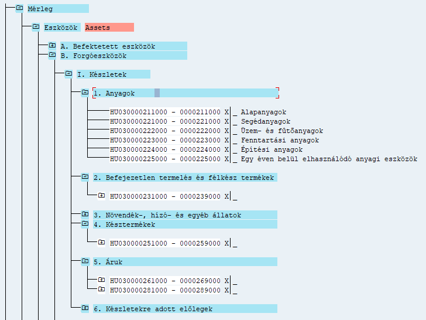

Másodsorban azonban lehetőség van 5-ös számlaosztályba tartozó, azonnali
felhasználású, tehát nem továbbszámlázott szolgáltatások
nyilvántartására.

**Purchasing.** A készlet beszerzését, a készletek beáramlását segíti a
beszerzési modul (Purchasing), amely a beszerzési igénylés (Purchase
Requisition), a beszerzési rendelés (Purchase Order), a szerződés
(Outline Agreement), az árajánlat (RFQ/Quotation), valamint a törzsadat
(Master Data) részmodult tartalmazza. A beszerzési modul üzemeltetése
elsősorban a beszerzési osztályok és csoportok feladatkörébe tartozik. A
készletek, illetve a tovább számlázott szolgáltatások mellett lehetőség
van 5-ös számlaosztályra beszerezni azonnali felhasználású
szolgáltatásokat, illetve 1-es számlaosztályra beszerezni tárgyi
eszközöket.

**Inventory Management.** A készlet mozgatását, az anyagáramlás
alapszintű szabályozását a készletmenedzsment modul látja el.
Legfontosabb területei az anyagmozgatás (Goods Movement), az
anyagbizonylatok (Material Document) és az anyagfoglalások
(Reservation). A modul üzemeltetéséhez elsősorban a készletkezelési
feladatok ellátó csoportoknak van jogosultsága.

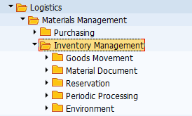

**Logistics Invoice Verification.** A beszerzési folyamatok, különösen a
készletrendelések könyvelését a LIV modul látja el. Az elnevezése arra
utal, hogy a modulban lehet könyvelni a logisztikai előzményekkel
rendelkező szállítói számlákat. A modulban a Document Entry mappában van
lehetőség a számlák iktatására és könyvelésére, az Automatic Settlement
mappa a költségek (pl.: szállítási, rakodási, stb.) szétosztást
támogatja, a GR/IR Account Maintance mappában az áru/számla
beérkeztetést időben elhatároló főkönyvi számla menedzselését segíti.

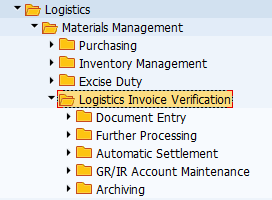

**Physical Inventory modul** az anyag- és árukészlet leltározását
segíti. Ebben a modulban hozhatók létre leltárbizonylatok (Physical
Inventory Document), végezhetők el készletszámítások (Inventory Count)
és az eltérések kezelése (Difference).

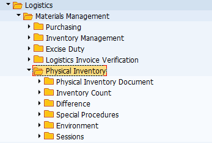

**Valuation modul** a készlet értékelésére vonatkozik, és segédkönyveket
használ. A Change in Material Price követi az anyagok értékben
bekövetkezett változásokat. A Balance Sheet Valuation a mérleg /
vagyonelemek szerinti értékelést számítja ki. Az ezen belül lévő mappák
különböző számítási lehetőségeket tartalmaznak: legalacsonyabb költség
meghatározása (Determination of Lowest Value), LIFO szerinti és FIFO
szerinti értékelés, valamint ezek eredményei (Results). További
értékelési lehetőséget tartalmaz a Balance Sheet Valuation with Material
Ledger, és a Actual Costing/Material Ledger.

**Service Master modullban** a jellemzően 5-ös számlaosztályra,
költségnemre és költséghelyre könyvelendő szolgáltatásokat lehet
nyilvántartani.

A szolgáltatás (Service) mappában lehet felvinni, megtekinteni és
módosítani a szolgáltatások törzsadatait. A Standard Service Catalog-ban
a szolgáltatásokból lehet katalógusokat, nyilvántartásokat létrehozni.

**Material Master modulban** lehet létrehozni olyan anyagokat, árukat és
közvetített szolgáltatásokat, amelyek II/1 mérleg osztályba, illetve a
21-28-as számlacsoportba tartoznak.

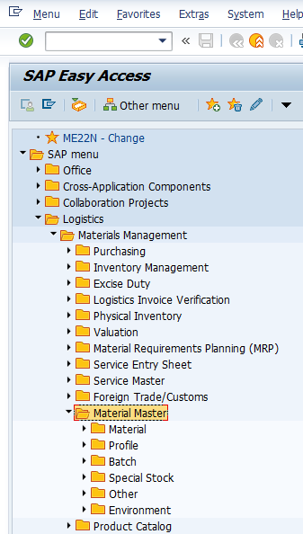

Material mappában lehet felvinni, módosítani, megtekinteni anyagokat,
árukat, tovább számlázott szolgáltatásokat. A Profile mappában lehet
létrehozn az automata beszerzési igények összeállítása miatt is lényeges
MRP és Forecast Profile-okat (ezeket később az anyagokhoz lehet
rendelni. A Batch mappában a sarsz számok beállítására van lehetőség. A
Special Stock mappában konszignációs szállítói készletekkel kapcsolatos
tranzakciók érhetők el.

**Lendvai Tamás**

# **Beszerzési modul (Purchase)**

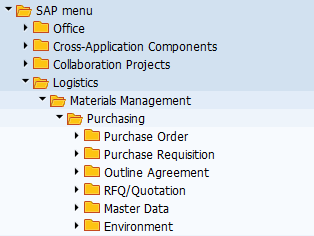

A modulban található szerződések, árajánlatok, beszerzési igények és
rendelések elsősorban a 2-es számlaosztályba tartozó anyag- és
árukészletbe sorolható vagyonelemekre vonatkoznak. Emellett lehetőség
van 5-ös számlaosztályra is beszerezni, illetve költségként elszámolni
szolgáltatásokat és anyagokat, valamint az 1-es számlaosztállyal
kapcsolatban tárgyi eszközöket rendelni.

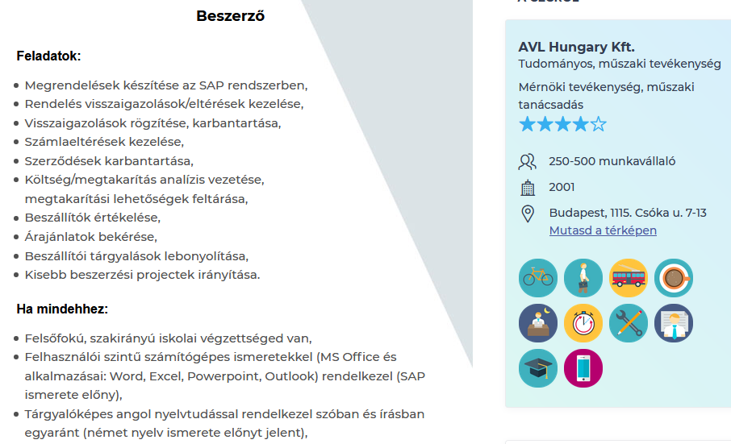

Az alábbiakban a szinte valamennyi beszerzési tranzakció közös elemeit
tekintjük át.

**[Tétel kategóriája (Item Category).]{.ul}** A szerződésekre,
beszerzési igényekre és rendelésekre vonatkozó tranzakciók egyik közös
tulajdonsága, hogy az alábbi beszerzési konstrukció nyilvántartására
alkalmasak.

**Standard:** alapanyag beszerzése a szállítótól (a szállító
késztermékét, vagy a tovább számlázandó szolgáltatását vásároljuk meg).

**Consignment:** a konszignációs készletre vonatkozó igénylés során a
szállító által leszállított áru egészen addig a szállító tulajdonában
marad, amíg nem adjuk ki a termelésre. Gazdasági esemény az anyag
termelésbe történő kiadásával történik, ebben az időpontban kell a
szállítói számlát is lekönyvelni. A konszignációs készlet a „beszállítók
által vezérelt készletek (VMI Vendor Management Invantory) típusába
tartozik." A konszignációs készletek esetében a vevő, tehát ebben az
esetben mi „csak a felhasznált mennyiség után fizet. ... A konszignációs
készletek olyan készletek, melyeket a beszállító a vevői megrendelések
alapján a vevő rendelkezésére bocsát, de egy későbbi időpontban történik
meg a fizetés és a beszállított ám tulajdonjogának az átadás. A vevő
csak a felhasznált, a gyártásnak átadott mennyiségeket fizeti ki a
beszállító részére." Oláh J. & Vad V. A konszignációs készletek
jellemzői az ellátási láncban. Vezetéstudomány. (15)8. 67-76. pp.
<https://core.ac.uk/download/pdf/161069385.pdf> (2021. január 20.)

**Subcontracting** esetében a bérmunkáról, illetve alvállalkozói
szerződésről van szó. Az alapanyagot, vagy a félkészterméket a
szállítónak adjuk megmunkálásra, majd a művelet végén a szállító
visszaszolgáltatja azt.

**Third Party**:

**Stock transfer:** az anyagot a szervezeten belül mozgatjuk, pl.:
üzemek között, ebben a relációban lesz jelentősége a Plant / Supply
Plant összefüggésének.

**Service:** jellemzően olyan törzsadatokkal rendelkező szolgáltatás,
amelyet 5-ös számlaosztályra és költséghelyre könyvelünk.

[**Kontírozási kategória. (Account Assignment).**]{.ul} A tranzakcióknak
alkalmasak többek-között (A) tárgyi eszközzel, (C) értékesítéssel (vevői
megrendeléssel), (F) gyártási rendeléssel, (K) költséghellyel, (P)
projekttel kapcsolatban létrehozni rendelési bizonylatokat.

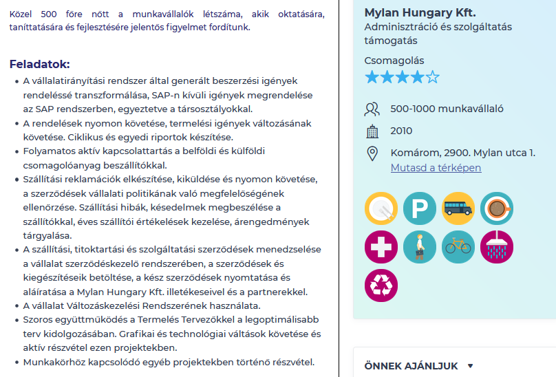

# **1. Beszerzési igény (Purchase Requisition)**

## **1.1. General Overview**

**A beszerzési igénylés moduláris felépítése és elhelyezkedése az SAP
navigációs menüjében**

**Beszerzési igénylés modul felépítése szerint a Logisztika \\
Anyaggazdálkodás \\ Beszerzés könyvtár** főkönyvtárban lévő
tranzakciókból és alkönyvtárakban elhelyezkedő tranzakciókból áll. A
főkönyvtárban elérhető ME51-ennel egyedileg hozhatunk létre, az
ME53N-nel egyedileg módosíthatunk, az ME53N-el egyedileg tekinthetünk
meg igényléseket. Az MEMASSRQ-val tömegesen tudunk megtekinteni és
szerkeszteni már elkészített igényléseket. A Release mappában az
elkészült igényléseket hagyhatjuk jóvá egyedileg, vagy tömegesen. A List
Displays-ban különböző lekérdezések és kimtatások érhetőek el, valamint
listák generálhatóak, ahonnan szintén elérhetőek az egyes
anyagigénylések megtekintésre és szerkesztésre. A Follow-On-Functions
keretében további műveletek érhetők el, pl.: az igénylések megfelelő
beállítás esetén megrendelésekké konvertálhatók.

**[A beszerzési igények fontosabb jelllemzőjük]{.ul}**

**Tárgyuk szerint** a beszerzési igények elsősorban az anyag- és
árukészletbe tartozó javakra, tovább számlázott szolgáltatásokra, tárgyi
eszközökre, valamint azonnal felhasználású anyagokra és szolgáltatásokra
adhatók le.

**Létrehozásukat** meghatározza, hogy a gyártási folyamatok részeként
jönnek létre, vagy attól függetlenül. Amennyiben tervezett gyártási
folyamatról van szó, úgy a gyártásvezérlés (Production Order), valamint
az MRP folyamatok hozzák létre automatikusan. Ezzel szemben a gyártási
folyamatokon kívüli, eseti eljárások keretében manuálisan létrehozhatunk
beszerzési igényeket. Hasonló eset, amikor egyedi tárgyi eszközre adunk
le igénylést. Egy másik lehetőség, ha a munkavállalók a napi
munkavégzésükhöz szükséges eszközökre, anyagokra adnak le belső
rendelési igényeket, pl.: katalógusok használatával.

**Környezetük** az igényléseket beszerzési, felhasználási, tárolási és
számviteli környezetbe sorolható objektumok veszik körül.

**Forrásuk szerint** a beszerzési igénylések készülhetnek korábban
létrehozott beszerzési igénylésekből, azonban a beszerzési rendelésektől
eltérően szerződések, megállapodások, stb. nem alapozhatnak meg
beszerzési igényeket.

**Felhasználásuk szerint a** beszerzési igénylésekkel megalapozhatók,
alapadataival létrehozhatók beszerzési rendelések, árajánlatok,
keretszerződések, ütemezései megállapodások.

**Kapcsolódásuk szerint** igénylésekhez kapcsolhatók szerződések,
megállapodások, és beszerzési infó rekordok, valamint szállítók is.

**Beszerzési igények elhelyezése a magyar standard számlatükörben és a
mérlegben:**

Megállapítható, hogy beszerzési igényeket elsősorban a forgóeszköz
mérlegosztály készleteibe tartozó anyagokra és árukra adunk le a
gyártási folyamat részeként. Az anyagok esetében a gyártáshoz szükséges
alapanyagok, segédanyagok, üzemanyagok és fenntartási anyagokról lehet
szó (többnyire), az áruk esetében a változatlan formában értékesíteni
kívánt kereskedelmi áruk és a tovább számlázott szolgáltatások igénylése
merülhet fel. A mérleg tekintetében, beszerzési igényléssel eszköz,
különösen anyagtartalommal rendelkező tárgyi eszköz megrendelése is
megalapozható. Befektetett pénzügyi eszközök és immateriális javak nem
képezhetik az igénylések alapját. A mérleg mellett lehetőségünk van
közvetlen költséget is elszámolni, és ezzel kapcsolatban anyagot, vagy
szolgáltatást azonnal felhasználni, tehát az 5-ös eredményosztályra,
illetve költséghelyre igényelni.

**A fentiekkel kapcsolatban alapvető kérdés**, hogy mit szeretnénk,
milyen mennyiségben, és hova igényelni (rendelni), valamint milyen
konstrukcióban, kitől (szerződések, megállapodások, megegyezések
szerint), milyen környezetben, illetve mikorra igényelni.

**Tranzakció típusa:** SAP-ban ME51 és ME51N-el lehet létrehozni
beszerzési igénylést. A különbség abban van, hogy amíg az ME51 egy több
képernyős felépítésű, úgynevezett classic tranzakció, addig az ME51N az
új típusú, egy / osztott képernyős Enjoy single screen tranzakciók
osztályába tartozik. Gyakorlatilag a táblázat és a tételrészletező egy
képernyő szerepel, amely jelentősen transzparensebbé teszi a
képernyőfelépítést.

## **[1.2. ME51N -- Create (PR)]{.ul}**

## **1.2.1. Áttekintés**

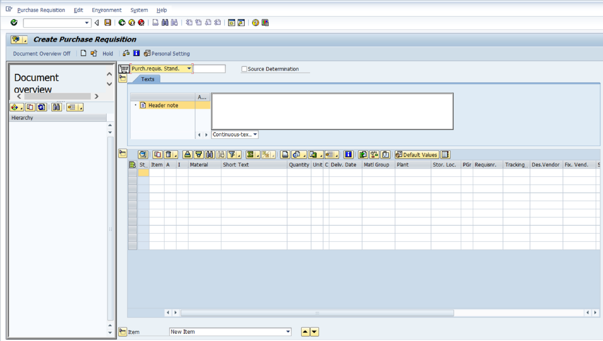

<a href="#pr_elso" style="border-bottom: medium none;"> 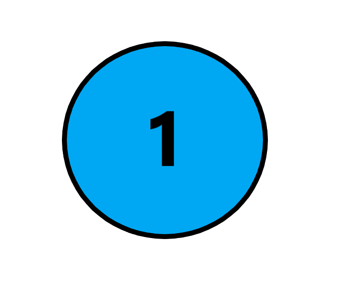 </a>

**Document Type (Bizonylat típusa)**

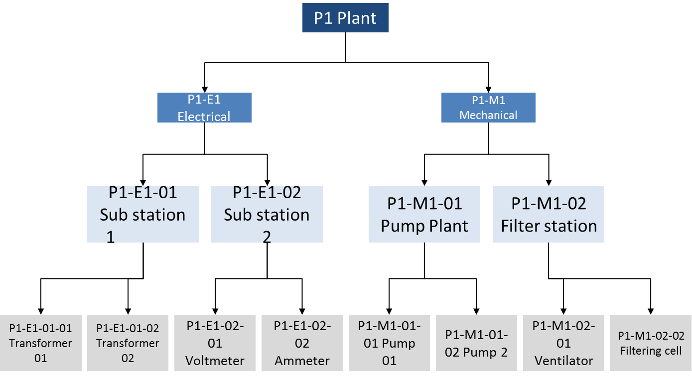

Az anyagigénylésünket egy bizonylat fogja tárolni, amely egy
bizonylatrendszerben, bizonylatkörben helyezkedik el. Minden bizonylat
mentés után egy egyedi számot fog kapni, amelynek segítségével
transzparensen nyomonkövethetővé válnak. A bizonylat tulajdonságait
pedig az őt leíró bizonylattípus beállításai fogják meghatározni. A
legördülő menüben elérhető bizonylattípusok - kiválasztás esetén --
meghatározzák egyrészt a bizonylat űtlaptáblázatának felépítését és
szerkezetét (különösen az elérhető oszlopokat / mezőket), másrészt
determinálják, hogy a bizonylat melyik számintervallumban fog
elhelyezkedni. Ennek hátterében az áll, hogy SPRO-ban minden
bizonylathoz tartozik egy előre definiált képernyőkép (Screen Layout),
illetve egy bizonylatintervallum. A bizonylattípusok emellett
meghatározhatják, hogy milyen típusú Account Assignment és Item
Categoriek befogadására alkalmasak.

A PTE TTK-s IDES rendszerben az alapértelmezett az NB Standard PR.

**Document Overview**

A Document Overview ON-ra kattintva a képernyő baloldalán megjelenik egy
hasáb. A hasábon lévő műveletek segítségével korábban elkészült, az
anyagigénylés szempontjából releváns előzményeket tudunk látszólag
betölteni. Eredményeim szerint azonban reálisan kizárólag korábbi
beszerzés igénykés másolható át új anyagigénylésre. A funkció értelmét
az a koncepció adja, amely szerint új beszerzési igényléshez
felhasználhatóak korábban elkészített bizonylatokat is.

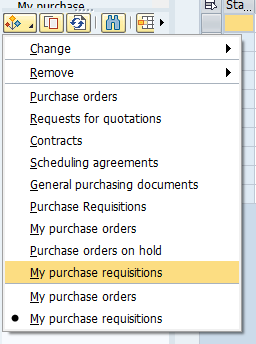

Purchase Order-ből, RFQ-ból, Conratcts-ból, Ütemezési megállapodásokból
nem lehet átvenni adatokat új igénylésekhez (ez csak a Purchase Order
esetében működik). Tehát csak a már korábban elkészített igénylés
választható. Amennyiben nem a saját igényléseinket (My PR) választjuk,
úgy egy összetett keresőfelület jön elő, amely érdemi segítséget jelent
az egyes bizonylatok megtalásában. (Lásd videót)

**Header**

A Header-ben, tehát fejlécben tudunk megadni olyan információt, amely
igénylésre, illetve az igénylés valamennyi / egyes tételeire vonatkozik.
Az 1-es változatban folyamatos szöveget tudunk megadni, a 2-es
változatban pedig sorokra bontott szöveget tudunk felvinni.

**Tételnyilvántartó**

**Menüsáv ikonjainak szerepe:**

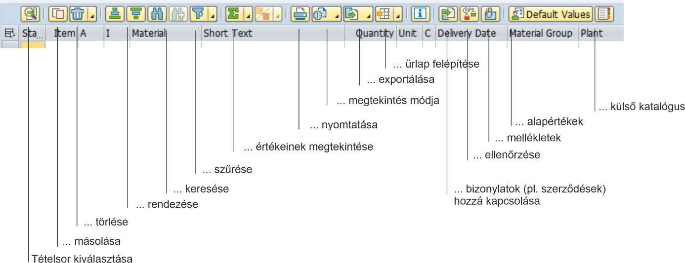

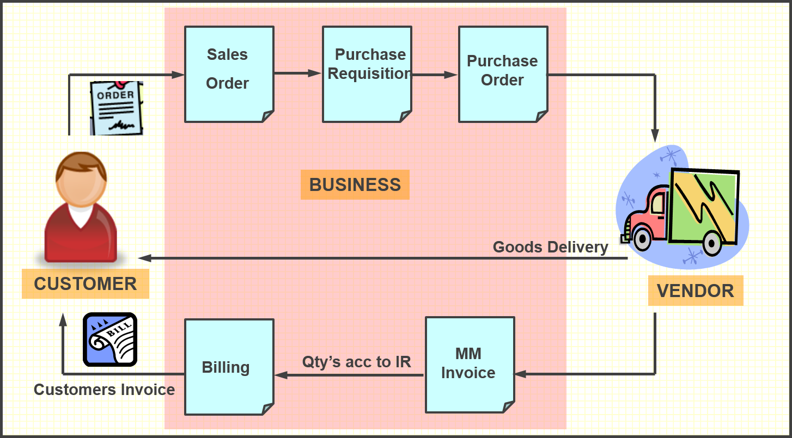

**Alapadatok:**

Material -- anyag kódja I Short Text -- anyag, rövid leírása I Quantity
-- mennyiség I Unit -- mennyiség mértékegysége I Plant -- üzem, ahová az
anyagot igényeljük I Storage Location: az üzemhez tartozó raktárhely I
Delivery date: szállítás naptári dátuma I Requested by: az igénylő neve,
vagy kódja I Tracking No.: az igénylés nyomonkövetésének száma

Az anyagigénylést a következő objektumokkal lehet összekapcsolni:
Purchase Group: Beszerzési csoport I Requested by: anyagigénylés
kérelmezője I Tracking Number: tétel követési száma I Des. Vendor:
javasolt szállító I Fixed Vendor: rögzített szállító I Purchase Org.:
beszerzési szervezet I Agreement: szerződés I Item: a szerződés
tételének sorszáma pl.: 10 I Info Record: beszerzési adatok.

Az Agreement-hez és az Info Record-hoz való hozzárendelés lényeges
lehet, tekintettel arra, hogy az azokban foglalt kondíciók
meghatározhatják az adott tétel tulajdonságait, pl.: árak és szállítási
feltételek tekintetében. Később a Purchase Order (beszerzési megrendelés
ezeket fogja átvenni).

Kitöltés sorrendje: először adjuk meg az anyag kódját, utána a Plant
(üzemet). A kettő kombinációjából a program az anyagtörzs adataiból
kitölti a többi mezők egy részét, szintén adjuk meg a Storage
Location-t, majd a többi szükséges mezőt. Az itt megadott adatokat
később átveheti többek között a Contract (szerződés nyilvántartó modul),
valamint a Purchase Order (megrendelések).

**Tételrészletező**

**Egyes tételek részletezésre szolgál**

Az egyes tételek részletes adatainak megtekintéséhez az Item drop
down-ból válasszuk ki az adott tételt, majd azt követően nyissuk meg az
egyes űrlapokat. Az űrlapok részben a táblázatban szereplő oszlop
mezőket tartalmazzák csoportosítva, néhány esetben a táblázatban nem
szereplő mezők és kapcsolók is rendelkezésre állnak.

**Material Data**

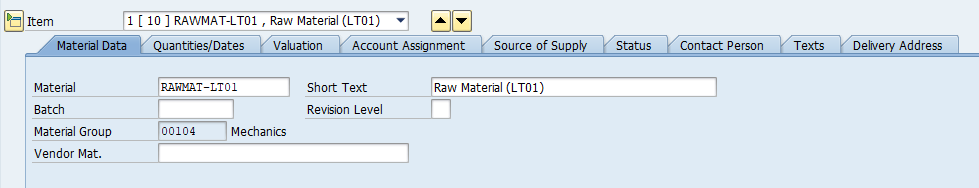

A Material Data űrlapon az anyag kódja, az anyag rövid neve, a sarzs
(Batch), és az anyag csoportja szerepel. Ezek az adatok az anyagtörzsből
töltödnek ki. A Vendor Material szabadszöveges mezőben a szállító
nyilvántartásában szereplő anyagnevet és / kódot lehet megadni, ennek
értelme abban az esetben van, ha a szállító adatbázisában más kóddal és
névvel fut az anyag, mint a saját SAP rendszerünkben. (In most cases,
the vendor uses a different number for the material than the one used in
this system. The vendor\'s material number can therefore also be quoted
in a [**purchase
order**](sapevent:DOCU_LINK\DS:GLOS.3526C0CEAFAB52B9E10000009B38F974)
for identification purposes. from: SAP help menü) A Batch esetében a
sarzs menedzsmentről van szó, amelynek segítségével bizonyos szempontok
szerint az egy kötegbe tartozó anyagok mozgása transzparensen nyomon
követhető. *(ehhez a részhez annyira nem értek, én az alábbi külső
hivatkozásból indultam ki)*

**Mennyiség és dátumok (Quantity/Dates)**

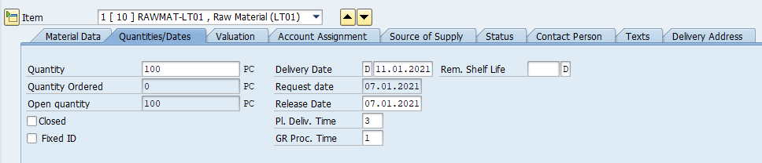

Az űrlapon három mennyiséget találunk. Az első az igénylendő
mennyiséget, a második az ebből megrendelt mennyiséget, a harmadik a
kettő különbözetét a nyitott mennyiséget tartalmazza. A Closed-el lehet
lezárni az igénylést. A jobb oldali hasábban lehet megadni a tervezett
szállítás időpontját, és az engedélyeztetés időpontját. A kérelem
időpontja alapértelmezetten az a nap lesz, amikor az igénylést
elkészítjük. Ezek alatt megadhatjuk a tervezett szállítás időt, illetve
az áruérkeztetéshez szükséges időmennyiséget.

**Értékelés (Valuation)**

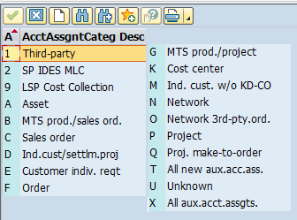

A Valuation űrlapon az anyagnak a mennyiségre / darabra vetített
tervezett ára, pénzneme szerepel. Ennek értéke elsősorban az
anyagtörzsből származhat. A Promotion alatt három kapcsoló szerepel. Az
anyagérkeztetés (Good Receipt) aktiválásával azt jelezzük, hogy a tétel
értékelése összefüggésben van a érkeztetéssel, a számlaérkeztetés
(Invoice Receipt) estében, ha a számlaértkeztetéssel, a GR Non-Val.
esetében, ha az olyan árut érkeztetünk, amelyet nem kell az ávételkor
értékelnünk.

**Kontírozás (Account Assignment)**

A kontírozás űrlap felépítését a legördülő listában elérhető kategóriák
határozzák meg. Ennek informatikai alapját az adja, hogy SPRO-ban az
egyes kategóriákhoz egyedi beállítások (űrlapfelépítések, mezőkészletek)
tartoznak. Alapesetben, ha nem választunk kontírozási kategóriát (tehát
az AccAssCat üres) akkor az igénylés a áru- és anyagkészletre fog
vonatkozni. A Fund, Functional Area, Fund Center, Grant elsősorban az
állami költségvetésből működő intézmények forrásgazdálkodásának
adminisztrációját teszik lehetővé. Segítségükkel pl.: megadható, hogy
adott igénylést milyen alapra kontírozzuk, illetve milyen támogatást
használunk fel. A Commitment Item a kötelezettségvállalási, pénzügyi
tételnek felel meg.

**K Cost Center (költséghely)**

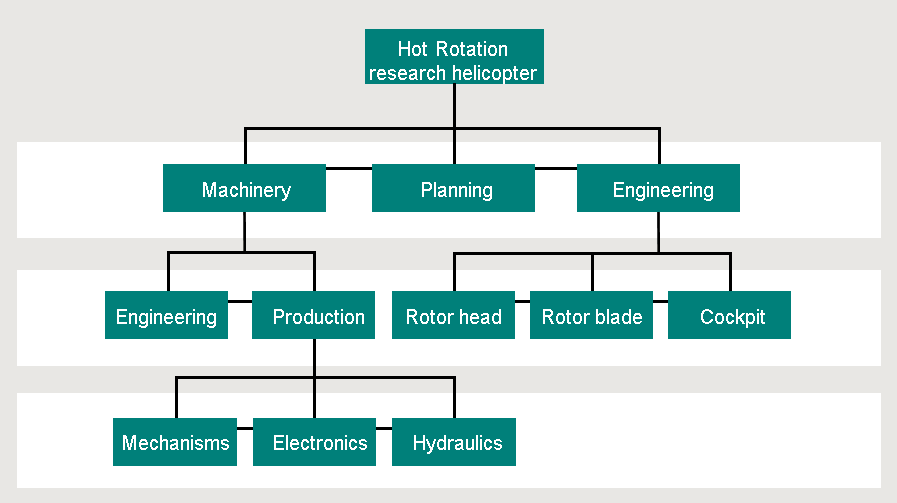

Költséghely kiválasztása elsősorban akkor indokolt, ha az anyagot, árut,
vagy szolgáltatást közvetlenül költségként, pontosabban költségnemenként
számoljuk el 5-ös számlaosztályban, és azonnal felhasználjuk. Az
alapadatok tekintetében költséghelyet (Cost Center), a pénzügyi
központot (Profit center), valamint az üzletágat (Business Area-t)
adhatjuk meg. Az egyes objektumok összefüggésben állhatnak egymással a
háttérbeállítástól függően, ezért pl.: a költséghely kitöltésével a
pénzügyi központ és az üzletág is kitöltődhet automatikusan. Amennyiben
költséghelyre adunk le beszerzési igényt, abban az esetben 5-ös
számlaszámra fogjuk később könyvelni a beszerzésünket, egyúttal egy 6-os
számvlteli költséghelyhez is hozzárendeljük azt. Az Unloading point
mezőjében a kirakodás, illetve a felhasználás helyét tudjuk megadni, a
mezőbe a költséghely fizikai elhelyezkedését célszerű megadni.

Amennyiben egy tételt több költséghely szerint szeretnénk felosztani,
úgy válasszuk az első kockát, a többszörös konítrozás beállítását.

Amennyiben több költséghelyre szeretnénk kontírozni a beszerzendő
tételt, úgy megosztás mezőben (Distribution) válasszuk ki a mennyiség,
vagy a százalékos (arányos) formában való megosztást, és töltsük ki az
alsó táblázatot.

Ha az első sort kitötöttük, utána a Reapet on (második ikonnal) tudjuk
másolni a sort.

**Projekt**

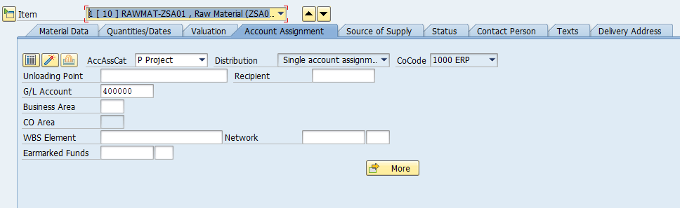

Ha a beszerzési igénylést projekthez szeretnénk kapcsolni, úgy a P
Project-et kell kiválasztani. A legtöbb mező azonos lesz a költséghely
űrlapjával, ugyanakkor a WBS Element és a Network új elemként jelenik
meg. A két mező kitöltése lehetővé teszi, hogy beszerzési igénylésünket
a projekt megfelelő szintjével, elemével tudjuk összekapcsolni. Egy
projekt alapszintű felépítését szemlélteti az alábbi ábra.

<https://help.sap.com/viewer/5ecdd9085d344e6693e65fc60c3b5b0f/6.17.19/en-US/26d4b65334e6b54ce10000000a174cb4.html>
(2021. január 20.)

Az ábrán szereplő projekt esetében az egyes szintekhez tudunk
anyagigényléseket rögzíteni.

**Befejezetlen beruházás / Tárgyi eszköz (Asset)**

Amennyiben tárgyi eszközt szeretnénk beszerezni, úgy az Asset-et
válasszuk ki. A szokásos kontírozásos mezők mellett az igénylésünket
rátudjuk vezetni egy / több befejezetlen beruházásra, vagy közvetlenül a
tárgyi eszközre.

**A beszerzési igény információ forrása (Source of Supply)**

Beszerzési igényekhez rendelhetünk különböző forrásdokumentumokat
(keretszerződéseket, központi szerződéseket, vagy infó rekordokat). Ezek
kiválasztásával alapesetben megjelenik az a rögzített szállító is,
amelyet az adott dokuemtum tartalmaz. Emellett megadhatunk javasolt
szállítót is. A keretszerződés, keretmegállapodás (amely jellemzően
valamilyen Outline Agreement objektum) esetében meg kell adni, hogy az
igénylés a szerződés melyik tételére vonatkozik, ellenkező esetben nem
lesz összefüggés az igényelt tétel és a szerződés tétele között. Ez alól
az információs rekord kivétel, ugyanis az mindig egy adott anyagra
vonatkozik, szemben a szerződésekre, amelyek több tételt is
tartalmazhatnak. Lényeges, hogy ezt csak abban az esetben tudjuk
megtenni, ha azok (szerződések, infó rekordok) már elkészültek. Emellett
szintén meg lehet adni a beszerzési szervezetet. A jelentősége ennek a
Purchase Order létrehozása során lesz, a PO az igénylés adott tételéhez
kapcsolt szerződésből fogja a kondíciók egy részét, pl.: az árat, a
szállítási feltételeket kiolvasni.

**Status** (a beszerzési igénylés státusza)

A Status űrlapon a Process Status (feldolgozás státusza), a Block ID (az
anyagigénylés blokkolása), és a Block text (a blokkolás szöveges
indoklása adható meg).

Az aktív legördülő menüből az anyagigénylés állapota tekinthető meg. 03
= engedélyeztetés alatt, 05 = engedélyeztetés teljesítve, 08 =
engedélyeztetés visszautasítva.

**Contact Person**

Created by: a felhasználó neve, aki készítette (ez a bejelentkezési
adatokból származik)

Created Indicator: a létrehozás módjára utal

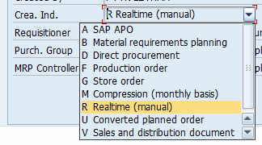

Amennyiben manuálisan hozzuk létre, úgy a Realtime (valós idejű,
manuális létrehozás) lesz az alapértelmezett, B) esetben az
anyagszükségletek tervezése hozza létre automatában, az F esetében a
gyártás elrendelés hozza létre automatában.

## **1.2.2. Enviroment**

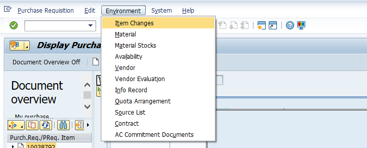

**Az Enviroment menüsorban** lehet a tételhez kapcsolt rekordokat /
objektumokat megtekinteni, illetve különböző kimutatásokat (pl.:
készletek, szállítók értékeléseit) lekérni. A menüsor előnye, hogy külső
tranzakciók nélkül is tudunk az adott tételhez tartozó objektumokat
menedzselni.

**Item Changes --** Ez a tétel egyes elemeinek módosításait mutatja
történeti megközelítésben (régi érték --\> új érték) kronológiailag.

**Material -\> A tétel, illetve az adott anyag törzsadatait nyitja meg**

**Material Stock -\> Az adott anyagból rendelkezésre álló mennyiséget és
elhelyezkedését mutatja meg vállalat \\ gyár \\ tárolási hely szerint:**

**Vendor -\> A szállító törzsadatainak egy részét (alapadatokat,
beszerzési adatokat) mutatja**

**Vendor Evaluation -\> A szállító automata értékelését nézhetjük meg:**

**Info Record -\> A tételhez kapcsolódó Infó Rekordot nyitja meg**

**Contract -- a tételhez kapcsolódó szerződést lehet megnézni /
módosítani**

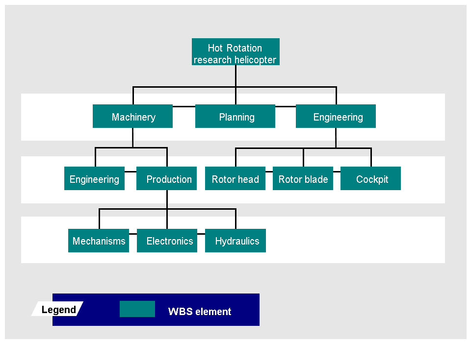

**Quota Arrangement -\> A tételhez tartozó kvótamegállapodásokat lehet
megtekinteni / módosítani**

Az alábbi videó az egyedi és csoportos megjelenítés és módosítás
lehetőségeit mutatja be.

&times;

1 / 45

2 / 45

3 / 45

4 / 45

5 / 45

6 / 45

7 / 45

8 / 45

9 / 45

10 / 45

11 / 45

12 / 45

13 / 45

14 / 45

15 / 45

16 / 45

17 / 45

18 / 45

19 / 45

20 / 45

21 / 45

22 / 45

23 / 45

24 / 45

25 / 45

26 / 45

27 / 45

28 / 45

29 / 45

30 / 45

31 / 45

32 / 45

33 / 45

34 / 45

35 / 45

36 / 45

37 / 45

38 / 45

39 / 45

40 / 45

41 / 45

42 / 45

43 / 45

44 / 45

45 / 45

<a class="prev" onclick="plusSlides(-1)">&#10094;</a>
<a class="next" onclick="plusSlides(1)">&#10095;</a>

</body>